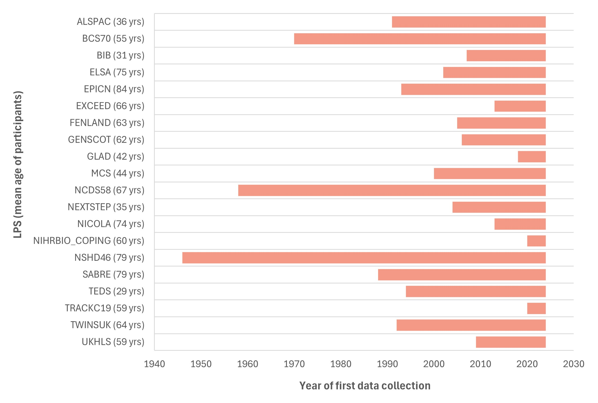

# Longevity of LPS

>Last modified: 30 Oct 2024 

As summarised in Figure 1 below, the LPS in the UK LLC partnership have been collecting data for between four years (LPS with a focus on COVID-19) and 78 years (NSHD46 which is the UK's longest running birth cohort).

**Figure 1** A summary of the temporal coverage of each LPS in the UK LLC partnership (mean age of participants on 30/09/2024 in parentheses)  
**Note**: mean age was calculated from date of birth in participants' NHS England records except for GENSCOT, NICOLA and SABRE (ages calculated from LPS data).