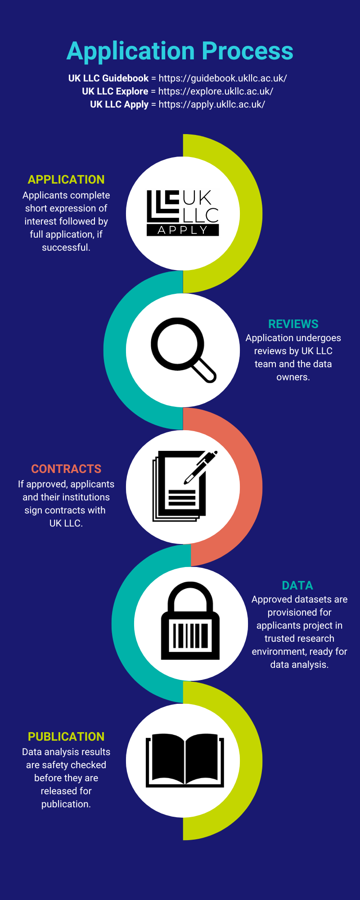

# Applying to UK LLC
>Last modified: 21 May 2026

<strong>UK LLC welcomes applications from eligible researchers.</strong>

 

To ensure the appropriate and fair use of LPS participants’ information, UK LLC operates a rigorous **multi-stage application review process**. All applicants and their applications are assessed against the [**Five Safes Framework**](https://ukdataservice.ac.uk/help/secure-lab/what-is-the-five-safes-framework/) to determine if the application meets the requirements and commitments agreed with participants of the partner LPS and linked data owners. See the diagram below and the [**UK LLC Data Access and Acceptable Use Policy**](https://ukllc.ac.uk/governance) for further information about UK LLC's application process. If approved, applicants and their organisations must sign contracts with UK LLC, before they are provisioned data for their project within the UK LLC TRE. Safety-checked results of data analyses can be used for publications. See the [**UK LLC Publication Policy**](https://ukllc.ac.uk/governance) for further information. Take a look at the [**UK LLC Data Use Register**](https://ukllc.ac.uk/data-use-register) to see a list of applications already submitted to UK LLC. 

