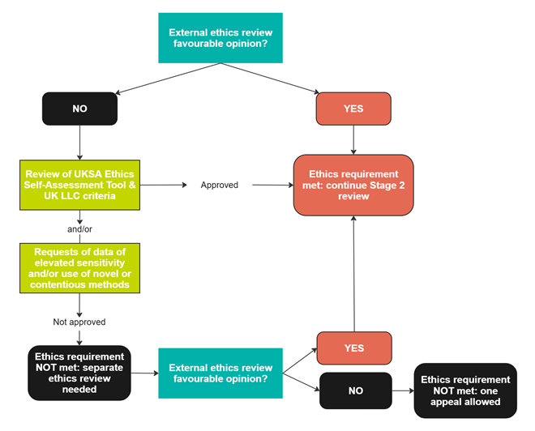

# Complete your application
>Last modified: 24 Jun 2026

<strong>When your EoI is approved you can complete your full application in UK LLC Apply.</strong>

 

Your full application comprises up to **three** sections: 

- Application form
- Data request
- Codelist (if you are applying to access certain NHS England datasets - see below)

If you would like to view a pdf of the application form, please click [**here**](../../images/application_form_template_20250128.pdf).

Your application will undergo **internal** and **external** review. You will be notified of the progress of your application - please see the [**How your application is reviewed guide**](../applying/review.md) for further information.

<strong>1. Complete your application form</strong>

Log into <strong><a href="https://ukllc.ac.uk/apply" target="_blank" rel="noopener noreferrer">UK LLC Apply</a></strong> and complete the following sections (you can save your application and come back to it later):  
- Co-applicants
- Project overview
- Methodology
- Benefits and public involvement
- Funding
- Lawful basis
- Ethics
- Data
- Setting
- Outputs.

**In particular, please take into consideration these following key points**:

**a) Co-applicants**
You can invite **co-applicants** to work with you on your application, but these should **only** be researchers who will be **accessing data** in the UK LLC TRE. If you deem it absolutely necessary to invite a co-applicant to help you develop your application, but this person won't be accessing the TRE, please restrict these co-applicants to only those  who will be involved in discussions while the research is ongoing. Make sure all co-applicants understand that they will be responsible for some administrative tasks in UK LLC Apply. Collaborators who will only view the final outputs do not need to be listed. 

>- There can be only **one main applicant** per application  
>- 	Only the main applicant can **submit** the application  
>-  A PhD student can **not** be the main applicant.  
 
**b) Conflicts of interest**

Please declare any financial and non-financial **conflicts of interest (COI)**. Examples of financial COI include (but are not limited to): funding (including consultancy fees), employment by, or any financial interests (such as stocks or shares) in organisations that could financially benefit from or be adversely affected by this project. Examples of non-financial COI include (but are not limited to): personal or professional relationships, as well as any unpaid roles (such as membership, advisory, consultancy, or expert positions) in organisations or with individuals that could be relevant to the project.

**c) Ethics**
You must have obtained a **favourable opinion** from an **independent** Research Ethics Committee (REC) if you are applying to access data of **elevated sensitivity** and/or if you are using **novel** or **contentious** research methods (see definitions below). We accept faculty ethics committee or Health Research Authority REC approval. If you do not have a favourable opinion from an independent REC, you will be asked to fill in the **Ethics Self-assesment Tool** developed by the UK Statistics Authority. The form can be downloaded from within <strong><a href="https://ukllc.ac.uk/apply" target="_blank" rel="noopener noreferrer">UK LLC Apply</a></strong>. Once completed, please upload your form to the Ethics section of your application. Your ethical assessment will be reviewed and, depending on the outcome, you may need to contact your institution’s REC for further advice - see the UK LLC ethics decision-making tree below.

**Figure 1** An overview of the UK LLC ethics decision-making process

>**Data of elevated sensitivity**:  
>- mental health 
>- sexual health 
>- drug and alcohol misuse 
>- assisted pregnancy, termination of pregnancy, pregnancy in age <16 years 
>- abuse 
>- self-harm
>- suicide.

 

>**Novel or contentious research methods**:
>- entirely novel or not commonly used methods
>- any artificial intelligence (AI) methods. (See UK LLC's AI policy [**here**](../applying/ai_policy.md).   

**d) Public good**
All applications approved by UK LLC must be for the **public good**. UK LLC is working with its public contributors to develop a context-specific public good definition. In the meantime, please use the [**National Data Guardian (NDG) guidance**](https://assets.publishing.service.gov.uk/government/uploads/system/uploads/attachment_data/file/1124013/NDG_public_benefit_guidance_v1.0_-_14.12.22.pdf).

**e) Public and Participant Involvement and Engagement (PPIE)**
We strongly encourage you to think about and develop **PPIE plans** that cover the duration of your project (from developing research ideas to discussing results and dissemination). This is **obligatory** for projects involving data of elevated sensitivity and novel/contentious research methods.

<strong>2. Complete your data request</strong>

Go to <strong><a href="https://explore.ukllc.ac.uk" target="_blank" rel="noopener noreferrer">UK LLC Explore</a></strong> to build your data request. Select all the datasets you require by ticking a box next to the dataset name. All datasets are clustered according to the **schema** to which they belong, e.g. PLACE refers to place-based datasets, MCS refers to Millennium Cohort Study datasets. Then go to **Selection** and press **Save** - this will download a data_selection.csv file which you then upload in the Data section of your application. 

**Please do not change the file format or extension of the data request form.** If your application is approved, this file will be used for automatic data provision, so it is essential that it remains unchanged.

<strong>3. Complete your codelist</strong>

If you have selected any of the following six **NHS England** datasets you must complete a codelist: 
- CANCER (Cancer Registrations)
- GDPPR (General Practice Extraction Service (GPES) Data for Pandemic Planning and Research) 
- HESAE (Accident & Emergency)
- HESAPC (Admitted Patient Care)
- HESOP (Outpatients)
- PCM (Primary Care Medicines).

(HES: Hospital Episode Statistics)

To download the **UK LLC codelist template** and for guidance on completing your codelist, please see the [**Codelists and NHS England data guide**](../../linked_health_data/nhs_england/coding/codelists.md). When you've completed your codelist, upload it in the Data section of your application.

**Please do not change the file format or extension of the data request form.** If your application is approved, this file will be used for automatic data provision, so it is essential that it remains unchanged.