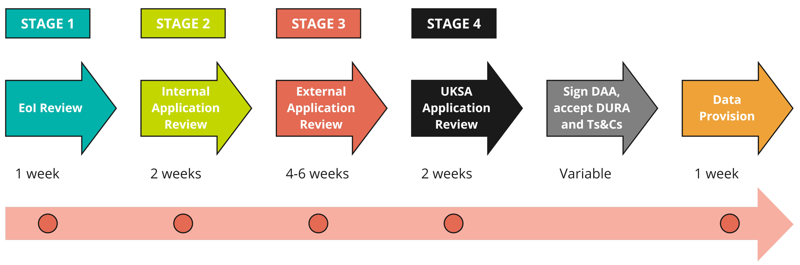

# How do I apply?
>Last modified: 24 Jun 2026

<strong>All applications must be submitted via UK LLC's online application management system, UK LLC Apply.</strong>

 

## Check feasibility of your proposed research project
UK LLC may not hold all data collected by each LPS and some LPS do not permit certain linkages or research topics. You are **strongly advised** to check the feasibilty of your proposed research project, using the links below, before submitting your EoI:
- [**UK LLC Explore**](https://explore.ukllc.ac.uk/) - UK LLC's data catalogue
- [**UK LLC Guidebook permitted linkages and research topics guide**](../../lps_partner/linkages/lps_linkages.md) - a summary of the linkages and research topics each partner LPS permits. 

## Register for a UK LLC Apply account
If you feel that your proposed project is feasible within the UK LLC TRE, go to <strong><a href="https://ukllc.ac.uk/apply" target="_blank" rel="noopener noreferrer">UK LLC Apply</a></strong> to register for an account.  

**Note**: Researchers must be **based in the UK**, be an **Office for National Statistics (ONS) Accredited Researcher** and be proposing a project that is **not in any way commercial**.

You may submit your EoI and complete the ONS accreditation process in parallel. Accreditation is managed by the Integrated Data Service’s (IDS) People & Project Services (PPS) - apply for an IDS account [**here**](https://integrateddataservice.gov.uk/apply-for-an-account). If you have any questions about accreditation, please email: [**Accredited.Researcher.Support@ons.gov.uk**](mailto:Accredited.Researcher.Support@ons.gov.uk)

We have split our **application guidance** into the following pages:
 - Submit your [**expression of interest (EoI)**](../applying/eoi.md)
 - Submit your [**full application**](../applying/application.md)
 - Complete the [**'paperwork'**](../applying/paperwork.md).

We have also written a guide about the [**application review process**.](../applying/review.md)

**Figure 1** A summary of UK LLC's application process with approximate timings for each stage - also see the metrics below   
**Note**: only applications that include [**non-health administrative data**](../../linked_admin_data/admin_data.md) will need to go through Stage 4 review by the UK Statistics Authority.   
**Note**: the time it takes for a researcher’s organisation to sign a DAA with UK LLC can vary between less than a month to several months – this is outside the control of UK LLC.   
**DAA**: Data Access Agreement; **DURA**: Data User Responsibilities Agreement; **EoI**: Expression of Interest; **Ts&Cs**: data owners' terms and conditions; **UKSA**: UK Statistics Authority.

<aside class="admonition note">
EoI metrics
On average it takes UK LLC 3.6 days to approve an expression of interest (from submission of final version of EoI).</aside> 
<aside class="admonition note">
Application metrics
On average it takes UK LLC and data owners 97.0 days to approve an application (from submission of final version of application).</aside> 

