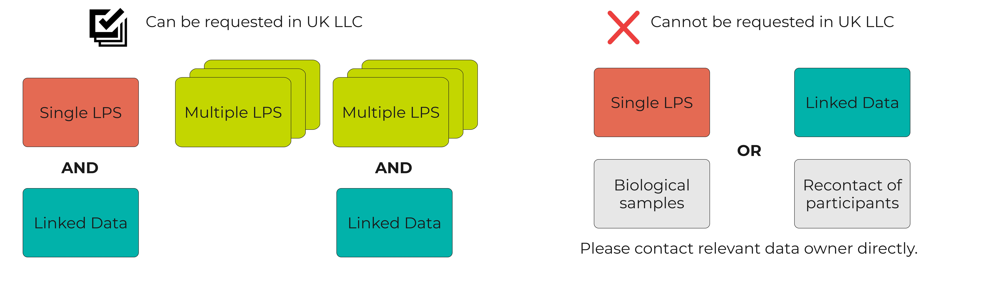

# Am I eligible?
>Last modified: 24 Jun 2026

<strong>Researchers must be UK-based and ONS accredited, and their project must be in the public good.</strong>

 

UK LLC welcomes **Expressions of Interest (EoIs)** to conduct research projects. If your EoI passes our researcher and application eligibility criteria AND the required data are available, you will be invited to submit a full application.

<strong>1. Researcher requirements</strong>

Researchers applying to access data in the UK LLC TRE must be:
- Based in the UK
- An Office for National Statistics (ONS) <strong><a href="https://www.ons.gov.uk/aboutus/whatwedo/statistics/requestingstatistics/secureresearchservice/becomeanaccreditedresearcher" target="_blank" rel="noopener noreferrer">Accredited Researcher</a></strong>
- Proposing a project that is not in any way commercial.

If you are a:
- **PhD student** you can submit an EoI. If your EoI is approved, you will be invited to submit a full application. Your supervisor **must** be included as the **main applicant** on the application and they must review and **submit the application**. They must also have access to the TRE so that they can provide practical support and oversight of your analyses.

- **MSc student** you can submit an EoI if your project timeline permits (note, it takes at least 12 weeks from submission of an EoI to access to the TRE). The same requirements that apply to PhD students also apply to MSc students.

If you are a **supervisor of a student** you must be the **main applicant** on the application, which means you must:
- Register on [**UK LLC Apply**](https://apply.ukllc.ac.uk/)
- Describe the supervision arrangements that are in place for your student
- Review and submit the application, as well as any subsequent amendments
- Enter into and sign any required agreements with UK LLC
- Take overall responsibility for your student's work within the UK LLC TRE, i.e. you are accountable for ensuring that your student's use of the UK LLC TRE complies with all UK LLC requirements.

<strong>2. Application requirements</strong>

Applications must:
* Be in the **public good** - UK LLC currently follows the <strong><a href="https://assets.publishing.service.gov.uk/government/uploads/system/uploads/attachment_data/file/1124013/NDG_public_benefit_guidance_v1.0_-_14.12.22.pdf" target="_blank" rel="noopener noreferrer">National Data Guardian (NDG) guidance</a></strong>1 to assess public good
* Have an ethical assessment
* Be approved by partner LPS and linked data owners
* Align with data owners' specific terms and conditions.

1UK LLC is working with its public contributors to develop a context-specific public good definition which will replace our use of the NDG definition - we will update this page in due course.

<strong>3. Data requirements</strong>

Please note that UK LLC may not hold all data collected by each LPS. Before proceeding with your EoI, check availability of data using the links below:
- [**UK LLC Explore**](https://explore.ukllc.ac.uk/) - UK LLC's data catalogue
- [**UK LLC Guidebook permitted linkages and research topics guide**](../../lps_partner/linkages/lps_linkages.md) - a summary of the linkages and research topics each partner LPS permits. 

As summarised in the diagram below, you can apply to UK LLC to access data from **multiple LPS**, or one or more LPS in **conjunction with linked data**. If you require non-linked LPS data from one LPS only, please contact that LPS directly. If you require access to linked data only (e.g. NHS data), please contact the linked data owner directly.  

