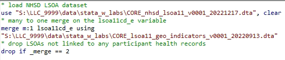

# Core datasets
>Last modified: 05 Jul 2024

  
CORE denominator file1

CORE_denominator_file1_v0000_YYYYMMDD has one row per UK LLC participant, the LPS to which they belong, and all UK LLC configurable permissions for the different domains of data. The date in the table/file name of the dataset relates to the file1 (permissions) that your project is fixed/locked to. Therefore participant permissions are correct and applied to your dataset as per this date. Permissions are updated by the LPS on a quarterly basis. This file allows users to:
* calculate linkage rates per LPS when joined to NHS demographics and other NHS datasets
* contextualise LPS participants within UK LLC in relation to the LPS datasets. 

  
CORE NHSD Presence
 
CORE_NHSD_Presence_v0000_YYYYMMDD contains the number of appearances and the date of the most recent appearance for each participant for each available NHS data source in the UK LLC database. There is one row per participant. The table also includes a ‘last seen date’ for each participant as the most recent record across all NHS data sources. Some NHS data sources do not include record dates. Therefore the presence table may include the counts of each participant’s appearances in a data source without an associated date. 

  
CORE NHSD Derived indicator
 
CORE_derived_indicator_v0000_YYYYMMDD contains the most recent and most reliable record for certain key variables sourced from NHS data sources in the UK LLC database. There is one row per participant. The table sources data from the following tables and preferentially uses data from datasets in this order:
1. Demographics
2. General Practice Extraction Service (GPES) Data for Pandemic Planning and Research (GDPPR)
3. HES Admitted Patient Care (HESAPC)
4. HES Outpatients (HESOP)
5. HES Accident & Emergency (HESAE).

Currently included are the following variables:
* sex
* Deceased: from NHSD.mortality
* Date of death: from NHSD.mortality
* ethnic: NHS ethncity coding system, see values table for coding lookup
* dob_year_month: year and month of birth 
* last_seen_date: last date record in any NHS England dataset.

  
CORE NHSD LSOA11
>

CORE_nhsd_lsoa11_v0000_YYYYMMDD has one row per health interaction where the project has selected the LPS and where participant permissions are in place. The indicator picks from the following NHS datasets where Lower Super Output Area 2011 (LSOA11) is routinely available:
* General Practice Extraction Service (GPES) Data for Pandemic Planning and Research (GDPPR)
* HES Accident & Emergency (HESAE)
* HES Admitted Patient Care (HESAPC)
* HES Outpatients (HESOP).

LSOA11 is encrypted in the dataset, because geographical units smaller than region are not permitted ‘in-the-clear’ in the UK LLC TRE. The dataset contains the following variables:
* record_date: date stamp from health record 
* lsoa11cd_e: encrypted LSOA 2011 from health record
* origin: NHS dataset the LSOA originated from 
This dataset can be linked to CORE_LSOA11_geo_indicators (documented in next subsection) to add in geographical indicator variables asscoiated with encrypted LSOA11 (lsoa11cd_e).

  
CORE LSOA11 geo indicators
>
This file is intended to be linked to CORE_NHSD_LSOA11 to add geographical indicators to the LSOA from the health record. The dataset contains the following variables:
* imd2019_#subdomain#_q##: IMD2019 with subdomains in deciles, quintiles, quartiles and tertiles. 1 is most deprived and ceiling value is least deprived
* ctry17nm: country name 2017
* gor10nm: region name 2010
* people_km2_2020: population density (number of people per Sq Km – mid 2020)
* ruc11cd_v2: urban rural classification collapsed from 8 to 5 categories. 

  
How to link LSOA datasets
>

To link CORE_nhsd_lsoa11_v0000_YYYYMMDD with CORE_lsoa11_geo_indicators_v0000_YYYYMMDD:
1.	Retrieve data from database via helper syntax.
2.	Link datasets on lsoa11cd_e field. Example of stata syntax:

**Note on linkage preprocessing**:
CORE_nhsd_lsoa11 is a long dataset typically with millions of rows, depending on size of data request. It is therefore recommended that you subset both or either of these datasets before linking/processing/saving. An example of this would be to select the quantile of IMD that you are going to use and keep these variables only. This will ensure the dataset size remains as manageable as possible.

