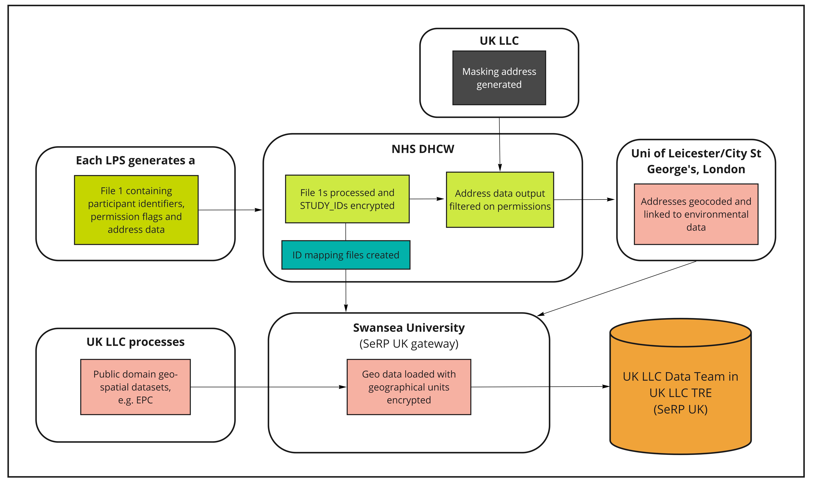
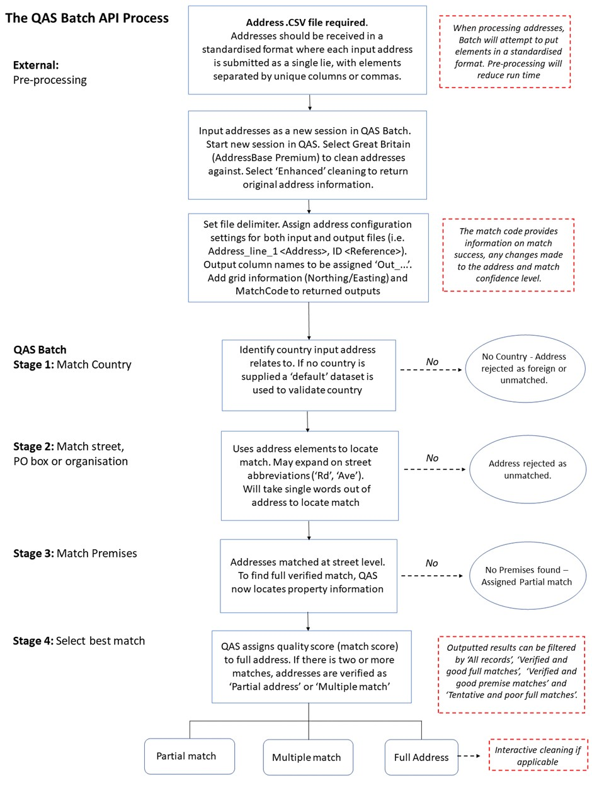
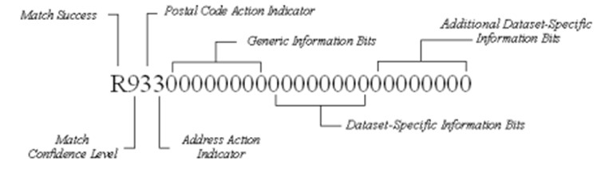

# Place-based datasets

> Last modified: 03 Jan 2025

## Introduction

Place-based data can be linked using study-provided address data or linked area indicators (e.g., linked Lower Super Output Area, LSOA). For linked place-based data that uses participant addresses, UK LLC sends address data to the same Trusted Third Party, **Digital Health and Care Wales (DHCW)**, used for health data linkage. This address data is only used for geocoding subject to study approval. All geographic identifiers in the UK LLC TRE below the region/devolved nation level are encrypted. 

**Figure 1** An overview of the flow of LPS participants' geo/environmental data into the UK LLC TRE

## Overview of Place-based Data

| **Dataset name in TRE** | **Full dataset name** | **Primary domain** | **Secondary domain** | **Data available in TRE** | **Data owner** | **Update frequency** |
|:-----------------------:|:---------------------:|:------------------:|:--------------------:|:-------------------------:|:--------------:|:--------------------:|
| annual_ave_no2_pm25     | Annual averages of NO2 and PM2.5 (UoL)   | Natural Environment             | Air Pollution          | 2010-2019                        | University of Leicester  | Annually            |
| Noise                   | Noise exposure (UoL)   | Built Environment       | Noise Exposure               | 2010-2019                         | University of Leicester  | Annually           |
| Greenspace              | Greenspace (UoL)       | Natural Environment    |   Greenspace                        | 2018                        | University of Leicester  | Annually             |
| AHAH                    | Access to Healthy Assets and Hazards | Built and Natural Environment | Health                  | 2022                        | Consumer Data Research Centre  | Every few years             |
| EPC                     | Energy Performance Certificates | Built Environment             | Housing                | 2008-2024                       | Department for Levelling Up, Housing and Communities (DLUHC)  | Annually             |

## Place-based Permitted Linkages

UK LLC has 4 different place-based permission flags. 
These include flags specifying if the study approves that:

**a.  'Geocoding_Permission':** address data can be geocoded to property, postcode level, or not at all; 

**b. 'Small_Area_Permission':** place-based information can be linked using encrypted LSOA and higher-level indicators originating from linked sources;

**c. 'Environment_Permission':** LLC can generally link different sources of natural and built environment subject to prior notification via Vanguard/email; 

**d. 'Property_Level_Permission':** LLC can generally link different sources of property-level data subject to prior-notification to each LPS.  

## Example permissions for specific datasets

*Please note: In order to link to datasets relating to the built and natural environment, permission flag C is required alongside an additional permission flag(s) to outline which geographic level you would like to link at. To link at Lower Super Output Area/equivalent also select permission flag B. If you would like to link to environmental datasets at property level, select permission flags A (geocoding) and D (property level).*

· Air pollution (modelled by University of Leicester): A, C, D, Leicester geocodes the addresses and then allocates nationally modelled spatial exposure estimates.

· Energy Performance Certificates: A, C, D, Unique Property Reference Numbers (UPRN) are derived from addressees and linked to property level certificates.

· Access to Healthy Assets and Hazards: B,C this dataset is at Lower Super Output Area (LSOA) level, which can be derived from routine NHS records and relates to the natural and built environment.

· Index of Multiple Deprivation, Urban/Rural, Population density: B,C this dataset is at Lower Super Output Area (LSOA) level/equivalent, which can be derived from routine NHS records and relates to the environment. 

· Live Births: B this dataset is at Local Authority Level, which can be derived from routine NHS records.

## Geocoding of address data to property or postcode level

 What is geocoding?

Geocoding is the assigning of geographical coordinates to a location. The following address data are provided by LPS:

* **Address line 1** (Premise level)
* **Address line 2** (Street name)
* **Address line 3** (Locality name)
* **Address line 4** (Town)
* **Address line 5** (Administrative area)
* **Postcode**  

These data are then matched using a database lookup to **convert the physical address into geographical coordinates**, where permissions allow full address to flow. Where permissions are set to postcode only, only the postcode is used in the geocoding process.

 Geocoding using Experian

Addresses are verified and **geocoded to one metre accuracy using Experian QAS Batch API software programme** (formerly QAS QuickAddress Batch API Software). In summary, the QAS Batch API software geocodes address records by verifying them against the official postal addresses using **OS AddressBase Premium**. Cleaned records are then assigned a **match result** based on the accuracy of the original address. The Experian QAS geocoding process follows five main stages: External pre-processing; Match Country; Match street, PO box or organisation; Match Premises; and Select best match (see Figure 2) (Experian, 2019).

**Figure 2** The QAS Batch API process

 Unmatched addresses

If no match is achieved, the output address is returned and a ‘partial address found’ match code is assigned to the address (see Figure 3). If an address has been fully verified at premises level, it is assigned a ‘quality score’ depending on whether the address was partially matched or has multiple matches (e.g., multiple addresses identified with High Street). Lastly, a match confidence level (0 - low, 5 - intermediate, 9 - high) is allocated to each address depending on how confident the QAS Batch API is about the match it has returned. A low confidence indicates that essential matching rules were not satisfied, while intermediate confidence shows that the less important rules were not satisfied or another check failed, i.e., input address is not in the expected order (Experian, 2019). For documentation on how to interpret the Experian matchcode see the [Experian documentation](https://docs.experianaperture.io/address-validation/batch-api/api-process/address-match-codes/#k-s~match-success)

Once any interactive cleaning has been made to the returned addresses, the full input address record and filtered address record are exported for further post-processing checks, according to the following match success rating: ‘Verified and good full matches’, ‘Verified and good premise matches’ and ‘Tentative and poor full matches’. 

**Figure 3** Returned match code indicators (Experian, 2019)

 Post-processing

Post-processing checks are undertaken to ensure that the output addresses are correctly matched and returned with the relevant grid information. First, the ‘full’ returned address data are imported into ArcGIS Pro 3.0 to convert the file into SpatialPointDataFrame. This process removes any addresses with no returned coordinates. The spatial address file is then intersected with a UK Census Geography file to **add relevant Output Area (OA) and Lower Layer Super Output Area (LSOA) level information**.

## *Bespoke Place-based Datasets*

*We are currently in the process of adding new place-based datasets into the TRE. When inputting new linked place-based data into the TRE, we conduct a rigorous statistical disclosure control risk assessment. As part of the risk assessment, we perform transformations/aggregation of variables to minimize disclosure risk.*

*If you require specific variables in their original form or at a higher level of granularity, please contact **support@ukllc.ac.uk**.*

*Please note that bespoke place-based datasets might be subject to costing.*

 

