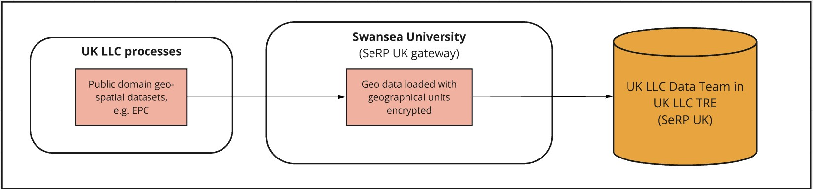

# Place-based datasets

> Last modified: 10 Dec 2024

## Introduction

Place-based data can be linked using study-provided address data or linked area indicators (e.g., linked Lower Super Output Area, LSOA). For linked place-based data that uses participant addresses, UK LLC sends address data to the same Trusted Third Party, **Digital Health and Care Wales (DHCW)**, used for health data linkage. This address data is only used for geocoding subject to study approval. All geographic identifiers in the UK LLC TRE below the region/devolved nation level are encrypted. 

**Figure 1** An overview of the flow of LPS participants' geo/environmental data into the UK LLC TRE

## Overview of Place-based Data

| **Dataset name in TRE** | **Full dataset name** | **Primary domain** | **Secondary domain** | **Data available in TRE** | **Data owner** | **Update frequency** |
|:-----------------------:|:---------------------:|:------------------:|:--------------------:|:-------------------------:|:--------------:|:--------------------:|
| annual_ave_no2_pm25     | Annual averages of NO2 and PM2.5 (UoL)   | Natural Environment             | Air Pollution          | 2010-2019                        | University of Leicester  | Annually            |
| Noise                   | Noise exposure (UoL)   | Built Environment       | Noise Exposure               | 2010-2019                         | University of Leicester  | Annually           |
| Greenspace              | Greenspace (UoL)       | Natural Environment    |                           | 2018                        | University of Leicester  | Annually             |
| AHAH                    | Access to Healthy Assets and Hazards | Built and Natural Environment | Health                  | 2022                        | Consumer Data Research Centre  | Every few years             |
| EPC                     | Energy Performance Certificates | Built Environment             | Housing                | 2008-2024                       | Department for Levelling Up, Housing and Communities (DLUHC)  | Annually             |

### Place-based Permitted Linkages

UK LLC has 4 different place-based permission flags where the LPS approves whether the following can take place:  

## 1. Geocoding of address data to property or postcode level

 What is geocoding?

Geocoding is the assigning of geographical coordinates to a location. The following address data are provided by LPS:

* **Address line 1** (Premise level)
* **Address line 2** (Street name)
* **Address line 3** (Locality name)
* **Address line 4** (Town)
* **Address line 5** (Administrative area)
* **Postcode**  

These data are then matched using a database lookup to **convert the physical address into geographical coordinates**, where permissions allow full address to flow. Where permissions are set to postcode only, only the postcode is used in the geocoding process.

 Geocoding using Experian

Addresses are verified and **geocoded to one metre accuracy using Experian QAS Batch API software programme** (formerly QAS QuickAddress Batch API Software). In summary, the QAS Batch API software geocodes address records by verifying them against the official postal addresses using **OS AddressBase Premium**. Cleaned records are then assigned a **match result** based on the accuracy of the original address. The Experian QAS geocoding process follows five main stages: External pre-processing; Match Country; Match street, PO box or organisation; Match Premises; and Select best match (see Figure 2) (Experian, 2019).

**Figure 2** The QAS Batch API process

 Unmatched addresses

If no match is achieved, the output address is returned and a ‘partial address found’ match code is assigned to the address (see Figure 3). If an address has been fully verified at premises level, it is assigned a ‘quality score’ depending on whether the address was partially matched or has multiple matches (e.g., multiple addresses identified with High Street). Lastly, a match confidence level (0 - low, 5 - intermediate, 9 - high) is allocated to each address depending on how confident the QAS Batch API is about the match it has returned. A low confidence indicates that essential matching rules were not satisfied, while intermediate confidence shows that the less important rules were not satisfied or another check failed, i.e., input address is not in the expected order (Experian, 2019). For documentation on how to interpret the Experian matchcode see the [Experian documentation](https://docs.experianaperture.io/address-validation/batch-api/api-process/address-match-codes/#k-s~match-success)

Once any interactive cleaning has been made to the returned addresses, the full input address record and filtered address record are exported for further post-processing checks, according to the following match success rating: ‘Verified and good full matches’, ‘Verified and good premise matches’ and ‘Tentative and poor full matches’. 

**Figure 3** Returned match code indicators (Experian, 2019)

 Post-processing

Post-processing checks are undertaken to ensure that the output addresses are correctly matched and returned with the relevant grid information. First, the ‘full’ returned address data are imported into ArcGIS Pro 3.0 to convert the file into SpatialPointDataFrame. This process removes any addresses with no returned coordinates. The spatial address file is then intersected with a UK Census Geography file to **add relevant Output Area (OA) and Lower Layer Super Output Area (LSOA) level information**.

## 2. Place-based information can be linked using encrypted LSOA and higher-level indicators originating from linked sources

 Linked LSOA and place-based indicators

These place-based indicators have been generated by UK LLC from open source datasets and inputted directly into the TRE via Swansea University (Figure 4). 

**Figure 4** UK LLC processed place-based datasets

The smallest level of geographic granularity for these datasets are Lower Super Output Area (LSOA) or equivalent in Scotland (Data Zone) and Northern Ireland (Super Output Area). These datasets have their geographical unit encrypted, for example, encrypted LSOA. These files can either be linked using encrypted geographic units that are LSOA and higher-level indicators originating from linked sources (e.g., that encrypted LSOA in routine NHS records are used to map temperature to participants). For example, the health record dataset, CORE_NHSD_LSOA11 which contains encrypted small area geography (LSOA) can be used to link to these place-based datasets via the encrypted LSOA.

These datasets may also come in the form of larger geographic units such as Middle Layer Super Output Area (MSOA) (England and Wales), Intermediate Zones (Scotland), Electoral Wards, Local Authority Districts, and Regions.

## 3. Linkage to natural and built environment data

 Linkage to environment data

Linkage to place-based natural and built environment datasets occurs through two different avenues. Firstly, some datasets that are Lower Super Output Area (LSOA)/equivalent and higher and relate to the natural and built environment (e.g., the Access to Healthy Assets and Hazards dataset) are inputted directly into the TRE by UK LLC via Swansea University. These datasets can be linked to the health record dataset, CORE_NHSD_LSOA11, which contains encrypted small area geography (LSOA) or linked to an encrypted small area geography code that has been derived from geocoding of a participant's address.

### Modelled Geospatial Exposure Data

The second source of place-based natural and built environment data is through linkage to 3 geospatial exposure datasets modelled by University of Leicester/City St George's, University of London which include: Air pollution, Noise exposure, and Greenspace. For these 3 datasets to be linked, DHCW sends participants' address information, where permissions allow, to **University of Leicester (UoL)**, who have been commissioned by UK LLC to model environmental exposure estimates. Before data are sent to UoL, UK LLC prepares a batch of 'masking' addresses. See figure 1 for an overview of the data flow. 

### Masking Addresses

The masking addresses are true addresses, but they do not necessarily belong to Longitudinal Population Study (LPS) participants. They are generated by UK LLC at a ratio of 3:1 (masking:real) to **minimise the disclosure risk** associated with location-based information and **appended to the real addresses at DHCW** before they are supplied to UoL. The masking addresses are proportionally selected (at random) from **Ordnance Survey (OS) AddressBase Plus** based on key attributes about the LPS that have participants with permission to link. The key attributes include the number of participants, age of cohort, and spatial buffers aligned with their catchment areas. This allows the masking addresses to more accurately represent the UK LLC population as a whole. Therefore, LPS with geographically constrained populations (e.g., EXCEED (Leicester)) drive the generation of more masking addresses around the Leicester area. 

There are currently **eight LPS that allow participants to be linked to geospatial measures** generated by **University of Leicester (UoL)**. These permissions are configurable to allow linkage at the **household level using Unique Property Reference Number (UPRN)** or to the **postcode level**. Where postcode level is selected, the nearest household (UPRN) to the centre of the postcode centroid is geocoded. The locations for these participants are therefore not as precise as those that are geocoded to the household level. When geocoding the household (UPRN), the central property coordinate is used.

Once geocoding has been completed, UoL stores the geocoded information to be linked to the Air pollution, Noise exposure, and Greenspace datasets.

## 4. Linkage to property-level data

 Linkage to property-level data

Linkage to property-level datasets occurs through two different avenues. Firstly, some datasets that are open source and at UPRN level (e.g., Energy Performance Certificates) are inputted directly into the TRE by UK LLC via Swansea University. DHCW sends participants' address information, where permissions allow, to **University of Leicester (UoL)**. Before data are sent to UoL, UK LLC prepares a batch of 'masking' addresses. See Figure 1 for an overview of the data flow and Section 3 for more information on the process to mask addresses. 

There are currently **eight LPS that allow participants to be linked to geospatial measures** generated by **University of Leicester (UoL)**. These permissions are configurable to allow linkage at the **household level using Unique Property Reference Number (UPRN)** or to the **postcode level**. Where postcode level is selected, the nearest household (UPRN) to the centre of the postcode centroid is geocoded. The locations for these participants are therefore not as precise as those that are geocoded to the household level. When geocoding the household (UPRN), the central property coordinate is used. 

Once geocoding has been completed, UoL stores the geocoded information to be linked to the UK LLC inputted UPRN/household level datasets.

## Bespoke Place-based datasets
We are currently in the process of adding new place-based datasets into the TRE. When inputting new linked place-based data into the TRE we conduct a rigourous statistical disclosure control risk assessment. As part of the risk assessment we perform tranformations/aggregation of variables to minimise disclosure risk. If you require specific variables in their original form or at a higher level of granularity please contact **support@ukllc.ac.uk** Please note that bespoke place-based datasets might be subject to costing.

 

