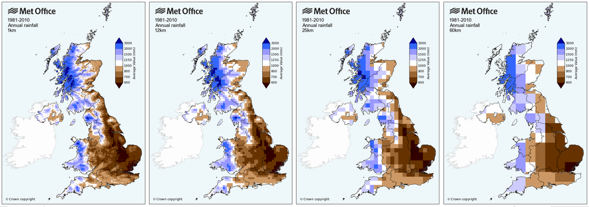

# Understanding: Met Office Datasets

>Last modified: 08 Oct 2026

<strong>UK LLC provides a version of the Met Office HadUK-Grid Gridded Climate Observations dataset, aggregated to Census Lower Super Output Area level (or equivalent). </strong>

 

The original [HadUK-Grid](https://eur02.safelinks.protection.outlook.com/GetUrlReputation) dataset from the Met Office is a collection of gridded climate variables derived from the network of UK land surface observations [(Met Office, 2019)](https://rmets.onlinelibrary.wiley.com/doi/10.1002/gdj3.78) .The original data have been interpolated from meteorological station data onto a uniform grid to provide complete and consistent coverage across the UK. This dataset covers the UK and has been aggregated to Census Lower Super Output Area Level (or equivalent) and spans the period from 2010-2024. The data have been produced for monthly and annual timescales. The variables included in the dataset are: air temperature (maximum, minimum and mean), precipitation, sunshine, mean sea level pressure, wind speed, relative humidity, vapour pressure, days of snow lying, and days of ground frost.  

### Methodology

Detailed information on how the original [HadUK-Grid dataset](https://www.metoffice.gov.uk/research/climate/maps-and-data/data/haduk-grid/haduk-grid) has been created by the Met Office and can be found in the following publication, [(Hollis et al., 2019)](https://rmets.onlinelibrary.wiley.com/doi/10.1002/gdj3.78).

The original gridded datasets were created by the Met Office by interpolating in situ land surface, station observations, such as maximum air temperature or precipitation amount, from conventional climate observing stations. A full list of the variables in the datasets and their accompanying definitions can be found in **Table 1**.

**Table 1** Summary of variables available in the HadUK-Grid dataset and their accompanying definitions.

| Variable | Name | Definition |
|----------|------|------------|
| tasmax | Maximum air temperature | Maximum air temperature measured between 09:00 UTC on day D and 09:00 UTC on day D + 1 (°C) |
| tasmin | Minimum air temperature | Minimum air temperature measured between 09:00 UTC on day D - 1 and 09:00 UTC on day D (°C) |
| tas | Mean air temperature | Average of daily maximum and minimum temperature |
| rainfall | Precipitation | Total precipitation amount measured between 09:00 UTC on day D and 09:00 UTC on day D + 1 (mm) |
| sun | Sunshine duration | Duration of bright sunshine during the month, season or year (hours) |
| sfcWind | Mean wind speed at 10 m | Average of hourly mean wind speed at a height of 10 m above ground level over the month, season or year (knots) |
| psl | Mean sea level pressure | Average of hourly (or 3 hourly) mean sea level pressure over the month, season or year (hPa) |
| hurs | Mean relative humidity | Average of hourly (or 3 hourly) relative humidity over the month, season or year (%) |
| pv | Mean vapour pressure | Average of hourly (or 3 hourly) vapour pressure over the month, season or year (hPa) |
| groundfrost | Days with ground frost | Count of days when the grass minimum temperature is below 0°C (days) |
| snowLying | Snow lying | Count of days with >50% of the ground covered by snow at 09:00 UTC (days) |

The majority of the station data were extracted from the Met Office's Integrated Data Archive System (MIDAS) [(Met Office, 2012)](https://rmets.onlinelibrary.wiley.com/doi/10.1002/gdj3.78#gdj378-bib-0004). The number of stations used as input to the gridding varies with time, partly due to changes in the size of the observing network and partly due to the availability of digitised data [Met Office, 2026](https://www.metoffice.gov.uk/research/climate/maps-and-data/data/haduk-grid/faq). Indicative numbers of stations available through the 1981–2010 period are provided in **Table 2**.

**Table 2** Number of stations used to generate long-term average grids. Source: Hollis et al., [(2019)](https://rmets.onlinelibrary.wiley.com/doi/10.1002/gdj3.78) reproduced from Kendon et al. [(2019)](https://rmets.onlinelibrary.wiley.com/doi/10.1002/gdj3.78#gdj378-bib-0001). 

| Climate variable | Average number of station values per monthly long-term average grid (1981–2010) | Average number of station values per monthly grid over period 1981–2010 |
|------------------|----------------------------------------------------------------------------------|-------------------------------------------------------------------------|
| Air temperature  | 1,203                                                                            | 545                                                                     |
| Rainfall         | 9,547                                                                            | 3,857                                                                   |
| Sunshine         | 611                                                                              | 226                                                                     |

**Census Lower Super Output Area Level (or equivalent)**

The original Met Office HadUK-Grid Gridded Climate Observations dataset was developed using 1km grids. UK LLC has produced versions of the dataset at Lower Super Output Area (LSOA), Data Zone (DZ) and Super Output Area (SOA). The  HadUK-Grid data was sampled at the population-weighted centroid of each LSOA/equivalent. For the 99 centroids of the LSOAs that were slightly outside of a 1km grid, the sample point was the centroid of the 1km grid cell nearest to the LSOA centroid [(Datadaptive, 2022)](https://www.datadaptive.com/docs/Climate%20Observations%20for%20Small%20Areas%20-%20User%20Guide.pdf).

## Caveats:

* UK LLC has taken reasonable care in preparing this dataset and aggregating the data to LSOA/equivalent level. However, the accuracy and completeness of the variables depend on the quality of the underlying source data and the methods used to process the data. 

* For the original Had-UK grid data, an indication of the quality and accuracy of the grid values has been provided by the Met Office by the root-mean-square Errors (RMSE) at verification stations. The RMSE values for the grids can be found as part of the documentation published on their [website](https://www.metoffice.gov.uk/research/climate/maps-and-data/data/haduk-grid/faq). 

* The [Met Office](https://www.metoffice.gov.uk/research/climate/maps-and-data/data/haduk-grid/faq) conducts quality control processes which corrects and removes erroneous data from the station observations used to produce the grids. They have also conducted additional checks to compare the station observations to the earlier [UKCP09 gridded dataset](https://catalogue.ceda.ac.uk/uuid/87f43af9d02e42f483351d79b3d6162a) in order to inform decisions to remove any remaining questionable historical data. However, the Met Office have not made an attempt to homogenise the input data. 

## Limitations:

* As outlined by Perry and Hollis [(2005)](https://rmets.onlinelibrary.wiley.com/doi/10.1002/joc.1161) the accuracy of the HadUK-Grid data varies and is dependent on the nature of the variable and the representativity of the station network. For example, errors will be highest in areas of sparse station coverage such as the Scottish Highlands where there are also areas of complex mountainous terrain.  

* The [Met Office](https://www.metoffice.gov.uk/blog/2026/haduk-grid-assessing-the-uks-climate-over-time) has highlighted the limitation that the density of weather observations varies across the country and has changed over time, in particular earlier periods generally contain fewer observations. Nevertheless, the Met Office has constructed the datasets to manage these issues as effectively as scientifically possible. 

* A new version of the HadUK-Grid dataset is released each year, as well as adding data for new calendar years additional changes can occur between dataset versions including for example: additional of newly digitised data, correction of corrupted or incorrect data and methodological updates. As a result, values can change slightly between dataset versions.  Updates between versions can be found on the [CEDA Archive website](https://catalogue.ceda.ac.uk/uuid/4dc8450d889a491ebb20e724debe2dfb/).

## Met Office HadUK-Grid Gridded Climate Observations dataset visualisation

**Figure 1** UK gridded climate observations (HadUK‑Grid) at 1 km resolution for temperature and rainfall, 1981-2010 derived from Met Office station data and interpolated across the UK. **Source:** https://www.metoffice.gov.uk/research/climate/maps-and-data/data/haduk-grid/overview

