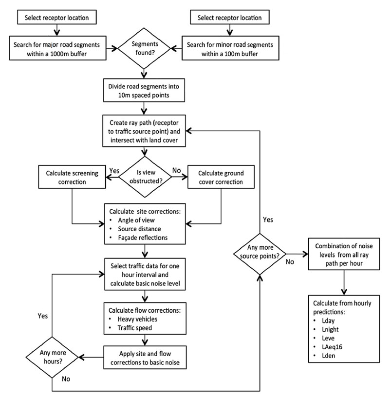

# Understanding: Noise pollution

>Last modified: 21 Jul 2025

<strong> </strong>UK LLC provides modelled road-traffic noise estimates using the CNOSSOS-EU framework, incorporating traffic volumes, speeds, land cover, building heights and environmental conditions.
  
 

## Common framework for noise assessment methods (CNOSSOS-EU) noise modelling

Modelled road-transport noise estimates have been calculated by University of Leicester/City St George’s, University of London in accordance with the ‘Common framework for noise assessment methods’ (CNOSSOS-EU) framework, developed by the European Commission (2002/49/EC). These noise propagation algorithms are implemented in PostgreSQL via the PostGIS v2.1 extension, following the protocol described in [Gulliver et al (2015)](https://doi.org/10.1016/j.envsoft.2014.12.022) and [Morley et al (2015)](https://doi.org/10.1016/j.envpol.2015.07.031). 

Annual Average Daily Traffic (AADT) counts and traffic speeds across the UK road-network in 2013 enter the model, along with information relating to the surface roughness of land cover, building heights, wind profiles and average temperatures. The road-transport noise estimates for 2013 are then scaled to other years by considering the average change in AADT at a Local Authority level, using traffic count sites recorded in the [Department for Transport’s regional traffic statistics](https://roadtraffic.dft.gov.uk/regions) dataset.

### Methodology

Modelled road-transport noise estimates are calculated in accordance to the ‘Common framework for noise assessment methods’ (CNOSSOS-EU) framework, developed by the [European Commission (2002/49/EC)](https://www.researchgate.net/publication/280894153_Common_noise_assessment_methods_in_Europe_CNOSSOS-EU). For the purposes of this study, the CNOSSOS-EU model algorithms are to be implemented in PostgreSQL via the PostGIS v2.1 extension, following the protocol described in [Morley et al (2015)](https://doi.org/10.1016/j.envpol.2015.07.031).

In brief, the coordinates of each receptor are assigned to the closest building. The building façade that is likely to experience the most noise levels is identified by considering the proximity and vehicle counts on nearby roads, and a receptor (point) is placed 1m away from the building. A GIS operation locates all major roads within a 1000m radius and all minor roads within a 100m radius of each receptor. These roads are then divided into a series of source points at 20m intervals along each road segment. Next, rays are projected from the receptor point to each source point as a direct path and the land cover types and buildings along this line are ascertained. For each ray path in turn, the noise level at each source point can be calculated using traffic flow data and the empirical relationships defined by CNOSSOS-EU. Following this, the receptor noise level is estimated according to the specific environments along the ray path and the CNOSSOS-EU sound propagation algorithms. 

The reported noise estimates are ‘A’ Frequency Weighted. The ‘A’ Weighting is standard weighting of the audible frequencies designed to reflect the response of the human ear to noise (between 500 Hz and 6 kHz):

* **Lday** is the A-weighted equivalent noise level (Leq) over the 12-hour day period (07:00-19:00), also known as the day noise indicator.
* **Levening** is the A-weighted equivalent noise level (Leq) over the 4-hour evening period 19:00-23:00 hours, also known as evening noise indicator.
* **Lnight** is the A-weighted equivalent noise level (Leq) over the 8-hour night period of 23:00 to 07:00 hours, also known as the night noise indicator.
* **LAeq16** is the A-weighted equivalent noise level (Leq) over the 16-hour day period of 07:00 to 23:00 hours.
* **Lden** is the A-weighted equivalent noise level (Leq) over a whole day, but with a penalty of +10 dB(A) for night-time noise (22:00-07:00) and +5 dB(A) for evening noise (19:00-23:00). Also known as the day-evening-night noise indicator.

The workflow of the CNOSSOS-EU model is described in Figure 1, adapted from Gulliver et al [(2015)](https://doi.org/10.1016/j.envsoft.2014.12.022):

**Figure 1: CNOSSOS-EU noise modelling workflow**

## Caveats: 

- The model does not include elevated road sections (e.g flyovers, bridges). 

- There is no information included in Traffic Noise Exposure model(TRANEX) on existing [noise barriers](https://www.sciencedirect.com/topics/earth-and-planetary-sciences/noise-barrier).

- Noise levels have been calculated at a single [facade](https://www.sciencedirect.com/topics/engineering/facades) that is closest to the nearest main road for each dwelling. Noise is modelled at one point per building due to time constraints in modelling such a large number of locations. Thus, the model may have misclassified exposures for other façades (i.e. rooms) within dwellings. 

## Limitations:  

- The model is not ‘dynamic’ in terms of representing varying vehicle speeds along road links. Others (Guarnaccia, 2013, Iannone et al., 2013) have shown that noise levels are different around road intersections (acceleration/deceleration) than at mid-block (i.e. the free-flowing section of a road link) for the same volume of traffic, which means that the model may have variable errors in modelled noise levels associated with changes in vehicle speeds along road links relative the average vehicle speeds that we have applied.

- Further information on the strengths and limitations of the model are outlined in [Gulliver et al (2015)](https://doi.org/10.1016/j.envsoft.2014.12.022).

 