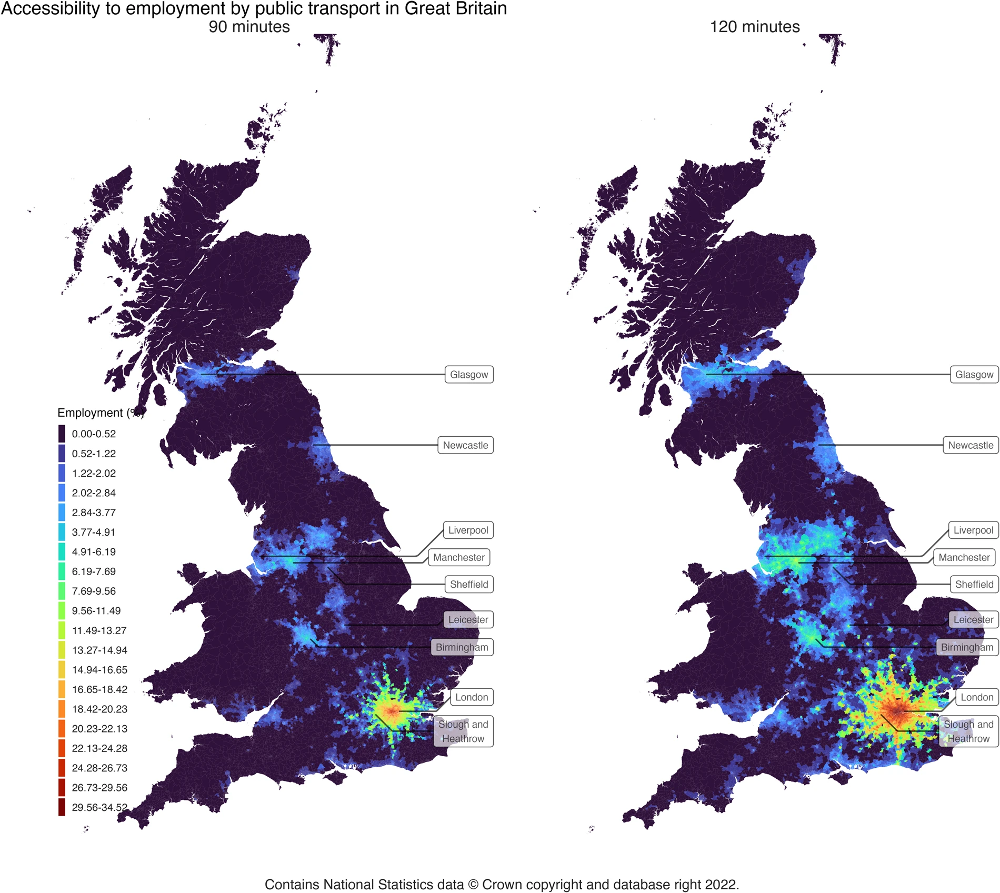

# Understanding: Public Transport Accessibility Indicators 

>Last modified: 08 Oct 2026

<strong>The Public Transport Accessibility Indicators dataset offers indicators to a key range of services, namely: employment, general practices (GP), hospitals, supermarkets, primary schools, secondary schools, and urban centres.</strong>

 

The dataset offers [Public Transport Accessibility Indicators for Great Britain](https://zenodo.org/records/8037156) aggregated by 2011 statistical geographies to a range of key services including: employment, general practices (GP), hospitals, supermarkets, primary schools, secondary schools, and urban centres. The original accessibility indicators were estimated for all 41,729 Lower Super Output Areas (LSOA) in England and Wales and Data Zones (DZ) in Scotland. This dataset contains the Public Transport Accessibility Indicators as quintiles.

### Methodology

Detailed information on how the original Public Transport Accessibility Indicators dataset was created by Verduzsco Torres and McArthur (2024) can be found in the [following publication](https://www.nature.com/articles/s41597-023-02890-w)

* Verduzsco Torres and McArthur [(2022)](https://zenodo.org/records/8037156) represented the transportation origins as LSOA/DZ population-weighted centroids based on the boundaries defined for the 2011 Census. 

* The LSOA centroids for England and Wales were sourced from the Office for National Statistics (ONS) via the [UK Government open data portal](https://data.gov.uk/) on 2021-12-12 (version last updated on 2019-12-21).  

* The DZ centroids for Scotland were sourced from the Scottish Government via the [UK Government’s open data portal](https://data.gov.uk/) (version last updated on 2021-03-26). 

**Table 1** Summary of groups of variables available in the Public Transport Accessibility Indicators dataset available within the UK LLC Trusted Research Environment and their definition

| Variable group         | Measure                                                  | Description |
|------------------------|----------------------------------------------------------|-------------|
| Employment             | Cumulative: time cut 15, 30, 45, 60, 75, 90, 105, 120   | Number of employment positions within N minutes by public transport (presented as quintiles) |
| GPs                    | Cumulative: time cut 15, 30, 45, 60, 75, 90, 105, 120   | Number of GPs within N minutes by public transport (presented as quintiles) |
| GPs                    | Minimum travel time                                      | Closest LSOA/DZ that contains at least one GP (presented as quintiles) |
| Hospitals              | Cumulative: time cut 15, 30, 45, 60, 75, 90, 105, 120   | Number of hospitals within N minutes by public transport (presented as quintiles) |
| Hospitals              | Minimum travel time                                      | Closest LSOA/DZ that contains at least one hospital (presented as quintiles) |
| Primary schools        | Cumulative: time cut 15, 30, 45, 60, 75, 90, 105, 120   | Number of primary schools within N minutes by public transport (presented as quintiles) |
| Primary schools        | Minimum travel time                                      | Closest LSOA/DZ that contains at least one primary school (presented as quintiles) |
| Secondary schools      | Cumulative: time cut 15, 30, 45, 60, 75, 90, 105, 120   | Number of secondary schools within N minutes by public transport (presented as quintiles) |
| Secondary schools      | Minimum travel time                                      | Closest LSOA/DZ that contains at least one secondary school (presented as quintiles) |
| Main built up area     | Minimum travel time                                      | Closest city (presented as quintiles) |
| Suburban built up area | Minimum travel time                                      | Closest greater city (presented as quintiles) |
| Supermarkets           | Cumulative: time cut 15, 30, 45, 60, 75, 90, 105, 120   | Number of supermarkets within N minutes by public transport (presented as quintiles) |
| Supermarkets           | Minimum travel time                                      | Closest LSOA/DZ that contains at least one supermarket (presented as quintiles) |

**Public transport accessibility indicators were calculated using location-based measures:** 

- Cumulative accessibility (used if a service can be easily replaced or they compete with each other (e.g., employment, groceries)): 

    ***The total number of services or opportunities that can be reached within a given travel time.***  

- Dual or travel time to the nearest facility (used if a service cannot be easily interchanged or is scarce): 

    ***The travel time to the closest service, e.g. to the main urban centre or hospital.***

**Public transport travel times:**

Verduzsco Torres and McArthur [(2024)](https://www.nature.com/articles/s41597-023-02890-w) estimated public transport travel times between each origin and all potential destinations, represented by population-weighted Lower Super Output Areas/ Data Zone centroids, to form a complete origin and destination travel time matrix.

- Journeys were simulated for a typical weekday during the morning peak (Tuesday 22 November 2021), with departure times spanning a three‑hour window from 07:00 to 10:00. 

- Door‑to‑door travel times account for walking access and egress, initial waiting time, in‑vehicle travel time, transfers between services, and walking‑only journeys where these provided the earliest arrival. 

- Road and pedestrian networks were derived from OpenStreetMap data for Great Britain, downloaded in PBF format from Geofabrik on 22 November 2021. 

- Public transport timetables were sourced from the Bus Open Data Service in GTFS format and from the Rail Delivery Group in CIF format, with rail data converted to GTFS using the UK2GTFS R package. 

- Travel times were computed using the r5r package (version 0.6.0) for R, which interfaces with the R5 multimodal open‑source routing engine. 

- Variability in travel times within the departure window was captured using multiple departure simulations, with results summarised as percentiles and the median (50th percentile) used for accessibility calculations. 

## Caveats:

* Within the modelling framework Verduzsco Torres and McArthur [(2024)](https://www.nature.com/articles/s41597-023-02890-w) have included walking-only journeys, as walking access and egress distances are unconstrained, provided the maximum travel time of 120 minutes is not exceeded. A small proportion of the routes (approximately 0.3%) are completed entirely on foot, which might marginally overstate public transport accessibility in areas with limited services. The walking speed has been set at 4.8 km/h and results are therefore sensitive to assumptions about pedestrian mobility. 

* While accessibility measures are often used as equity indicators, they capture potential access at the area level but do not account for individual constraints such as income, disability or caring responsibilities. 

## Limitations:

* The location-based accessibility measures have been calculated at LSOA and Data Zone level and therefore, like any spatially aggregated measure, are susceptible to the Modifiable Areal Unit Problem (MAUP). Consequently, larger zones, especially in rural areas are likely to introduce additional measurement error and further internal heterogeneity of the population and the features represented by each unit. Results should therefore be interpreted cautiously, especially when drawing comparisons between urban and rural areas [(Verduzsco Torres and McArthur, 2024)](https://www.nature.com/articles/s41597-023-02890-w). 

* The maximum travel time allowed is limited to 120 minutes, regardless of the distance travelled and the maximum number of in-vehicle rides is set to three [(Verduzsco Torres and McArthur, 2024)](https://www.nature.com/articles/s41597-023-02890-w). Therefore, longer or more complex journeys are excluded which could potentially underestimate accessibility in poorly connected areas. 

* The indicators measure potential access to services, but do not include measures of service quality, opening hours, capacity or affordability. 

* The employment data exclude some worker categories such as voluntary workers, self-employed, and those who do not pay their taxes on pay as you earn (PAYE) basis [(Verduzsco Torres and McArthur, 2024)](https://www.nature.com/articles/s41597-023-02890-w). This may bias accessibility to jobs in areas with higher informal or self-employed work. 

* The supermarket locations have been derived from an OpenStreetMap open-source dataset, which Verduzsco Torres and McArthur [(2024)](https://www.nature.com/articles/s41597-023-02890-w) estimate to capture 80% of locations compared to commercially obtained Ordnance Survey data. 

## Accessibility to employment by public transport in Great Britain

**Figure 1** Visualisation of public transport accessibility indicator to employment as percent of the total for 90 minutes and 120 minutes. **Source:** Public transport accessibility indicators to urban and regional services in Great Britain by J. Rafael Verduzco Torres and David P. McArthur, published in Scientific Data (2024). Data source: Urban Big Data Centre. Licensed under CC BY 4.0. Available at: https://www.nature.com/articles/s41597-023-02890-w.

