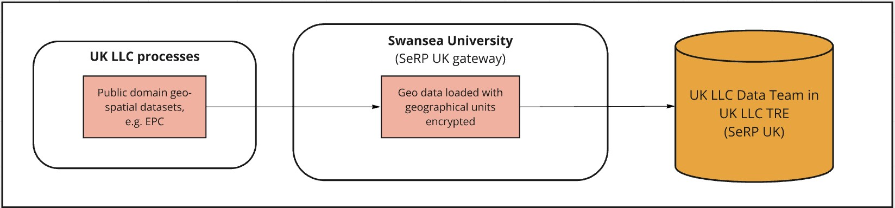

# Processing and linkage to place-based datasets 

>Last modified: 21 Jul 2025

<strong>UK LLC securely links study participants’ addresses with environmental data using a method that keeps personal and location data separate.</strong>
  
 

## Flow of place-based data into the UK LLC TRE 

Flows of data from contributing Longitudinal Population Studies (LPS) and place-based data are conducted through a ‘split file’ protocol, where the flow of LPS participants’ addresses (File 1s) is entirely separate from the flow of place-based datasets (File 2s) - see Figure 1. Place-based datasets are updated at the frequency specified on the individual dataset-level pages.

**Figure 1.** An overview of the flow of place-based data into the UK LLC TRE.

## Processing and risk assessment for place-based data
Place-based datasets flow into the UK LLC TRE by one of two pathways:

1. The first pathway is for datasets that are developed by agreed partners and linked at address level. For these datasets to be linked, the participants’ addresses provided by the LPS must first be pooled with masking addresses and then geocoded. Our current partner for air pollution, greenspace, and noise modelled data is City St George's, University of London.

Find out more about partner-generated datasets

- We ask each LPS to send address data to our Trusted Third Party, NHS Digital Health and Care Wales (DHCW), along with the permission flags that indicate LPS/participant approvals for place-based linkages.

- Our TRE, provided by SeRP UK, is introducing new functionality to enable DHCW to clean and geocode address data. DHCW uses specialist linkage software to match LPS addresses to a clean master file of all addresses. This happens entirely within DHCW and is carried out by DHCW staff who already hold the address data.

- This geocoding process produces cleaned UPRN (property ID), postcodes, and LSOAs/equivalent (area IDs). It also produces coordinate equivalents (either the central point of the property or the central point of the postcode or LSOA). This is linked to encrypted versions of the participant ID included in File 1s.

- DHCW will pool all (current and historical) address data at the appropriate resolution* for the task from all LPS (subject to permissions). This will generate a file including only an encrypted version of the participant ID and the address; it will not include any other identifiers or data. This will be filtered to exclude participants who have objected to this use of their data (as indicated in the File 1 permission flags).

>*"Appropriate resolution" means we will send the least granular data needed to undertake the linkage, e.g., if a place-based linkage is >based on LSOA, then we would only send LSOA, not full address.

- UK LLC will generate a list of 'masking' addresses — these are real addresses (UPRNs, LSOA, coordinates) sampled from across the UK, and are purposefully sampled to replicate LPS sample distributions (e.g., oversampling in Bristol and Bradford) and sampled for high-risk identifiability geographies (e.g., every inhabited UK island has masking addresses sampled to mitigate for outlier participants). UK LLC sends these to DHCW, who add them to the pooled address data at a 1:3 case:control ratio. DHCW generates new randomised encrypted participant IDs for these masking cases.

- DHCW sends the pooled and masked addresses to agreed partners to add the geocoding data.

- The place-based modeller assigns the environmental exposure estimate to the full list of pooled and masking addresses. The resulting file has the address removed, leaving only the encrypted participant ID and environmental exposure. Disclosure risk assessment is undertaken to ensure that the exposure data is not a proxy ID for a real-world location (i.e., it cannot be used as a look-up to identify participants in online databases).

- This is sent as a File 2 into SeRP. SeRP uses an ID mapping file generated by DHCW to map the encrypted participant ID used by the place-based modeller to the encrypted participant ID used in UK LLC. The resulting file of UK LLC ID + environmental exposure is deposited in the UK LLC TRE.

- UK LLC can then identify and remove the masking cases because the ID of the masking case does not match any real encrypted participant ID in UK LLC.

- Additional disclosure control and QC checks are made. The data are then added to the UK LLC database, documented, and made available for research.

  
2. The second pathway is for datasets that are pre-processed by UK LLC. They are at either household level or higher geographical units (e.g., LSOA/equivalent). 
These datasets undergo data cleaning and risk disclosure checks before being ingested into the TRE.  

Find out more about UK LLC pre-processed datasets

The place-based datasets that UK LLC has pre-processed are either open sources or obtained through data sharing agreements with third parties.

Disclosure risk assessment is undertaken to ensure that the exposure data is not a proxy ID for a real-world location (i.e., it cannot be used as a look-up to identify participants in online databases). Data transformation is conducted to reduce risk while still maintaining utility.

If the geographic unit of the dataset is LSOA/equivalent or higher, the datasets can be sent as File 2s directly into SeRP. The geographic unit is encrypted and can then be linked to the encrypted geographical unit assigned to participants in the TRE.

If the geographic unit of the dataset is UPRN level, the datasets are sent to DHCW and processed in the same way as ‘partner-generated datasets’. For more information, please see the associated dropdown.

## LPS participants can opt out of linkage to place-based data

* LPS can send quarterly updates of their File 1s (participant identifiers and permission flags) to DHCW. If a participant has decided to opt out of UK LLC altogether, or to opt out of linkage to place-based data, or conversely has decided to opt into linkage to place-based data, their instructions are communicated to DHCW. 

* If a participant does not want their data linked to place-based data, they should contact the LPS directly to check what permissions are in place (not all LPS have permissions in place to link to place-based data). Once a participant has asked to opt out of place-based linkage, no further place-based data about them will flow into the UK LLC TRE, and the participant’s data will not be provisioned to new research projects. 

* Researchers who already have access to that individual’s information will be permitted to retain that access until the end of the project, but they will not obtain any new data about that individual.

Find out more about place-based permissions

UK LLC has four different place-based permission flags that are specified by each LPS in their File 1s sent to DHCW. These include flags specifying if the LPS approves:

a. `Geocoding_Permission`: address data can be geocoded to property or postcode level.

b. `Small_Area_Permission`: place-based information can be linked using encrypted LSOA and higher-level indicators originating from linked sources.

c. `Environment_Permission`: UK LLC can link different sources of natural and built environment data, subject to prior notification to individual LPS.

d. `Property_Level_Permission`: UK LLC can generally link different sources of property-level data, subject to prior notification to each LPS.

**Example permissions for specific datasets:**

- **Air pollution**: flags A, C, D. The place-based modeller geocodes the addresses and then allocates nationally modelled spatial exposure estimates.

- **Energy Performance Certificates**: flags A, C, D. UK LLC derives Unique Property Reference Numbers (UPRNs) from addresses and links to property-level certificates.

- **Access to Healthy Assets and Hazards**: flags B, C. This dataset is at LSOA level and relates to the natural and built environment. UK LLC can derive LSOA from routine NHS records if the appropriate permissions are in place.

- **Index of Multiple Deprivation, Urban/Rural, Population Density**: flags B, C. This dataset is at LSOA level/equivalent, which can be derived from routine NHS records and relates to the environment.

- **Live Births**: flag B. This dataset is at Local Authority level, which can be derived from routine NHS records.

