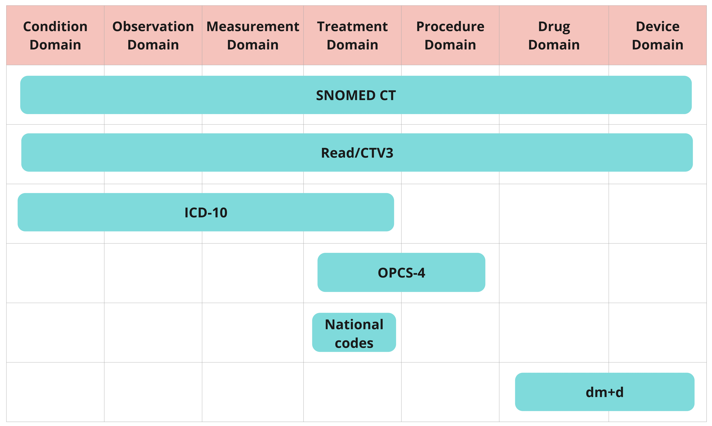

# Coded variables in NHS England datasets
>Last modified: 01 Dec 2025

<strong>Clinical classification systems are used to code information collected about patients in the NHS England datasets.</strong>

 

Codes are used for a range of **statistical, clinical** and **management purposes**, e.g. by Integrated Care Boards (ICBs) to reimburse hospitals for the care they have provided.

The main **clinical classifications** mandated by NHS England are **SNOMED CT, ICD-10 and OPCS-4**. However, you'll also find **Read codes**, **NHS national codes**, **dm+d codes** and **non-clinical classifications** in the datasets. The clinical domains covered by these different systems vary, as shown in Figure 1 below.

In **hospital settings**, specialist clinical coders translate medical information in patients' case notes into codes **post-discharge**. In **other settings**, clinicians directly record information in the electronic patient record (EPR) at the **point of care**.

**Figure 1** Scopes of the clinical classification systems used in NHS England datasets
**Note**: Figure 1 is adapted from the Bennett Institute for Applied Data Science's blog: <strong><a href="https://www.bennett.ox.ac.uk/blog/2023/06/an-introduction-to-clinical-codes-and-terminology-systems/" target="_blank" rel="noopener noreferrer">An Introduction to Clinical Codes and Terminology</a></strong>
## Classification systems

Table 1 lists the systems used in each NHS England dataset in the UK LLC TRE. Beneath the table we summarise the key aspects of each system. For the datasets marked with an asterisk (*) and in italics, you [**must submit a clinical code list**](../Coding/codelists.md) alongside your data request when you apply to access data in the UK LLC TRE.

**Note:** The information in the table was obtained from the NHS England API, apart from DEMOGRAPHICS and MORTALITY - for these two datasets information was obtained from the <strong><a href="https://digital.nhs.uk/services/data-access-request-service-dars/dars-products-and-services/metadata-dashboard" target="_blank" rel="noopener noreferrer">NHS England Metadata dashboard</a></strong> We are aware that the information from the API is not comprehensive and in due course we will update this table accordingly.

  \
**Table 1** Classification systems used in NHS England datasets
| **Dataset name in TRE** | **SNOMED CT** | **READ** | **ICD-10** | **ICD-9** | **OPCS-4** | **National codes** | **dm+d** | **ODS** | **Local** | **Other** |
|---|:---:|:---:|:---:|:---:|:---:|:---:|:---:|:---:|:---:|:---:|
| ****HESOP***|&cross;|&cross;|&check;|&cross;|&check;|&check;|&cross;|&cross;|&cross;| &check; |&cross;
| ****HESAPC*** | &cross;|&cross;| &check;|&cross; | &check;| &check; | &cross;|&cross;|&cross; |&check; |&cross;
| ****HESAE*** |&cross;|&cross;|&cross;|&cross;|&cross;| &check;|&cross; | &cross; |&cross; |&cross; |
| **ECDS** | &check;| &cross;|&cross;| &cross;| &cross;| &check; | &cross;| &check;| &cross;|&cross;|&cross;
| **NPEX** | &cross;|&cross;|&cross;|&cross;| &cross;|&cross;|&cross;| &cross; | &check;|    &cross;       |
| **COVIDSGSS**| &cross;|&cross;|&cross;|&cross;| &cross;| &cross; |&cross;| &check;| &cross; |   &cross; |
| **CHESS**|&cross;|&cross;|&cross;|&cross;|&cross;|&cross;|&cross;| &check;|&cross;|&cross;|
| **CVAR** | &check;|&cross;|&cross;|&cross;|&cross;|&cross;  |&cross;| &cross;|&cross;|&cross;|
| **CVS** | &check;|&cross;| &cross;|&cross;|&cross;| &cross;|&cross;|&cross;|&cross;|&cross;|
| **IELISA** |&check;|&cross;|&cross;|&cross;|&cross;|&cross;|&cross;|&check;|&cross;|&cross;|
| **MHSDS** |&check;|&check;|&check;|&cross;|&check;|&check;|&cross;|&cross;|&cross;|&cross;|
| **IAPT**|&check;| &cross;| &check;|&cross;| &cross;| &check; | &cross; | &check; |&cross;| &cross; |
| ****GDPPR***  | &check;| &cross; |&cross;|&cross;| &cross;| &check; | &check;| &check;|&cross;| &cross;|&cross;
| ****PCM***| &cross; | &cross; | &cross; | &cross;| &cross; |  &cross;| &check;| &check;|  &cross; |&cross;|
| **CSDS**  | &check; | &check;| &check;|&cross; |&cross;| &check; |&cross;| &check;| &cross;| &cross;|
| **MSDS** | &check; | &check; | &check; | &cross; |&check; | &check;| &cross; | &check; |  &cross; | &cross; | &cross;
| ****CANCER*** | &cross; |&cross; | &check;| &check;|&cross;| &cross; | &cross; | &check;| &cross; |&cross; |
| **MORTALITY** |  &cross;| &cross; | &check; | &check; | &cross;| &cross; | &cross;| &cross;| &cross;| &cross;|&cross;
|**DEMOGRAPHICS** |  &cross; | &cross; | &cross;| &cross;| &cross; | &cross; | &cross;| &cross;| &cross;| &cross; |
|  |  |  |  |  |  |  |  |   |

 ## Clinical classifications
**SNOMED CT:**  Systematized Nomenclature of Medicine Clinical Terms (SNOMED-CT) is an international system used to classify many types of medical data, including diagnoses, procedures, symptoms, family history, assessment tools, observations and medications. The UK edition of SNOMED CT contains the UK extensions, which include UK-specific screening procedures and assessment scales. In contrast to OPCS-4 and ICD-10, SNOMED CT is designed for direct management and care of patients. Codes are in numeric format, e.g. '85189001' represents ‘Acute appendicitis’. All NHS healthcare providers in England must now use SNOMED CT for capturing clinical terms within EPR systems. <strong><a href="https://termbrowser.nhs.uk/?" target="_blank" rel="noopener noreferrer">Click here to browse SNOMED CT codes</a></strong>.

**Read/CTV3:** Read/Clinical Terms Version 3 (CTV3) codes are classed by NHS England as a deprecated standard that should be replaced by SNOMED CT. They were used in England in primary care until around 2018 and they were permitted for use in secondary care, including mental health care settings, until March 2020. SNOMED CT was formed by a merger of Read codes with SNOMED RT (the original SNOMED Reference Terminology). Read codes are in alphanumeric format. NHS England no longer supports a browser.

**ICD-10:** World Health Organization’s International Classification of Diseases (ICD), version 10, is used to classify diagnosis information. Codes are in alphanumeric format, e.g. 'K351' represents 'Acute appendicitis'. ICD-9 was superseded in 1995 by ICD-10. ICD-11 officially came into effect in January 2022, but is not expected to be mandated across the NHS until April 2026. <strong><a href="https://classbrowser.nhs.uk/#/" target="_blank" rel="noopener noreferrer">Click here to browse ICD-10 codes</a></strong>

**OPCS-4:** Office of Population Censuses and Surveys (OPCS), 4th revision, is used to classify treatments and procedures in the UK. Codes are in alphanumeric format, e.g. 'H01' represents 'Emergency excision of appendix'. OPCS-4 is updated every three years; the current version is OPCS-4.10, which was implemented across the NHS in April 2023. <strong><a href="https://classbrowser.nhs.uk/#/" target="_blank" rel="noopener noreferrer">Click here to browse OPCS-4 codes</a></strong>

**NHS national codes:**
NHS national codes are defined for specific data items in NHS datasets. These include variables such as admission source, discharge destination, ethnic group, etc. National codes are also used to record the specialised service within which a patient is treated. <strong><a href="https://www.datadictionary.nhs.uk/supporting_information/main_specialty_and_treatment_function_codes_table.html" target="_blank" rel="noopener noreferrer">Click here to browse NHS national codes for specialties and treatments</a></strong>

**dm+d:** This is the NHS Dictionary of Medicines and Devices (dm+d) licensed for use in the UK. The scope is currently limited to medicines only. All unique identifiers used in the dm+d are SNOMED CT codes. Codes are in numeric format, e.g. '39732311000001104' represents 'Amoxicillin 250mg capsules'. <strong><a href="https://dmd-browser.nhsbsa.nhs.uk/code-lookup" target="_blank" rel="noopener noreferrer">Click here to browse dm+d codes</a></strong>.

## Other classifications

**ODS:** Organisation Data Service (ODS) codes are used to identify organisations across health and social care. <strong><a href="https://odsportal.digital.nhs.uk/Organisation/Search" target="_blank" rel="noopener noreferrer">Click here to browse ODS codes</a></strong> In most cases in the UK LLC TRE, ODS codes are encrypted to strategic health authority or NHS region.

**Variable-specific codes**: Some variables have their own specific set of codes as detailed in the value labels available to you in the UK LLC TRE.

## Accuracy and completeness of codes
In England, clinical coding is key to hospitals being reimbursed and so emphasis is placed on criteria including accuracy and completeness. Accuracy of coding tends to be higher for **procedures** rather than diagnoses and for **straightforward admissions** or **consultations**, rather than emergency admissions or consultations involving patients with multiple co-morbidities.
