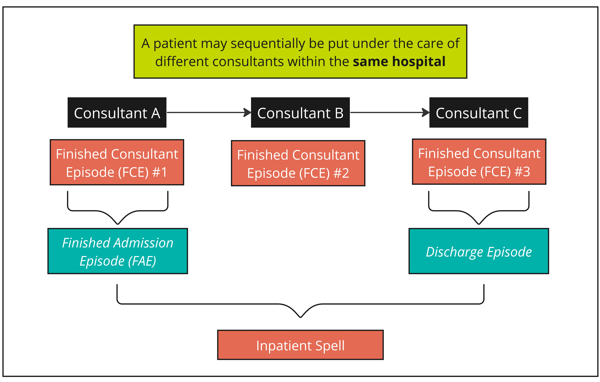
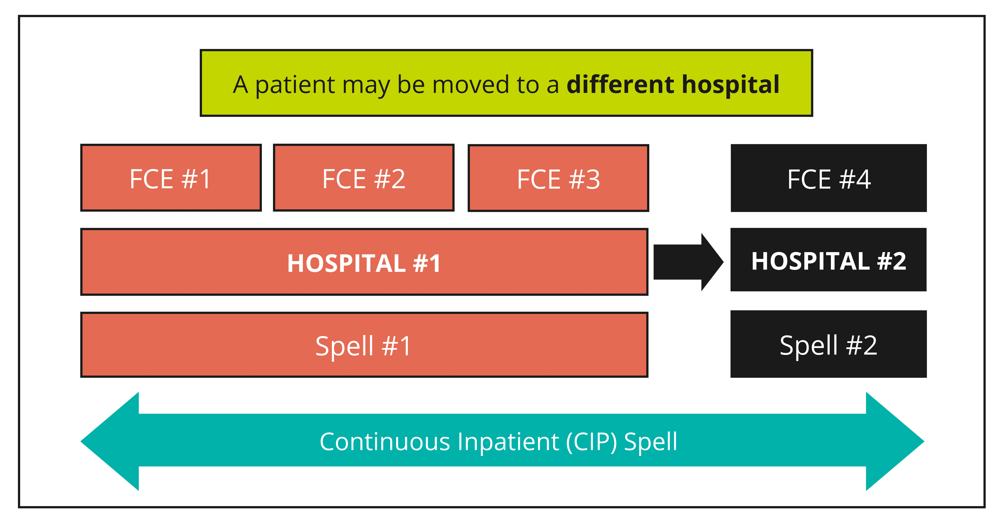

# Understanding the HESAPC dataset
>Last modified: 26 Jun 2025

<strong>The structure of the HES APC dataset is particularly complex.</strong>
  
 

## Episodes and spells
Data in the HESAPC dataset are organised into **episodes** and **spells**. Each row indicates a **Finished Consultant Episode (FCE)**, which is a continuous period of care under one consultant at a single hospital. A **spell** is a continuous period of care within a single hospital from admission to discharge or death. Most patients in the HESAPC datasets are represented by one row of data (i.e. a spell comprising one episode), but others may be represented by multiple rows if they move between consultants within or between hospitals (see the scenario below). Furthermore, in the **HESAPC_MAT** dataset, each birth generates at least two episodes, one recording details of the delivery (relating to the mother) and one episode per child delivered (relating to the child).  

If the patient was seen by multiple consultants during the same stay at the same hospital, a spell may contain one or more FCEs, i.e. one or more rows of data per patient (see figure 1). The first (or only) FCE can also be called a **Finished Admission Episode (FAE)** and the final (or only) FCE can also be called a **Discharge Episode**. This is why there are more FCEs than FAEs in the APC dataset: [https://digital.nhs.uk/data-and-information/publications/statistical/hospital-admitted-patient-care-activity.](https://digital.nhs.uk/data-and-information/publications/statistical/hospital-admitted-patient-care-activity) 

  

**Figure 1** Episodes and spells in the HESAPC dataset - each row of data in the dataset corresponds to a single FCE

## Continuous Inpatient (CIP) spells
A more complex scenario again is if a patient is transferred to a different hospital. In this instance, a new spell begins. To identify and measure continuous hospital stays, which include transfers to other hospitals, Continuous Inpatient (CIP) spells need to be derived (see figure 2).

  

**Figure 2** Spells and CIP spells in the HESAPC dataset

## Episodes/spells that span financial years
FCEs are entered into the HESAPC dataset according to the financial year in which they end. Consequently, episodes/spells that start in one financial year and end in another will be classified as unfinished in the starting financial year and finished in the ending financial year. 

**Unfinished episodes/spells need to be removed before analysis to prevent double counting.** 