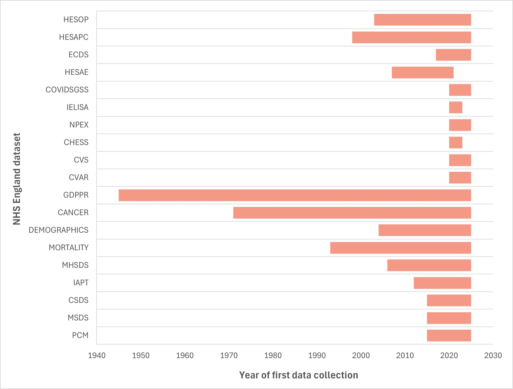

# Longevity of NHS England datasets
>Last modified: 19 Nov 2024

The availability of NHS England data in the UK LLC TRE differs according to when each dataset was established and the time periods permitted to flow to UK LLC as documented in the data sharing agreement. As summarised below in Figure 1, the General Practice Extraction Service (GPES) Data for Pandemic Planning and Research (GDPPR) Dataset covers the longest time period (1940s onwards) and the COVID-19 datasets the shortest time periods (2020 onwards).     

**Figure 1** A summary of the temporal coverage of each NHS England dataset in the UK LLC TRE
