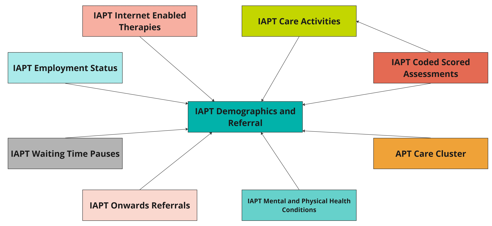

# Understanding the IAPT dataset
>Last modified: 27 Jan 2026

<strong>IAPT includes adults who are treated in England for depression and/or anxiety under the NHS Talking Therapies service.</strong>

 

## 1. Introduction
The IAPT dataset contains information about adults in England who access **psychological therapy for anxiety and/or depression** as part of the NHS Talking therapies for Anxiety and Depression service. This programme was launched in **2008** and was known as **Improving Access to Psychological Therapies (IAPT) until January 2023.** Despite the re-naming of the service, the associated dataset continues to be known as the IAPT dataset until its next formal revision – we therefore continue to refer to this dataset as IAPT.     

The NHS Talking Therapies for Anxiety and Depression service is delivered using a **stepped-care model**. People with less severe depression and anxiety are offered a course of **low-intensity treatment** (e.g. guided self-help) delivered by a Psychological Wellbeing Practitioner, usually 6-8 sessions. Those who do not fully recover at this level are stepped up to a course of **high-intensity treatment**. Patients with more severe depression and/or anxiety should receive high-intensity treatment from the outset. High-intensity treatments (e.g. cognitive behavioural therapy) are delivered by accredited therapists over a number of sessions (e.g. 15-20). Some patients will not receive a course of treatment, instead they will be assessed and then signposted onto another service. 

**Employment advice and support** is also provided as part of the service to help support the patient’s employment goals.  Data from patients accessing Talking Therapies for Anxiety and Depression have been collected since **2012**. 

<aside class="admonition warning">
The IAPT dataset is designed to support service delivery and inform clinical decision-making and has secondary uses related to commissioning, service improvement and service design.
As with all NHS England datasets, it is not designed to be used for research.</aside>

## 2. Strengths of IAPT

Although not designed for research, the IAPT dataset can be a useful research resource as its strengths include: 

1. Comprehensive data on referral pathways, patient employment/benefit status, long-term physical health conditions or medically unexplained symptoms the patient may have, and patient outcomes (e.g. recovery, improvement, deterioration). 

2. Standardised measures of depression, anxiety, and impairment in functioning.  

3. Standardised [coding systems](#coding-systems-used) – for example SNOMED CT and ICD-10 codes.

4. Measures of symptoms – patients receiving NHS Talking Therapies for Anxiety and Depression complete measures of symptoms at every session so there is always a last available score that can be used to assess outcome even if the patient stops treatment earlier than expected or the clinician forgets to deliver a measure on a particular occasion. Outcome data has been obtained for more than 98% of all patients who have a course of treatment.

5. Longitudinal data.

6. Nationally consistent and comparable information for patients accessing IAPT services located in England.

## 3. Limitations of IAPT
1. Missing outcome data may be caused by patients' distress or objection to its collection, language or reading barriers, perceived administrative burden and lack of understanding of the importance of collecting data.

2. End of treatment scores may be unavailable if data are not collected every session.

3. Limited to adults receiving talking therapies for anxiety and/or depression in England.

4. Limited to NHS-funded talking therapies.

## 4. Scope and coverage
The IAPT dataset includes information about adults who access NHS psychological therapies for anxiety and/or depression in England. A diagnosis of anxiety or depression is not required and therefore the dataset **includes patients with and without a formal diagnosis.** Anxiety and depression can be in the context of comorbid long-term physical health conditions or other persistent physical symptoms as well as some drug and alcohol use. Information is included for those who **self-refer** for talking therapy as well as those who are **referred by a health professional or voluntary organisation.**  

The NHS Talking Therapies service is not designed to treat mental health problems such as psychosis, bipolar disorder, ‘personality disorders’ or eating disorders, even if they interact significantly with anxiety and depression (see the [**Mental Health Services Data Set (MHSDS))**.](../MHSDS/MHSDS.ipynb)

Note: The IAPT dataset includes people under the age of 18 who access NHS adult talking therapy services. It **does not include** activity related to the provision of Children and Young People’s (CYP) IAPT services which is included in [**MHSDS**.](../MHSDS/MHSDS.ipynb) Please also see [**FAQs**](../mh_faq.md) for information about the differences between IAPT and MHSDS.

The IAPT dataset contains patient-level information about:
-	Patient age, gender, ethnicity, language and religion
-	Referral pathway (e.g. source of the referral, start & end)
-	Dates, times, and type of appointments 
-	Problem descriptor(s) 
-	Patient employment and benefit status
-	Patient long-term physical health conditions or medically unexplained symptoms
-	Scores from patient-reported measures (symptoms, impairment)
-	Information about internet-enabled therapies
-	Waiting time pauses 
-	Clinical outcomes (e.g. recovery, improvement, deterioration)

## 5. Data collection methodology
Patients under the Talking Therapies for Anxiety and Depression service complete self-report measures of their symptoms at every session. The [**Patient Health Questionnaire-9 (PHQ-9)**]( https://www.apa.org/depression-guideline/patient-health-questionnaire.pdf) is used for the measurement of depression, and the [**Generalised Anxiety Disorder 7-item assessment (GAD-7)**](https://adaa.org/sites/default/files/GAD-7_Anxiety-updated_0.pdf) is the default measure for anxiety. However, where a specific anxiety disorder is identified, the GAD-7 is replaced with an appropriate **anxiety disorder specific measure**. Patients also complete the [**Work and Social Adjustment Scale**](https://greenspacehealth.com/en-us/work-and-social-functioning-wsas/) to measure how their anxiety and depression symptoms impair their social, work and private life functioning. At the end of their assessment and treatment patients complete **patient experience questionnaires (PEQs)** to comment on the quality of their care.  

NHS England collects data for the IAPT dataset through monthly submission from service providers via the Strategic Data Collection Service (SDCS) Cloud. Each month providers send data representing referrals that were received, seen or closed in that month, care contacts that took place, and patient outcomes. There are two opportunities each month to submit data for that reporting period. NHS England carry out validation checks to ensure the data is of sufficient quality, pseudonymisation to ensure the protection of patient confidentiality and linkage to connect newly received data to previous months’ submissions.

## 6. Structure of the dataset
The IAPT dataset is comprised of several tables (i.e. individual datasets). These constituent tables flow from NHS England to UK LLC grouped into 9 themed tables capturing patient demographics and referral, care activities, care cluster, scored assessments, employment status, internet enabled therapies, mental and physical health conditions, onward referrals and waiting time pauses. See [Availability in the UK LLC TRE](https://guidebook.ukllc.ac.uk/docs/linked_health_data/nhs_england/mental%20health%20datasets/iapt/understanding_iapt#availability-in-the-uk-llc-tre) below for more detail. 

## 7. Coding systems used
The Talking Therapies for Anxiety and Depression dataset uses **ICD-10** and **SNOMED CT** codes according to the [**NHS Data Model and Dictionary**.](https://archive.datadictionary.nhs.uk/DD%20Release%20May%202024/data_sets/clinical_data_sets/improving_access_to_psychological_therapies_data_set.html) 

**ICD-10 codes** are used to identify the patient’s main presenting problem as well as any additional problems where relevant. ICD-10 codes appear in the following tables:

- IAPT care activities
- IAPT mental and physical health conditions 

**SNOMED CT codes** are used to capture clinical and procedural terms. SNOMED CT codes appear in the following tables:
- IAPT demographics and referral 
- IAPT care activities 
- IAPT mental and physical health conditions
- IAPT coded scored assessments 

More information is available via [**SNOMED International – service migration**.](https://www.snomed.org/)

Further information about coding systems can be found in the [coded variables guide.](../../Coding/coding_intro.md) 

## 8. Evolution of the dataset
The IAPT dataset has been collected **since 2012**. There have been some incremental changes to the dataset over time (summarised in Table 1). The current version is **v2.1** which was released **20 July 2021**. For full details of the changes (e.g. the specific variables that were deleted/added) please refer to the [Change Specification documents](https://digital.nhs.uk/data-and-information/information-standards/governance/latest-activity/standards-and-collections/dapb-1520-improving-access-to-psychological-therapies-data-set) published by NHS England for current and previous versions. 

**Table 1** A summary of versions between 2012 and the present day.

|**Version**|**Year released1**|**Summary of changes from previous version**|
|:---|:---|:---|
|v1.0|2012|Developed to support consistent data collection and reporting across IAPT services. It was mandated for central return from April 2012.|
|v1.5|2013| Addition of waiting time pauses table and time from patient opt-in to treatment monitoring. Addition of patient experience questionnaires for assessment and treatment.|
|v2.0|2019| Structural changes to data to align with other NHS datasets (e.g. [MHSDS](../MHSDS/MHSDS.ipynb)) including increased use of clinical terminology (e.g. SNOMED CT) and improved relational modelling across data tables. Changes to support the collection of internet-enabled therapies, addition of information about language, qualifications of care personnel, location of treatment, and delivery of group treatment. Incorporation of the Employment Advisors Pilot Data Set2 and items from the Long Term Conditions and Medically Unexplained Symptoms Pilot Data Set3. Clarification of dataset scope regarding the inclusion of people under the age of 18 who are accessing adult IAPT services, deletion of items no longer required, and amendments to align with the [NHS data model and dictionary.](https://archive.datadictionary.nhs.uk/DD%20Release%20May%202024/data_sets/clinical_data_sets/improving_access_to_psychological_therapies_data_set.html)|
|v2.1|2021| Change to the recording of gender, to align with MHSDS, addition of medical history (previous diagnosis) table, addition of accommodation type table, adding and updating items relevant to employment support activity, some items changed from ‘required’ to ‘mandatory’, deletion of items no longer required, and amendments to align with the [NHS data model and dictionary.](https://archive.datadictionary.nhs.uk/DD%20Release%20May%202024/data_sets/clinical_data_sets/improving_access_to_psychological_therapies_data_set.html)|

1 The year of release is the date specified in the guidance reports.

2 This pilot increased the number of Employment Advisors embedded in IAPT services. Collection of Employment Advisors in IAPT pilot data from those services involved in the pilot started in October 2017 and was submitted alongside the core IAPT dataset vV1.5. Version 2.0 incorporated this into the main dataset. 

3  This pilot integrated IAPT care into existing medical pathways and services for patients with long term conditions and/or medically unexplained symptoms. Collection of IAPT integrated services pilot data from those services involved in the pilot started in January 2017 and was submitted alongside the core IAPT dataset v1.5. Version 2.0 incorporated this into the main dataset. 

## 9. Availability in the UK LLC TRE

The UK LLC TRE currently holds an extract of the IAPT dataset from **2020 onwards.** This is comprised of **9 tables**. A detailed overview of these tables is provided below **(Table 2)** as well as a pictorial representation of the relationships between these tables **(Figure 1)**.  

IAPT records of participants in the UK LLC’s partner LPS, where individual or LPS permissions allow linkage to NHS data, are included in the TRE. UK LLC does not hold any information about people who are not part of a partner LPS or about LPS participants who have requested that their NHS data not be shared via UK LLC.

**Figure 1** Relationships between the IAPT tables available in the UK LLC TRE.

**Table 2** IAPT tables available in the UK LLC TRE, including summary and key variables.

|**Table name**|**Summary of constituent tables**|**Key variables**|
|--------------|-----------|-----------------|
|IAPT demographics and referral|**Master patient index (IDS001):** personal details of the patient   **GP practice registration (IDS002):** records GP registration and changes when they leave or join a practice   **Accommodation status (IDS003):** accommodation details of the patient   **Disability type (IDS007):** the type of disability affecting a patient according to formal diagnoses, the patient’s perception or the perception of a patient proxy   **Social and personal circumstances (IDS011):** social and personal circumstances of the patient   **Overseas visitor charging category (IDS012):** records details of non-UK residents using IAPT services   **Service or team referral (IDS101):** records details of the service or team referral that the patient is subject to| Patient ID, Organisational ID, Gender, Ethnicity, Language, Age at start/end of reporting, Start/end date of GP registration, GP distance from home, Indices of deprivation (decile & quartile), Accommodation type, Disability code, Social and personal circumstances code (religion, sexual orientation, smoking status, alcohol status, asylum status, debt status, drug use status, gambling status, other), Date social and personal circumstance code recorded, Overseas visitor charging category, Date of referral, Source of the referral, Age at referral received/discharge, Onset date of mental health symptoms, Previous diagnosed condition indicator, Age at service discharge, Date of discharge, Reason for discharge, First and last recorded outcome scores for Anxiety Disorder specific measures, First and last recorded scores for GAD-7, First and last recorded scores for PHQ-9, Indicator of caseness, Indicator of recovery, Indictor of no change, Indicator of reliably deterioration, Indictor of reliable improvement, Count of contacts & treatment (including CBT, self-help, therapy, employment support)| 
|IAPT employment status| **Employment status (IDS004):** records patient employment details| Employment status, Date employment status recorded, Hours worked per week, Benefit receipt indicator, Sickness absence indicator, Statutory sick pay receipt indicator, Universal credit receipt indicator, Personal Independent Payment receipt indicator, Employment and Support Allowance receipt indicator, Date referred for/discharged from employment support|
|IAPT internet enabled therapies|**Internet enabled therapy care professional activity log (IDS205):** details of the activity for the care professional supporting internet enabled therapy for the patient   **Care personnel qualification (IDS902):** details of each qualification attained or planned to be attained by the care personnel| Start/end date for the period of internet enabled therapy log, Time spent supporting the internet enabled therapy, Name of the internet enabled therapy Programme delivered, Qualification/accreditation attained or planned to be attained by the care personnel, Date qualification awarded/expected to be awarded|
|IAPT care activities| **Care contact (IDS201):** details of any contacts with a patient which have taken place as part of a referral   **Care activity (IDS202):** details of any activities that have taken place as part of a care contact   **Care personnel qualification (IDS902):** details of each qualification attained or planned to be attained by the care personnel| Date and time of contact, Appointment attended indicator, Duration of contact, Location of contact, Type of appointment (e.g. assessment, treatment, review etc), Type of appointment (e.g. face-to-face, telephone, email), Mode of therapy, Psychotropic medication indicator, Duration of a care activity, Coded procedure, Coded finding, Coded observation|
|IAPT coded scored assessments|**Coded scored assessment (referral) (IDS606):** details of scored assessments that are issued and completed as part of a service request, but do not take place at a specific contact   **Coded scored assessment (care activity) (IDS607):** details of scored assessments that are issues and completed as part of a specific care activity| Assessment code, Assessment score, Date and time of assessment, Age of patient when assessment completed|
|IAPT care cluster| **Care cluster (IDS803):** records information about needs-based groupings| Start/end date & time a patient is assigned to a care cluster, Assigned adult mental health care cluster code| Start/end date & time a patient is assigned to a care cluster, Assigned adult mental health care cluster code|
|IAPT mental and physical health conditions| **Long term physical health condition (IDS602):** details of any long term physical health conditions for a patient which are stated by the patient or recorded in medical notes   **Presenting complaints (IDS603):** details of the primary and secondary complaints recorded for a patient, made by the service that the patient was referred or admitted to| Long-term physical health condition or presenting complaint code, Description of the long term physical health condition, Date presenting complaint recorded|
|IAPT onward referrals|**Onward referral (IDS105):** records onward referrals to other services both within and outside of the organisation|Date & time of referral, Reason for referral, Organisation patient is referred to|
|IAPT waiting time pauses| **Waiting times pauses (IDS108):** records details of breaks in activity initiated by the patient with the intention of resuming at some point|Start/end date of activity break, Reason for the activity break|

## 10. UK LLC transformations of the dataset
All variables which identify organisations (e.g. IAPT service provider, GP practice, NHS Trust) or geographic areas smaller than a region (e.g. LSOA) are encrypted before being ingested into the UK LLC TRE. The encrypted variables (identifiable by the suffix _e) enable researchers to identify which participants were treated by the same organisation, or live in the same area, but not to identify the organisation or area.

## 11. Tips for researchers using IAPT in the UK LLC TRE
Please also see the list of [**mental health FAQs**](../mh_faq.md)
1. Descriptions of the variables included in the dataset can be downloaded from the **Enhanced Technical Output Specification** available from [**NHS England.**](https://digital.nhs.uk/data-and-information/data-collections-and-data-sets/data-sets/improving-access-to-psychological-therapies-data-set/implementing-iapt-tools-and-guidance) 
2. The cohort key variable (cohortkey_e) is available within each table to enable researchers to link between tables.  
3. A patient is deemed to have had a ‘course’ of treatment if they had at least two clinical sessions before discharge.
4. Problem descriptors in IAPT are based on ICD-10 diagnostic codes however a patient does not necessarily meet all diagnostic criteria. It is also possible that they meet diagnostic criteria for other disorders. 

 
We will regularly update these tips as we gather more information. 

## 12. Useful syntax 
Below we will include syntax that may be helpful to other researchers in the UK LLC TRE. For longer scripts, we will include a snippet of the code plus a link to the UK LLC Github repository where you can find the full scripts.

## 13. Further reading 
Information in this section will be added in due course.

