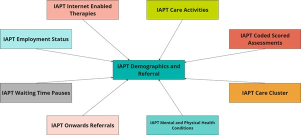

# Understanding the IAPT dataset
<<<<<<< HEAD
>Last modified: 27 Jan 2026

<strong>IAPT includes adults who are referred in England for depression, anxiety, or related conditions under the NHS Talking Therapies for Anxiety and Depression Service.</strong>

=======
>Last modified: 09 Feb 2026

<strong>IAPT includes adults who are treated in England for depression and/or anxiety under the NHS Talking Therapies service.</strong>

>>>>>>> 41de7f7df810f0d646b2bd3816edf86e0d2f3af7
 

## 1. Introduction
The IAPT dataset contains information about adults in England referred to the NHS Talking Therapies for Anxiety and Depression service. This service offers **psychological therapy for anxiety and/or depression as well as other related mental health conditions (e.g. obsessive compulsive disorder, body dysmorphic disorder).** It was launched in **2008** as **Improving Access to Psychological Therapies (IAPT)** and was rebranded in **January 2023** though the associated dataset retains the IAPT name until its next formal revision. We therefore continue to refer to this dataset as IAPT.     

The NHS Talking Therapies for Anxiety and Depression service offers evidence-based psychological treatments delivered using a **stepped-care model**. People with less severe depression and anxiety are typically offered a course of **low-intensity treatment** (e.g. guided self-help) delivered by a Psychological Wellbeing Practitioner over 6-8 sessions. Those who do not respond at this level can be stepped up to a course of **high-intensity treatment.** People with more severe depression and/or anxiety may receive high-intensity treatment from the outset. People with specific disorders (e.g. post-traumatic stress disorder or social anxiety) should also receive high-intensity treatment. High-intensity treatment (e.g. cognitive behavioural therapy) is delivered by an accredited therapist, involves more intensive clinician input and a greater number of sessions (e.g. 15-20). Following initial assessment some patients are not considered suitable for a course of treatment and will instead be signposted onto another service. 

**Employment advice and support** is also provided as part of the service to help support the patient’s employment goals.  

Central data collection has been in place for IAPT since **2012** by which time the service had been rolled out nationally across England. 

<aside class="admonition warning">
The IAPT dataset is designed to support service delivery and inform clinical decision-making and has secondary uses related to commissioning, service improvement and service design.
As with all NHS England datasets, it is not designed to be used for research.</aside>

## 2. Strengths of IAPT

Although not designed for research, the IAPT dataset can be a useful research resource as its strengths include: 

1. Comprehensive coverage – captures care pathway (e.g. referral, appointments, treatment type), sociodemographic information (e.g. age, gender, ethnicity, employment/benefit status), long term physical health conditions, and patient outcomes (e.g. recovery, improvement, deterioration). 

2. Standardised and validated measures of depression, anxiety, and functional impairment. Specific thresholds are used for the symptom measures to calculate key outcomes such as reliable recovery and reliable improvement.   

3. Standardised [coding systems](#coding-systems-used) – for example SNOMED CT and ICD-10 codes.

4. Repeated assessment of symptoms – patients complete measures of symptoms at every session rather than only at the start and end of treatment. This design provides a last available score to calculate outcome metrics even if treatment ends earlier than expected. Outcome data has been obtained for more than 98% of all patients who have a course of treatment.

5. Large-scale naturalistic data about psychological treatment which enhances generalisability.

6. National consistency – standardised data collection enables comparison across services and geographical areas of England. 

## 3. Limitations of IAPT

1. Scope – limited to NHS-funded talking therapies for anxiety, depression and related conditions. Does not capture private mental health care, other NHS mental health services, or treatment outside of England.

2. Selection bias – includes only those people who are referred (by GP, other professional) or who self-refer. Excludes people whose problems are not recognised by referring professionals, those unaware of the service, lacking motivation or capacity to self-refer  or seek help, or facing other barriers to access including perceived stigma. Treatment access barriers affect some sociodemographic groups disproportionately.

3. Missing data – while outcome data completion is high, incomplete date may arise due to patient distress or objection to its collection, language or literacy barriers, perceived administrative burden, or data collection errors. 

4. Self-report data – many items, including concurrent medication use and long term conditions, rely on self-reported information without clinical verification. 

5. Absence of formal diagnoses – patients are not formally diagnosed so they may not meet clinical criteria for their treated condition or may  have unrecognised comorbidities. 

## 4. Scope and coverage
Population: The IAPT dataset includes adults referred for NHS psychological therapies for anxiety, depression and related conditions in England. A formal diagnosis is not required and therefore the dataset **includes patients who may or may not meet clinical criteria for their treated condition.** The IAPT dataset includes some people under the age of 18 who access adult services. It **does not include** activity related to the provision of Children and Young People’s (CYP) IAPT services which is included in [**MHSDS**.](../MHSDS/MHSDS.ipynb) Please also see [**FAQs**](../mh_faq.md) for information about the differences between IAPT and MHSDS.

Included conditions: Anxiety, depression and other related conditions such as post-traumatic stress disorder, obsessive-compulsive disorder and body dysmorphic disorder. These conditions may occur in the context of comorbid long-term physical health conditions or symptoms such as irritable bowl syndrome, as well as some drug or alcohol use.

Excluded conditions: The service is not designed to treat other conditions including psychosis, bipolar disorder, 'personality disorders' or severe eating disorders ([**MHSDS**](../MHSDS/MHSDS.ipynb) captures these). However, individuals with these conditions may be accepted if their primary presenting problem is an included condition and they have no active symptoms that would interfere with treatment. 

Referral routes: Patients can **self-refer** to the service or be **referred by a health professional or voluntary organisation.**  

Data collected: 

The IAPT dataset contains patient-level information about:
-	Sociodemogrphics including age, gender, ethnicity, language, religious affiliation
-	Area level deprivation, employment status, benefit status 
-	Clinical presentation - problem descriptor (informal diagnosis) , long term physical health conditions, disabilities, medically unexplained symptoms, use of medication for mental health problems 
-	Care pathway - referral source and dates, appointment dates/times/type, waiting time pauses, attendance
-	Treatment - therapy type (e.g. cognitive behavioural therapy), internet enabled therapies, professional qualification of the care provider 
-	Clinical measures - symptom and impairment scpres from each appointment, and derived outcomes such as recovery

Coverage of specific items is dependant on whether the item is mandatory or optional in the dataset specification, and when the item was introduced (See [Evolution of the dataset](#8-evolution-of-the-dataset) below). 

## 5. Data collection methodology
Patients complete self-report measures of their symptoms at every session, typically before or at the beginning. Depression is measured using the [**Patient Health Questionnaire-9 (PHQ-9)**]( https://www.apa.org/depression-guideline/patient-health-questionnaire.pdf). Anxiety is measured with the [**Generalised Anxiety Disorder 7-item assessment (GAD-7)**](https://adaa.org/sites/default/files/GAD-7_Anxiety-updated_0.pdf) or an **anxiety disorder specific measure** where available and appropriate for the patient's problem descriptor. The PHQ-9 and GAD-7 assess the frequency of symptoms over the previous two weeks. Patients also complete the [**Work and Social Adjustment Scale**](https://greenspacehealth.com/en-us/work-and-social-functioning-wsas/) to measure how their anxiety and depression symptoms impair their social, work and private life functioning. At the end of assessment and of treatment patients complete **patient experience questionnaires (PEQs)** about the quality of their care.  

NHS England collects data for the IAPT dataset through monthly submissions from service providers via the Strategic Data Collection Service (SDCS) Cloud. Providers send data on referrals (received, seen or closed), contacts, and patient outcomes for that reporting period. NHS England carries out validation checks to ensure data quality, pseudonymisation to protect patient confidentiality, and linkage to previous months’ submissions.

## 6. Structure of the dataset
The IAPT dataset is comprised of several tables (i.e. individual datasets). These constituent tables flow from NHS England to UK LLC grouped into 9 themed tables capturing patient demographics and referral, care activities, care cluster, scored assessments, employment status, internet enabled therapies, mental and physical health conditions, onward referrals and waiting time pauses. See [Availability in the UK LLC TRE](https://guidebook.ukllc.ac.uk/docs/linked_health_data/nhs_england/mental%20health%20datasets/iapt/understanding_iapt#availability-in-the-uk-llc-tre) below for more detail. 

## 7. Coding systems used
The IAPT dataset uses **ICD-10** and **SNOMED CT** codes according to the [**NHS Data Model and Dictionary**.](https://archive.datadictionary.nhs.uk/DD%20Release%20May%202024/data_sets/clinical_data_sets/improving_access_to_psychological_therapies_data_set.html) 

**ICD-10 codes** are used to identify the patient’s main presenting problem as well as any additional mental or physical health conditions. ICD-10 codes appear in the following tables:

- IAPT care activities
- IAPT mental and physical health conditions 

**SNOMED CT codes** are used to capture clinical and procedural terms as well as some sociodemographic information (e.g. religious affiliation). SNOMED CT codes appear in the following tables:
- IAPT demographics and referral 
- IAPT care activities 
- IAPT mental and physical health conditions
- IAPT coded scored assessments 

For SNOMED CT lookups and definitions see [**SNOMED International – service migration**.](https://www.snomed.org/)

Further information about coding systems can be found in the [coded variables guide.](../../Coding/coding_intro.md) 

## 8. Evolution of the dataset
The IAPT dataset has been collected **since 2012** and has evolved through incremental changes over time (summarised in Table 1). These have included: mandating previously optional items, introducing or discontinuing variables, alterations to response options, incorporating pilot datsets, and aligning with NHS-wide standards such as SNOMED CT coding and the [NHS data model and dictionary.](https://archive.datadictionary.nhs.uk/DD%20Release%20May%202024/data_sets/clinical_data_sets/improving_access_to_psychological_therapies_data_set.html) 

The current version of the IAPT dataset is **v2.1** which was **released 20 July 2021** and **implemented in 2022.** 

**Important:** When working with IAPT data spanning multiple years, researchers should ensure they check for differences in variables availability, coding and response options. For full details of the changes across versions see NHS Engalnd's [Change Specification documents](https://digital.nhs.uk/data-and-information/information-standards/governance/latest-activity/standards-and-collections/dapb-1520-improving-access-to-psychological-therapies-data-set) published by NHS England for current and previous versions. 

**Table 1** A summary of IAPT dataset versions since 2012.

|**Version**|**Year released1**|**Year implemented**|**Summary of major changes from previous version**|
|:---|:---|:---|:---|
|1.0|2012|2012|Initial version developed to support consistent data collection and reporting across IAPT services. It was mandated for central return from April 2012|
|1.5|2013|2014|Addition of waiting time pauses, time from patient opt-in to treatment and patient experience questionnaires (PEQs) for assessment and treatment, appointment purpose made mandatory, new code list for reason for end of treatment|
|2.0|2019|2020| Major structural changes to align with other NHS datasets (e.g. [MHSDS](../MHSDS/MHSDS.ipynb). See [NHS data model and dictionary](https://archive.datadictionary.nhs.uk/DD%20Release%20May%202024/data_sets/clinical_data_sets/improving_access_to_psychological_therapies_data_set.html)) including expanded use of clinical terminology (e.g. SNOMED CT). Added/updated variables relating to internet-enabled therapies, language, qualifications of care personnel, treatment location, and group treatment delivery. Changes to anxiety disorder specific measures. Incorporated the Employment Advisors Pilot Data Set2 and items from the Long Term Conditions and Medically Unexplained Symptoms Pilot Data Set3. Clarified scope regarding the inclusion of under-18s who access adult IAPT services|
|2.1|2021|2022| Updated the recording of gender to align with MHSDS, addition of medical history (previous diagnosis), accommodation type information, and added/updated items relevant to employment support activity|

1 The year of release is the date specified in the guidance reports.

2 This pilot increased the number of Employment Advisors embedded in IAPT services. Collection of Employment Advisors in IAPT pilot data from those services involved in the pilot started in October 2017 and was submitted alongside the core IAPT dataset v1.5. Version 2.0 incorporated this into the main dataset. 

3  This pilot integrated IAPT care into existing medical pathways and services for patients with long term conditions and/or medically unexplained symptoms. Collection of IAPT integrated services pilot data from those services involved in the pilot started in January 2017 and was submitted alongside the core IAPT dataset v1.5. Version 2.0 incorporated this into the main dataset. 

## 9. Availability in the UK LLC TRE

The UK LLC TRE currently holds an extract of the IAPT dataset from **2020 onwards** organised into **9 linked tables**. A detailed overview of these tables is provided below **(Table 2)** as well as a pictorial representation of the relationships between these tables **(Figure 1)**.  

The UK LLC TRE includes IAPT records for participants in partner LPS and only where individual or LPS permissions allow linkage to NHS data. UK LLC does not hold any information about people who are not part of a partner LPS or about LPS participants who have requested that their NHS data not be shared via UK LLC.

**Figure 1** Relationships between the IAPT tables available in the UK LLC TRE.

**Table 2** IAPT tables available in the UK LLC TRE, including summary and key variables.

|**Table name**|**Summary of constituent tables**|**Key variables**|
|--------------|-----------|-----------------|
|IAPT demographics and referral|**Master patient index (IDS001):** personal details of the patient   **GP practice registration (IDS002):** GP registration and changes when they leave or join a practice   **Accommodation status (IDS003):** accommodation details of the patient   **Disability type (IDS007):** the type of disability affecting a patient according to formal diagnoses, the patient’s perception or the perception of a patient proxy   **Social and personal circumstances (IDS011):** social and personal circumstances of the patient   **Overseas visitor charging category (IDS012):** details of non-UK residents using IAPT services   **Service or team referral (IDS101):** details of the service or team referral that the patient is subject to| Patient ID, Organisational ID, Gender, Ethnicity, Language, Age at start/end of reporting, Start/end date of GP registration, GP distance from home, Indices of deprivation (decile & quartile), Accommodation type, Disability code, Social and personal circumstances code (religion, sexual orientation, smoking status, alcohol status, asylum status, debt status, drug use status, gambling status, other), Date social and personal circumstance code recorded, Overseas visitor charging category, Date of referral, Source of the referral, Age at referral received/discharge, Onset date of mental health symptoms, Previous diagnosed condition indicator, Age at service discharge, Date of discharge, Reason for discharge, First and last recorded outcome scores for Anxiety Disorder Specific Measures, First and last recorded scores for GAD-7, First and last recorded scores for PHQ-9, Indicator of caseness, Indicator of recovery, Indictor of no change, Indicator of reliably deterioration, Indictor of reliable improvement, Count of contacts & treatment type (including CBT, self-help, therapy, employment support)| 
|IAPT employment status| **Employment status (IDS004):** patient employment details| Employment status, Date employment status recorded, Hours worked per week, Benefit receipt indicator, Sickness absence indicator, Statutory sick pay receipt indicator, Universal credit receipt indicator, Personal Independent Payment receipt indicator, Employment and Support Allowance receipt indicator, Date referred for/discharged from employment support|
|IAPT internet enabled therapies|**Internet enabled therapy care professional activity log (IDS205):** details of the activity for the care professional supporting internet enabled therapy for the patient   **Care personnel qualification (IDS902):** details of each qualification attained or planned to be attained by the care personnel| Start/end date for the period of internet enabled therapy log, Time spent supporting the internet enabled therapy, Name of the internet enabled therapy programme delivered, Qualification/accreditation attained or planned to be attained by the care personnel, Date qualification awarded/expected to be awarded|
|IAPT care activities| **Care contact (IDS201):** details of any contacts with a patient which have taken place as part of a referral   **Care activity (IDS202):** details of any activities that have taken place as part of a care contact   **Care personnel qualification (IDS902):** details of each qualification attained or planned to be attained by the care personnel| Date and time of contact, Appointment attended indicator, Duration of contact, Location of contact, Type of appointment (e.g. assessment, treatment, review etc), Method of appointment delivery (e.g. face-to-face, telephone, email), Type of therapy, Psychotropic medication indicator, Duration of a care activity, Coded procedure, Coded finding, Coded observation|
|IAPT coded scored assessments|**Coded scored assessment (referral) (IDS606):** details of scored assessments that are issued and completed as part of a service request, but do not take place at a specific contact   **Coded scored assessment (care activity) (IDS607):** details of scored assessments that are issues and completed as part of a specific care activity| Assessment code, Assessment score, Date and time of assessment, Age of patient when assessment completed|
|IAPT care cluster| **Care cluster (IDS803):** information about needs-based groupings| Start/end date & time a patient is assigned to a care cluster, Assigned adult mental health care cluster code| Start/end date & time a patient is assigned to a care cluster, Assigned adult mental health care cluster code|
|IAPT mental and physical health conditions| **Long term physical health condition (IDS602):** details of any long term physical health conditions for a patient which are stated by the patient or recorded in medical notes   **Presenting complaints (IDS603):** details of the primary and secondary complaints recorded for a patient, made by the service that the patient was referred or admitted to| Long-term physical health condition or presenting complaint code, Description of the long term physical health condition, Date presenting complaint recorded|
|IAPT onward referrals|**Onward referral (IDS105):** onward referrals to other services both within and outside of the organisation|Date & time of referral, Reason for referral, Organisation patient is referred to|
|IAPT waiting time pauses| **Waiting times pauses (IDS108):** details of breaks in activity initiated by the patient with the intention of resuming at some point|Start/end date of activity break, Reason for the activity break|

## 10. Missing information
- **Variable and value labels**

UK LLC is infilling missing variable and value labels in the NHSE datasets in the TRE. Where variable labels have been added by UK LLC, rather than being found in NHSE documentation, this is made apparent in the variable label.
- **Missing data**

The amount of missing data varies widely between variables and across datasets. Throughout 2026 we will update this section with informationn about missingness in the IAPT dataset.

<<<<<<< HEAD
=======
## 10. Missing information
* **Variable and value labels**  
UK LLC is infilling missing variable and value labels in the NHSE datasets in the TRE. Where variable labels have been added by UK LLC, rather than being found in NHSE documentation, this is made apparent in the variable label.  
* **Missing data**  
The amount of missing data varies widely between variables and across datasets. Throughout 2026, we will update this section with information about missingness in the IAPT dataset.

>>>>>>> 41de7f7df810f0d646b2bd3816edf86e0d2f3af7

## 11. Tips for researchers using IAPT in the UK LLC TRE
Please also see the list of [**mental health FAQs**](../mh_faq.md)
1. Descriptions of the variables included in the dataset can be downloaded from the **Enhanced Technical Output Specification** available from [**NHS England.**](https://digital.nhs.uk/data-and-information/data-collections-and-data-sets/data-sets/improving-access-to-psychological-therapies-data-set/implementing-iapt-tools-and-guidance) 
2. Linking between tables: Use the cohort key variable (cohortkey_e) to link patients across IAPT tables and use the pathway ID variable (pathwayid) to link pathways (i.e. distinct referrals/episodes of care for a patient) across IAPT tables.  
3. Multiple referrals per patient: Some patients have been referred on more than one occasion and therefore have records for multiple referrals (each referral has its own unique pathway ID). It may be appropriate for your analysis to select one per patient (e.g. first referral, most recent referral, or meeting other specific criteria). 
4. Defining a course of treatment: A patient is deemed to have had a ‘course’ of treatment if they had at least two clinical sessions before discharge. Patients with only one session or assessment-only contacts are not considered to have received a course of treatment. Inspecting the type of contact that occured in each session is therefore important for understanding a patient's care pathway.
5. Interpreting problem descriptors: Problem descriptors in IAPT use ICD-10 diagnotic codes but do not represent formal diagnoses. They are used to assign patients to appropriate treatment protocols, as specified by NICE guidelines. A patient may not meet full clinical criteria for for the condition they are treated for and it is possible that they could meet diagnostic criteria for other conditions not captured by their problem descriptor.
6. Understanding outcome metrics: Key outcomes including recovery are calculated based on symptom scores at a patient's first and final sessions using specific thresholds. Not all participants are eligible for all outcome calculations. For example, a patient who scores below the clinical thresholds on both the PHQ-9 and GAD-7 at baseline cannot be assessed for recovery as they were not in the 'caseness' range to begin with.

We will regularly update these tips as we gather more information. 

## 12. Useful syntax 
Below we will include syntax that may be helpful to other researchers in the UK LLC TRE. For longer scripts, we will include a snippet of the code plus a link to the UK LLC Github repository where you can find the full scripts.

## 13. Further reading 
Information in this section will be added in due course.

