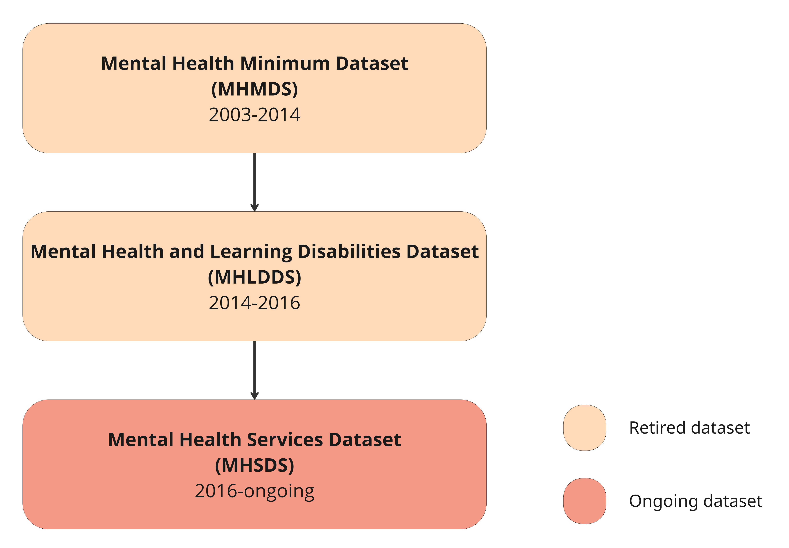
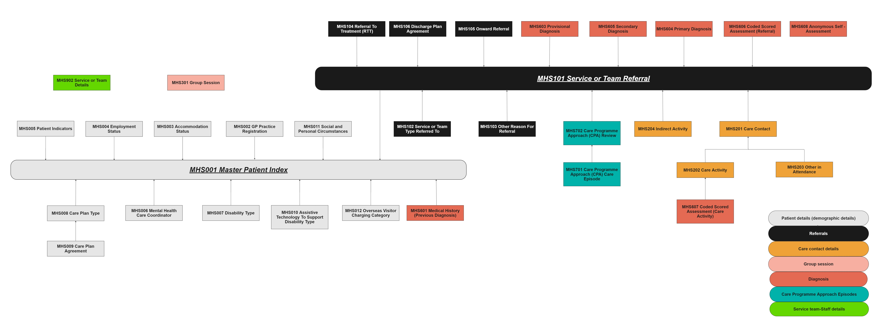

 # Understanding the MHSDS dataset
>Last modified: 09 Feb 2026

<strong>MHSDS records secondary care services that support people with severe or complex mental health conditions, e.g. psychosis, bipolar disorder, gambling, eating disorders and learning disabilities.</strong>

 

<aside class="admonition danger">
MHSDS is widely acknowledged to be complex and poorly documented - it is constantly evolving to meet the requirements of administrators in the NHS
Researchers should be aware of the limitations of this dataset and use it carefully in their analyses.</aside>

## 1. Introduction 
Data about mental health services was introduced in **April 2000** to provide clinical information to align with the requirements of the [**National Service Framework for Mental Health**](https://www.gov.uk/government/publications/quality-standards-for-mental-health-services). Published in 1999 by the Department of Health, this framework set a 10-year agenda for improving mental healthcare for working-age adults in England (for further information see [**Government policy and the National Service Framework for Mental Health: modelling and costing services in England)**](https://www.cambridge.org/core/journals/advances-in-psychiatric-treatment/article/government-policy-and-the-national-service-framework-for-mental-health-modelling-and-costing-services-in-england/26B358B82C9996D4E3E732FDB987D4ED). Over the years, the mental health dataset has evolved significantly as summarised in Figure 1. The first publication of the data was released in 2008, covering the period from 2003 to 2007, and was titled the **Mental Health Minimum Dataset (MHMDS)**. MHMDS was replaced in 2014 by the **Mental Health and Learning Disabilities Data Set (MHLDDS)**, which in turn was replaced in 2016 by the **Mental Health Services Data Set (MHSDS)**.

**Figure 1** Evolution of NHS England datasets from 2003 to the present day

**Table 1** Key characteristics of each of the mental health datasets

| **Dataset**|**Summary**|**Coverage**|**Available in TRE?**|
|---|:---|:---:|:---:|
|MHMDS|Adults with mental health issues, including those with drug or alcohol dependence|2003-2014|No|
|MHLDDS|Adults as above, plus information about learning disabilities services and autistic spectrum disorder services|2014-2016|No|
|MHSDS|Adults as above, plus Child and Adolescent Mental Health Services (CAMHS), Children and Young People’s Improving Access to Psychological Therapies Programme (CYP-IAPT), Eating Disorders in Children and Young People, Problem Gambling services|2016 onwards|Yes|

<aside class="admonition note">
The rest of this guide focuses on MHSDS because this is the only dataset of the three currently in the UK LLC TRE. If MHMDS and MHLDDS flow into the TRE, we will update this guide.</a>
</aside> 

## 2. Strengths of MHSDS 
- MHSDS is designed for administrative purposes; however, it provides comprehensive coverage of NHS-funded mental health, learning disability, and autism services, promoting a better understanding of mental health conditions.
- The dataset tracks individuals over time, enabling researchers to study care pathways, continuity of care, and long-term conditions.
- It includes clinical fields such as diagnoses, interventions, risk assessments, and legal status, which support clinical and epidemiological analyses.
- The dataset captures a wide range of community-based contacts and interventions, allowing research that reflects real-world care.

## 3. Limitations of MHSDS 
- Certain data fields are missing from MHSDS because these details may not be effectively captured, or it may not be mandatory for providers to submit them.
- Gaps can occur in understanding a person’s full care pathway, as not all voluntary-sector, privately funded, or local authority–commissioned mental health services submit data.
- Diagnosis and treatment details might be recorded late or inconsistently, making some fields difficult to use for research.
Unlike other datasets, MHSDS captures data over a shorter time period, which limits long-term analyses.
- Very little diagnostic information can be obtained from the MHSDS diagnosis table. To gain a deeper understanding of mental health conditions, this table must be linked to other datasets — such as GP data — because MHSDS contains relatively few conditions. However, access to **GP data is currently only permitted for COVID-related research**.
- Although the dataset was commissioned in 2016, it includes records that predate this period. This may introduce inconsistencies in data quality and completeness, which researchers should consider when conducting analyses.

## 4. Scope and coverage
The MHSDS collects information about patient activity and care within **inpatient services** and **community services**. It also records specific service areas, including the Learning Disability Census and Assuring Transformation Collection, Eating disorders in Children and Young People, Problem Gambling Services or gambling disorders and Early intervention in psychosis. While these services are mainly delivered in community settings, they may also involve inpatient care for patients in a crisis state. **Inpatient services** in scope include acute inpatient care, psychiatric intensive care, learning disability and autism inpatient services care, specialist inpatient care, and forensic and secure inpatient care. **Community services** in scope include organic and functional community mental health teams, crisis and liaison services, Children and Young People’s Mental Health Services (CYPMHS), specialist community services, and triage and Single Point of Access (SPA) services. 

The MHSDS **includes** information about patients who are attending a **mental health service in England**. If the person is **wholly or partially funded by the NHS**, data submission for that person is **mandatory**. If the person is **wholly funded by any means that is not NHS**, data submission for that person is **optional**. For each person attending a service located **outside England** but commissioned by an English Clinical Commissioning Group (CCG) or more recently an Integrated Care Board (ICB), data submission for that person is **optional**. 

The MHSDS does **not include** information about patients who receive mental health care but are not diagnosed with a mental illness, learning disability, or autism spectrum disorder. Additionally, the MHSDS does not capture data on patients receiving treatment for conditions such as anxiety and depression from psychological wellbeing practitioners or counsellors, where services are not delivered through secondary mental health care. Although the MHSDS includes some information on anxiety and depression, the level of detail is limited and not adequate for detailed analysis. More comprehensive information about anxiety and depression is available in the [**NHS Talking Therapies for Anxiety and Depression (IAPT) dataset**](../IAPT/IAPT.ipynb).

## 5. Data collection methodology
NHS England collects MHSDS data through monthly submissions from service providers via the Strategic Data Collection Service (SDCS) Cloud. The patient-level information is extracted by the providers and commissioners from the local systems and uploaded into the cloud system. The process includes validation checks, and under the **Multiple Submission Window Model**, providers can resubmit corrected data within the reporting cycle. Earlier versions used the Bureau Service Portal, but SDCS Cloud replaced it to simplify submission and remove the need for special NHS networks.

## 6. Structure of the dataset
MHSDS is comprised of more than **60 tables or datasets**, which are grouped into themes capturing patient demographics, referrals, care episodes, diagnoses (clinically coded classifications and terminology), Mental Health Act (MHA) episodes, hospital provider spells, staff service, group sessions and care contact information. Each category consists of identifiers to enable linkage of tables across the dataset. Below we provide a summary of each category of tables available in the MHSDS.

**Table 2** Categories of tables within the MHSDS

| **Table series numbers**|**Category**|**Summary**|
|:---|:---|:---|
|MHS001-MHS012|Patient details|Core patient level details|
|MHS101-MHS106|Referrals|Entry into service details|
|MHS201-MHS204|Care contacts and activities|Activity and attendance data|
|MHS301-MHS302|Group sessions|Information about group activities|
|MHS401-MHS405|Mental Health Act (MHA) legal status classification period|Information about patients detained, assessed or treated|
|MHS501-MHS517|Hospital provider spells|Information about patients treated in hospital|
|MHS601-MHS608|Clinically coded terminology|Information about diagnoses|
|MHS701-MHS702|Care Programme Approach (CPA) care episodes|Information about patients on CPA|
|MHS801-MHS804|Care clusters|Information about needs based groupings|
|MHS901-MHS903|Staff, service and ward|Details of staff who attended the service|

## 7. Coding systems used
MHSDS uses both **ICD-10** codes and **SNOMED CT** codes, according to the [**NHS Data Model and Dictionary**.](https://www.datadictionary.nhs.uk/data_sets/clinical_data_sets/mental_health_services_data_set.html?hl=mhsds)

**ICD-10 codes** are used to represent disease diagnoses and appear in the following tables:
- MHS601 – Previous Diagnosis
- MHS603 – Provisional Diagnosis
- MHS604 – Primary Diagnosis
- MHS605 – Secondary Diagnosis

**SNOMED CT codes** are used to represent clinical and procedural terms.SNOMED CT codes appear in the following diagnosis tables:
- MHS601 – Previous Diagnosis
- MHS603 – Provisional Diagnosis
- MHS604 – Primary Diagnosis
- MHS605 – Secondary Diagnosis

The SNOMED CT codes are present in the diagnosis columns (*prevdiag*, *provdiag*, *primdiag*, *secdiag*) as well as in the master SNOMED CT code columns (*mastersnomedctprevdiagcode*, *mastersnomedctprovdiagcode*, *mastersnomedctprimdiagcode*, *mastersnomedctsecdiagcode*).

However, formatting issues such as loss of precision in 16-digit codes and conversion to scientific notation, have impacted their usability. These codes are now defined as numeric values in the NHS Data Model and Dictionary. More information is available via [**SNOMED International - Service Migration**.](https://www.snomed.org/)

Researchers may use SNOMED CT codes,ICD-10 codes ,or both depending on the research aims and the level of diagnostic detail required. 

Further information about coding systems can be found in the [**Coded variables guide**.](../../Coding/coding_intro.md)

## 8. Evolution of the dataset
Over time the dataset has undergone various incremental changes without any major expansion in scope. The current version is V6.0, which was released in 2024. 

**Table 4** A summary of MHSDS versions between 2015 and the present day

|**Version**|**Year released1**|**Summary of changes from previous version**|
|:---|:---|:---|
|V1.0|2015|Added Children’s and Adolescent Mental Health Services (CAMHS); Children and Young People’s Improving Access to Psychological Therapies (CYP-IAPT); Learning Disability Census and Assuring Transformation collection. As per the Guidance to Support the [**Introduction of Access and Waiting Time Standards for Mental Health Services**](https://www.england.nhs.uk/mentalhealth/wp-content/uploads/sites/29/2016/02/tech-cyped-eip.pdf), data on the first episode of psychosis was added - this enables monitoring of access times using data items such as referral and care coordinator allocation, along with relevant SNOMED CT codes.|
|V2.0|2016|Integrated clinical terminologies using SNOMED CT; collected CAMHS needs-based groupings; based on the [**Payments by results (for CAMHS)**](https://assets.publishing.service.gov.uk/government/uploads/system/uploads/attachment_data/file/499475/Annex_B4_Mental_health_clustering_booklet.pdf) the dataset supported Payment by Results (PbR) currency model for children’s mental health; According to the [**Out of Area Placements Policy**](https://digital.nhs.uk/data-and-information/clinical-audits-and-registries/out-of-area-placements-oaps) added Out of Area Placements to reduce inappropriate placements by 2020.|
|V3.0|2017|Implemented Achieving Better Access to Mental Health Services by 2020 and [**Five-Year-Forward View for Mental Health by 2021**](https://www.england.nhs.uk/wp-content/uploads/2016/02/Mental-Health-Taskforce-FYFV-final.pdf); added CYP eating disorders.|
|V4.0|2018|Incorporated Problem Gambling services based on the Problem Gambling Services Expansion Policy; according to the NHS Digital Cloud Strategy moved to Strategic Data Collection Service (SDCS Cloud); enabled multiple submission windows.|
|V4.1|2018|Removed the option to submit Read codes; removed the CAMHS Tiers of Service data item; introduced an algorithm to identify the CYP services; changed service or team type list for better current practice; minor maintenance changes to respond to issues for e.g. [**NHS Data Model and Dictionary Service**](https://www.datadictionary.nhs.uk/data_sets/clinical_data_sets/mental_health_services_data_set.html?hl=mhsds).|
|V5.0|2021|Supported Specialised Mental Health (SMH) commissioning and retired legacy datasets; introduced Gender Identity Code; added fields to Learning Disability and Autism Transforming Care; removed certain data items; added community crisis and internet enabled therapy services; changes made to support reporting in line with the recommendations from the [**Independent Review of the Mental Health Act 1983**](https://www.gov.uk/government/groups/independent-review-of-the-mental-health-act).|
|V6.0|2024|Deleted obsolete tables (care cluster, pilot currency); retired provisional diagnosis; removed delayed discharge table; added new tables to capture ward details, staff activity and service-level information are designed to flow as one record per service rather than being linked to individual patients; added data items to capture digital interventions to support patients as part of their care plan; replaced the Mental Health Delayed Discharge table with the clinically Ready for Discharge table; replaced the provisional diagnosis table with the presenting complaint table, which captures details of complaints recorded by the referring or admitting service. [**Further details here.**](https://digital.nhs.uk/data-and-information/information-standards/governance/latest-activity/standards-and-collections/dapb0011-mental-health-services-data-set)|

1 The year of release is the date specified in the user guidance reports, e.g. MHSDS V1.0 was released in 2015, but became mandatory in 2016.

## 9. Availability in the UK LLC TRE
The Data Sharing Agreement between University of Bristol (Data Controller of UK LLC) and NHS England stipulates that the following MHSDS packages should flow to UK LLC:
- Package 1d Mental Health Services Community Activity ALL: this package is community activity - admin data, clinical data, demographics.
- Package 2d Mental Health Services Inpatient activity ALL: this package includes everything in 2c plus details of individual incidents of assault, restrictive intervention, self harm and substance misuse.
- Package 3 Mental Health Services All Users: this package provides full information about the people using services, but excludes details of contact with services. 
- Package 4 Mental Health Services All Users: this package provides detailed information about mental health currency assessments and assignments.

These packages cover more than **60 MHSDS tables**. However, the extract from NHS England that flowed in 2024, only included **33 tables**. UK LLC has worked with NHS England to ensure that all tables will flow in the latest extract. This section will be updated with more information once the extract is complete. A detailed overview of the tables available in the UK LLC TRE is provided below, including a pictorial representation of table relationships (**Figure 2**) followed by a summary table of categories and linkages (**Table 3**).

**Figure 2** Relationships between the MHSDS tables available in the UK LLC TRE

**Table 3** MHSDS tables available in the UK LLC TRE, including summary, key variables and linkages 

|**Table name**|**Summary**|**Key variables**|**Linkages**|
|--------------|-----------|-----------------|------------|
|MHS001 Master Patient Index|Core table with patient demographics, identifiers, and NHS trust details.|Patient ID, Organisation ID, Gender, Ethnicity, Marital Status, Accommodation details, NIC number, Age at start/end of reporting. |Linked to Referrals (MHS101), Care Contacts (MHS201), Medical History (MHS601), CPA Care Episode (MHS701), and other demographic tables (MHS002–MHS012). |
|MHS002 GP Practice Registration|Records patient GP registration and changes when they join or leave a practice.|Start/end date of registration, GP details, Practice distance from home.|Linked to MHS001 for patient identifiers.|
|MHS003 Accommodation Status|Stores patient accommodation details.|Accommodation type, Status code, Placement type, Indicator, Start date, Age at start, Patient and Organisation IDs.|Linked to MHS001 for patient identifiers.|
|MHS004 Employment Status|Shows patient’s employment details.|Start Date of the employment and Number of hours worked by the Patient, Employment status and Employment record date.|Linked to MHS001 for patient identifiers.|
|MHS005 Patient Indicators|Captures indicators like responsibilities, risks, or key characteristics.|Carer responsibilities, Parental responsibilities indicator, Look after child indicator, Looked after legal child status, Psychosis start date.|Linked to MHS001 for patient identifiers.|
|MHS006 Mental Health Care Coordinator|Records the care coordinator assigned to a patient.|Care team, Assessment end date, Program start date.|Linked to MHS001 for patient identifiers.|
|MHS007 Disability Type|Details patient disability type and perceived impact.|Disability code, Impact perception.|Linked to MHS001 for patient identifiers.|
|MHS008 Care Plan Type|Describes the care plan assigned to a patient (e.g. Mental Health Plan).|Care plan creation date/time, Implementation date, Last update, type.|Linked to MHS001 for patient identifiers.|
|MHS009 Care Plan Agreement|Records agreements between patient and NHS or other authorities.|Who (patient, family, advocate) agreed with the Care plan, Care plan agreed date, Care plan agreed time, Care |Linked to MHS008 for care plan details.|
|MHS010 Assistive Technology|Tracks assistive technology used for mental health or independence.|Technology type, Prescription date/time.|Linked to MHS001 for patient identifiers.|
|MHS011 Social and Personal Circumstances|Captures social and personal factors affecting mental health.|Circumstances like belief system, sexual orientation.|Linked to MHS001 for patient identifiers.|
|MHS012 Overseas Visitor Charging|Records details of non-UK residents using NHS mental health services.|Charging category, Application start/end date.|Linked to MHS001 for patient identifiers.|
|MHS101 Service or Team Referral|Records referrals to mental health services.|Service team ID, Referral dates, Priority type, Reason for referral, Source referral.|Linked to MHS001, Care Contact (MHS201), Diagnosis tables (MHS604–MHS605), Assessments (MHS606), and related referral tables.|
|MHS102 Service or Team Type Referred To|Lists additional services or teams involved in the same referral.|Referral closure date, Referral closure reason, Referral rejection reason.|Linked to MHS101 for patient identifiers.|
|MHS103 Other Reason for Referral|Captures extra reasons for referral when more than one applies.|Other reason for referral|Linked to MHS101 for patient identifiers.|
|MHS104 Referral to treatment|Records referral-to-treatment pathway for Allied Health Professional (AHP) services (e.g. OT, physiotherapy, speech therapy).|Waiting time, Referral status.|Linked to MHS101 for patient identifiers.|
|MHS105 Onward Referral|Records onward referrals to other mental health services within or outside the organisation.|Referred out of area reason, Onward referral reason.|Linked to MHS101 for patient identifiers.|
|MHS106 Discharge Plan Agreement|Captures discharge plan details agreed by person, team, or organisation.|Date of discharge, Who provided the discharge and Date of discharge mentioned by the person initiated the discharge.|Linked to MHS101 for patient identifiers.|
|MHS201 Care Contact|Records direct patient contact (face-to-face, phone, video).| Location of care provided, Administrative category code, Safety of the location, Care contact provided date, Care contact provided reason, Care contact cancelled reason, Age at which care contact is provided.|Linked to MHS101; connects to Care Activity (MHS202) and Other Attendance (MHS203).|
|MHS202 Care Activity|Details care activities provided to a patient.|Care activity location id, Care activity clinical duration, Schemes used.|Linked to MHS201.|
|MHS203 Other Attendance|Records people accompanying the patient.|Other persons attend the care; Reason the patient does not have an independent mental capacity advocate and Reason the patient does not have an independent mental health advocate.|Linked to MHS201.|
|MHS204 Indirect Activity|Care provided when patient is not present.|Indirect contact date, Care duration, Care scheme, Age at contact.|Linked to MHS201.|
|MHS301 Group Session|Records group activities for multiple patients.|Clinical contact duration of group days, Group session date, Number of participants per group, Site id of treatment, Service team type of referral, Group session id, Group location id.|Stand-alone table|
|MHS601 Previous Diagnosis|Records previous diagnoses, including non-mental conditions.|Date of diagnosis, Previous diagnosis.|Linked to MHS001.|
|MHS603 Provisional Diagnosis|Records provisional diagnosis before investigation.|Provisional diagnosis, Provisional diagnosis date, and Master ICD-10 codes.|Linked to MHS101.|
|MHS604 Primary Diagnosis|Records primary diagnosis for the patient.|Diagnosis date, Primary diagnosis, Organisational provider id, Diagnosed month.|Linked to MHS101.|
|MHS605 Secondary Diagnosis|Records secondary diagnoses after referral or admission.|Secondary diagnosis, Diagnosed date, Month diagnosed, Patient service id, Unique service id.|Linked to MHS101.|
|MHS606 Coded Scored Assessment (Referral)|Standardised scored assessments at referral stage.|Age at the assessment complete age, Assessment complete date, Coded assessment tool type, Person score.|Stand-alone table.|
|MHS607 Coded Score Assessment (Care Activity)|Standardised scored assessments during care activity.|Coded assessment tool type, Person score.|Linked to MHS202.|
|MHS608 Coded Scored Assessment (Standalone)|Anonymous assessments completed during referral.|Activity location type, Person score.|Stand-alone table.|
|MHS701 Care Programme Approach (CPA) care episode|Records when a patient is under Care Programme Approach.|Coded Assessment Tool Type, Person score.|Linked to MHS001; connects to CPA Review (MHS702).|
|MHS901 Staff Details|Records staff involved in patient care.|Care professional job role code, Care profile staff group entry who is involved in the service, Main speciality code, Occupation code.|Stand-alone table.|

## 10. Missing information
* **Variable and value labels**  
UK LLC is infilling missing variable and value labels in the NHSE datasets in the TRE. Where variable labels have been added by UK LLC, rather than being found in NHSE documentation, this is made apparent in the variable label.
* **Missing data**
The amount of missing data varies widely between variables and across datasets. Throughout 2026, we will update this section with information about missingness in the MHSDS.

## 11. Tips for researchers using MHSDS in the UK LLC TRE
**Very few researchers have used the MHSDS in a longitudinal research context**. Below are some tips – we will regularly update this page as we gather more information. Please also see the [**list of mental health FAQs**](../mh_faq.md).

1.  In MHSDS, the term “referral” does not follow the conventional definition. Instead, it refers to any mental health-related contact with a professional, such as in A&E, a school, a GP practice, with a social worker, within the justice system, or even self-referral.
2.  The cohort key and the record number are available within each table (except MHS 301 group session) and so researchers should be able to link between tables. 	  
3.  Patient counts for mental health related cohorts can be derived from the Hospital Episode Statistics Outpatients (HESOP) and the Hospital Admitted Patient Care (HES APC) datasets.  In some cases, patients have diagnostic information recorded in both HES  (HESOP and HESAPC) and MHSDS. But MHSDS provides additional details on referrals and services received.
4. HES APC can be used as a substitute until we receive the MHS 500 series which describes hospital activity (for identifying the count only).

## 12. Useful syntax 
Below we will include syntax that may be helpful to other researchers in the UK LLC TRE. For longer scripts, we will include a snippet of the code plus a link to the UK LLC Github repository where you can find the full scripts.

## 13. Further reading 
Information in this section will be added in due course.

