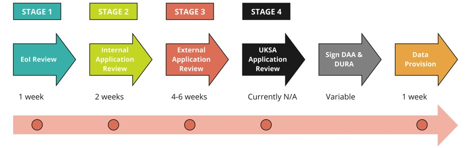

# How can I apply?
>Last modified: 27 Aug 2025

<strong>All applications must be submitted via UK LLC's online application management system, UK LLC Apply.</strong>

 

To ensure the appropriate and fair use of LPS participants’ information, UK LLC operates a rigorous **multi-stage application process** (figure 1). Once an application is approved, each applicant must complete **legal documentation** before the UK LLC Data Team **provisions their approved data** in the UK LLC Trusted Research Environment (TRE). Take a look at the [**UK LLC Data Use Register**](https://ukllc.ac.uk/data-use-register) to see a list of applications already submitted to UK LLC.

We have split our **application guidance** into the following pages:
 - Submit your [**expression of interest (EoI)**](../Applying/EoI.md)
 - Submit your [**full application**](../Applying/application.md)
 - Complete the [**'paperwork'**](../Applying/paperwork.md).

We have also written a guide about the [**application review process**.](../Applying/review.md)

**Figure 1** A summary of UK LLC's application process with approximate timings for each stage  
**Note**: only applications that include non-health administrative data will need to go through Stage 4 review.   
**Note**: the time it takes for a researcher’s organisation to sign a DAA with UK LLC can vary between less than a month to several months – this is outside the control of UK LLC.   
**DAA**: Data Access Agreement; **DURA**: Data User Responsibilities Agreement; **EoI**: Expression of Interest; **UKSA**: UK Statistics Authority.

