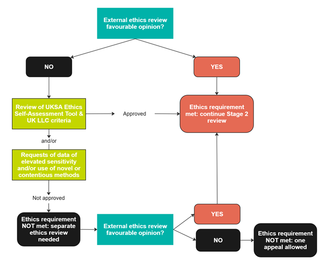

# How your application is reviewed 
>Last modified: 15 Sep 2025

<strong>Your application will undergo rigorous internal and external review.</strong>

 

Your application will first be reviewed by **UK LLC** (internal review). If approved, it will then be reviewed by the **data owners** (external review). The review stages collectively take approximately **6-8 weeks**, but for reasons outside UK LLC's control, review may take longer. 

## 1. Internal review by UK LLC
Review by the **UK LLC Application Review Panel** assesses applications against the [**Five Safes Framework**](https://ukdataservice.ac.uk/help/secure-lab/what-is-the-five-safes-framework/) and checks that all requested fields are filled out appropriately and fully. In particular, applications are reviewed to ensure that the data being requested are **available**, can be used for the proposed research (i.e. **align** with data owners’ terms of use) and are **relevant** to the research question. Applicants must **justify** the inclusion of data of ‘elevated sensitivity’ such as socially sensitive data (e.g. mental and sexual health data) and demographically sensitive data (e.g. ethnicity). The panel ensures that **public good** has been addressed, that public involvement plans are included and that a lay summary has been provided. The panel also assesses whether **ethical requirements** have been met following the UK LLC ethics decision-making tree below.

**Figure 1** An overview of the UK LLC ethics decision-making tree

Any questions or concerns are sent back to the applicant(s) and resubmitted applications are re-reviewed by the UK LLC Application Review Panel. Once the UK LLC panel is satisfied that the application can proceed it will be sent out for **external review**. 

Applications that are **declined** may go through the appeal process once. Applicants must address all comments, questions and criticisms fully for the appeal to be considered. 

## 2. External review by data owners
Applications are reviewed by:
1)	The individual **Longitudinal Population Study (LPS) Data Access Committees** – each LPS Data Access Committee is responsible for reviewing the application against their LPS-specific application review framework. UK LLC collates and records the LPS’ responses and shares this information, plus any stated conditions, with the applicant.
2)	The **UK LLC Data Access Public Review Panel** – this panel focuses on the lay summary and public involvement plans within each application and assesses the overall public good. Applicants may be asked to present their research question(s) to the panel at an online meeting. 
3)	The **UK LLC Linked Data Review Panel** – this panel focuses on reviewing the application against the linked data owners’ requirements.

Once [**non-health administrative data**](../../linked_admin_data/admin_data.md) becomes available, applications requesting that data will be sent to relevant data owners and UK Statistics Authority’s Research Accreditation Panel (UKSA RAP).
