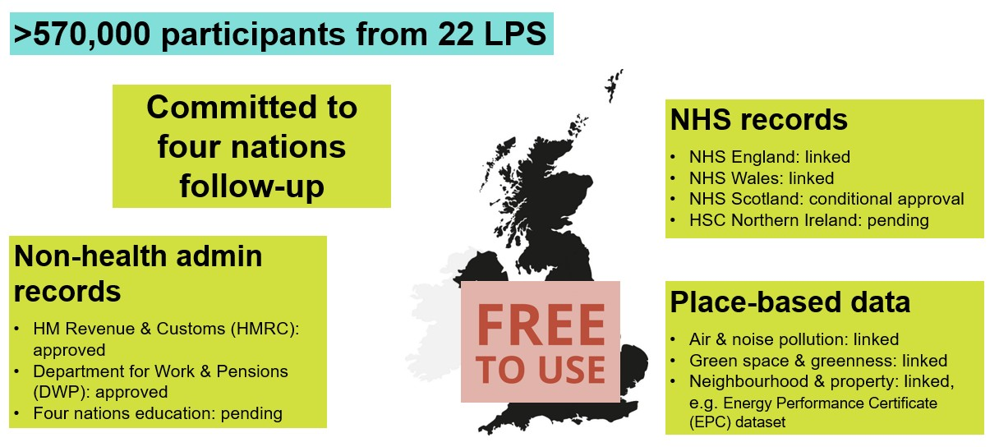

# Understanding UK LLC
>Last modified: 06 Feb 2026

<strong>Key information to help researchers decide if UK LLC is the best place to conduct their research project.</strong>
  

 

 

LPS: Longitudinal Population Studies

You can read more about UK LLC's unique attributes [**here**](../welcome.md). 

