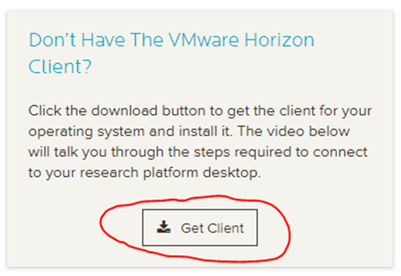
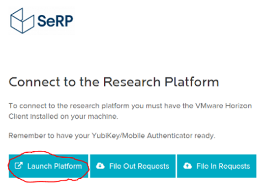
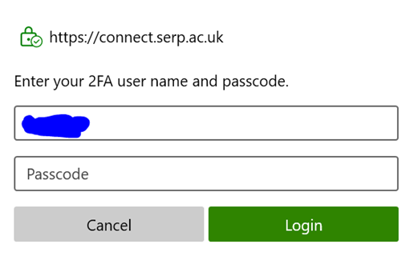
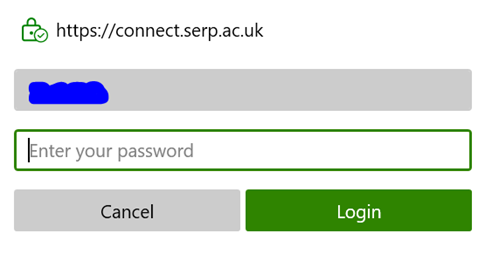

# Logging in

## Account setup
The UK LLC TRE is based on the **SeRP UK infrastructure**. When your project is approved and all paperwork completed, the UK LLC Data Team will provide you with the following information which will enable you to set up your account: 
* **Username**
* **QR code** for 2-factor authentication (2FA).  

Follow the steps below to **set up your account**:
1.	Navigate to [**https://portal.ukllc.ukserp.ac.uk/requestnewpassword**](https://portal.ukllc.ukserp.ac.uk/requestnewpassword) and enter either your username or email address.
2.	You will receive an email with a link to choose your password. Follow the link and enter your password (twice). **Do not share your password with anyone else**. 
3.	Open/download a 'One-Time Password' (OTP) app on your smartphone (we recommend FreeOTP) and scan the QR code. **Keep the QR code secure and do not share it with anyone else**. 
4. In the 2FA passcode field, enter the unique 6 digit code generated by the OTP app. 
5. Submit the form - your SeRP account is now set up and you are ready to log into the UK LLC TRE.

## First-time login  

Follow the steps below to log in: 
1.	Using **Google Chrome**, navigate to [**https://portal.ukllc.ukserp.ac.uk/requestnewpassword**](https://portal.ukllc.ukserp.ac.uk/requestnewpassword) and enter your username and password. 
2. You may need to download **VMware Horizon Client** from the right side of the webpage:  

3.	Once installed, you can **launch SeRP** by clicking ‘Launch Platform’:  

4. Click ‘**Open VMware Horizon Client**’ from the pop-up box and ‘Accept’ the terms when prompted.

5.	The following dialogue box appears:  

6. Enter your **Username** and generate an OTP in your app and enter it into the '**Passcode**' field.

7.	The following dialogue box appears:   

8.  Enter your **password**, and the desktop should launch.

9. When you have finished in the UK LLC TRE, **save your work**, select ‘**Options**’ and then ‘**Log off**’ from the top bar menu.

## Subsequent log in
Once your account is setup, you can also access the UK LLC TRE **directly via VMware**, rather than opening the portal and launching from there. To do this, navigate to **My Computer** and launch **VMware Horizon Client**. Click ‘**connect.ukserp.ac.uk**’ and follow the steps detailed above.

## Video guide

 

