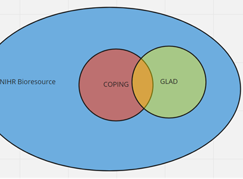
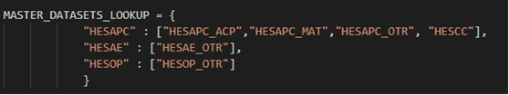
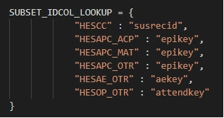

# FAQs
>Last modified: 25 Jul 2024

## 1. Working in the TRE

  
Can I access the TRE from home?

  
  Yes, as long as you're using a work provided laptop/desktop – see below the user security requirements in the [**Data Access and Acceptable Use Policy.**](https://ukllc.ac.uk/governance/) 

*All UK LLC users must:* 
* *Only access the UK LLC TRE using organisation owned/approved machines, which are automatically maintained so that they are fully patched and up to date with relevant virus protection.* 
* *Only access the UK LLC TRE from the UK and via a secure private or corporate network. Where using a private network, the user must make all reasonable efforts to ensure this is maintained and the equipment is secure (strong password) and kept patched and up to date.*

  
Can I access the TRE from abroad?

No, you must only access the UK LLC TRE from the UK, in line with the user security requirements detailed in the question above.

  
How do I unzip my QR code on a Mac?

  If you are using a Mac and therefore using “Archive Utility” rather than 7-Zip, you could experience issues. Archive Utility doesn't support the encryption 7zip uses. Therefore we suggest using a different extractor program called [**The Unarchiver**.](https://theunarchiver.com/) 
  

  

  
What should I do if I can't connect to the TRE?

Some users may experience a blank screen after logging in. They may also see a message saying the connection has been timed out. This is a known issue with some network configurations. To address this issue, right click before logging into SeRP and you will see two options (VMware Blast and PCoIP). You may find that your home network works better with PCoIP, whereas your organisation network works better with VMware Blast.
  

  

    
What is study ID?

Each project is allocated a unique individual/participant-level ID system in the form llc_####_stud_id. This ID identifies a participant within an LPS, therefore if a participant exists in more than one LPS their records will exist in the UK LLC twice against 2 different study IDs. Study ID is specific to each project and must not be shared with users outside the project. If a researcher is named on more than one project in the TRE, separate identifiers are attached to each set of datasets relative to each project. Therefore, datasets cannot be combined between projects. 

  
Can participants be linked between LPS?

Currently, participants who are in multiple LPS cannot be linked. However, this functionality has been factored into the design of the UK LLC TRE and will be implemented.

R helper – which method should I use to pull my data?

We advise using method A (one table at a time) or B (one LPS/data source at a time) for LPS-collected data. However, we advise using method A only for NHS data because of the size of some of the tables.

Why is my screen blank in RStudio?

If you encounter a blank screen when launching RStudio, please refer to this guide to fix the issue: [**https://docs.hiru.swan.ac.uk/display/HDK/RStudio+not+loading**](https://docs.hiru.swan.ac.uk/display/HDK/RStudio+not+loading)

Why isn’t Stata opening when I click on Stata files?

If logging into a fresh desktop, you have to launch Stata from the Windows start menu. It should then ‘deliver’ itself to your desktop and all Stata files should then associate themselves with Stata. 

Can I download Stata packages?

‘net’ downloads are blocked in the TRE because they require an internet connection. However, Stata package downloads via ssc have been whitelisted and are available. If what you need is not available via ssc you can request a file-in including the .do files using the file-in process. 

Can I download R packages from CRAN?

Yes, R packages available on CRAN can be installed on SeRP desktops. CRAN is a whitelisted connection for all approved users.

Can researchers work simultaneously in the TRE?

Yes, researchers can work with their approved project team simultaneously in the TRE. Each project is allocated a project folder, which is a shared area for storing all project-related workings. 

Can researchers share their screen in online meetings?

As long as the other researcher(s) is named on your project and has got valid ONS Accredited Researcher status and has completed a DURA, then yes, it is OK to share your screen on a conference call so that you can discuss your analyses.

Are there backups of researchers’ files in the TRE and how can I access these?

 
If you inadvertently delete or overwrite a file you can restore a previous version. To do this right click on the file/folder and choose ‘properties’ and then go to the ‘previous versions’ tab. Choose the version you want to restore.

How much time is required for output clearance?

Output clearance can take 7-10 working days. We therefore recommend submitting outputs as early as possible and following the guidance to increase the likelihood of them passing first time. 

Is there flexibility in the <10 rule?

No – due to the variability of SDC thresholds set by data providers, we are unable to be flexible. 

How do I extend my access to the TRE?

To extend access beyond the agreed project end date, please complete an amendment form and submit it to the UK LLC Applications Team: [**access@ukllc.ac.uk**](mailto:access@ukllc.ac.uk)

Has UK LLC published a data resource profile that can be cited?

No – UK LLC has not yet published a data resource profile paper, but will do so when resources permit. In the interim, please cite the Summary Profile of the UK LLC Resource which is available on the UK LLC GitHub:
Berman S, Evans K, Thomas R, Crane M, McLachlan S, Whitehorn R, Oakley J, Flaig R, Turner E, Boyd A. Summary Profile of the UK Longitudinal Linkage Collaboration (UK LLC) Resource. Bristol, UK: UK LLC. Available from: [**https://github.com/UKLLC**](https://github.com/UKLLC)

## 2. Working with LPS data

Why are there duplicate study IDs in my LPS dataset?

In most cases LPS data is one row per person. However, there are a few exceptions. Please check the relevant LPS documentation associated with the dataset you are working on.

Are there quirks in some datasets?

This section is work-in-progress and will be updated as further quirks are brought to our attention – if you identify quirks, please notify the UK LLC Data Team [**support@ukllc.ac.uk**](mailto:support@ukllc.ac.uk)

#### Quirk 1: ncds58_ncds5_mother_child_v0001
Datasets which are >1000 variables wide are split on loading to the UKSERPUKLLC database due to SQL field limit of 1024. Where this is the case the table name will contain a _1_, _2_ etc nested between the version and date in the table name. In most cases the 2 (or more) parts can be merged/joined on LLC_XXXX_stud_id. This can be done when the table has a 1-row per participant structure.   

The following table(s) is/are an exception to this:
* ncds58_ncds5_mother_child_vXXXX_1_YYYYMMDD
* ncds58_ncds5_mother_child_vXXXX_2_YYYYMMDD. 

These data require a join on 2 fields, LLC_XXXX_stud_id and person, because this table is at the child-level whereas the key ID LLC_XXXX_stud_id is at the parent-level.  

What is the relationship between participants in NIHRBIO_COPING and GLAD?

As an overview, consider the diagram below. GLAD in the UK LLC TRE contains participants in the Green AND Orange. NIHRBIO_COPING in the UK LLC TRE only contains those in the RED but NOT the orange:   

Work is ongoing to create a ‘true’ individual-level ID in the UK LLC TRE. This is known as Anonymous Linking Field (ALF2), and used in conjunction with llc_XXXX_stud_id, it will be possible to unpick these relationships.

Do LPS have weighting variables in the TRE?

|LPS name|Weighting variables in the TRE?|Further information
|:--|:--:|:--|
|AIRWAVE|TBC|TBC|
|ALSPAC|No|Published paper with missing data: [The Avon Longitudinal Study of Parents and Children - a resource for COVID-19 research: questionnaire data capture July 2021 to December 2021, with a focus on long COVID](https://wellcomeopenresearch.org/articles/8-292). You can also find other papers on the Welcome Open Research site (search for ALSPAC and COVID) that explain how to deal with missing data.|
|BCS70|Yes|Search for weighting variables (e.g. 'design weight') using the Variables search in [Explore](https://ukllc-data-catalogue-96b71e84a70e.herokuapp.com/) and use the Advanced Options to filter on BCS70.|
|BIB|No|The BIB cohort recruited people during pregnancy who attended a 28-week antenatal appointment at the hospital. The aim was to invite all attendees to participate in the BIB cohort. BIB didn’t use any sample frame or weighting during recruitment and the population is broadly representative of people having babies in Bradford during this time. Compared to other LPS in UK LLC, the Bradford cohort falls into the highest deprivation groups and is more ethnically diverse (c. 50% South Asian). |
|ELSA|Yes|Search for weighting variables (e.g. 'cross-sectional weight') using the Variables search in [Explore](https://ukllc-data-catalogue-96b71e84a70e.herokuapp.com/) and use the Advanced Options to filter on ELSA.|
|EPICN|No|Eligible participants were recruited by post. Individuals were requested to provide detailed dietary, biological and other health data, and to be followed up over a few years, and so the response rate was c. 45%. Therefore participants were not a random population sample, but they were [closely similar to UK population samples](https://pubmed.ncbi.nlm.nih.gov/10466767/) with respect to many characteristics, including anthropometry, blood pressure, and lipids, although with a lower proportion of smokers.|
|EXCEED|No|Published paper with missing data: [Extended Cohort for E-health, Environment and DNA (EXCEED) COVID-19 focus](https://wellcomeopenresearch.org/articles/6-349) |
|FENLAND|No|TBC|
|GENSCOT|No|Published paper with missing data: [Generation Scotland: an update on Scotland's longitudinal family health study](https://bmjopen.bmj.com/content/bmjopen/14/6/e084719.full.pdf) |
|GLAD|No|Published paper with missing data: [Comparison of depression and anxiety symptom networks in reporters and non-reporters of lifetime trauma in two samples of differing severity](https://www.sciencedirect.com/science/article/pii/S266691532100127X)|
|MCS|Yes|See the [MCS User Guide](https://cls.ucl.ac.uk/wp-content/uploads/2020/09/MCS1-5_User_Guide_ed9_2020-08-07.pdf) to understand how the weighting variables are named. Search for weighting variables (e.g. 'weight1') using the Variables search in [Explore](https://ukllc-data-catalogue-96b71e84a70e.herokuapp.com/) and use the Advanced Options to filter on MCS.|
|NCDS58|Yes|Search for weighting variables (e.g.  ‘design weight’) using the Variables search in [Explore](https://ukllc-data-catalogue-96b71e84a70e.herokuapp.com/) and use the Advanced Options to filter on NCDS58.|
|NEXTSTEP|Yes|Search for weighting variables (e.g.  ‘design weight’) using the Variables search in [Explore](https://ukllc-data-catalogue-96b71e84a70e.herokuapp.com/) and use the Advanced Options to filter on NEXTSTEP.|
|NICOLA|No|Weighting is explained in [Early key findings from a study of older people in Northern Ireland](https://www.qub.ac.uk/sites/NICOLA/FileStore/Filetoupload,783215,en.pdf)|
|NIHRBIO_COPING|No|Published paper with missing data: [Risk and protective factors for new onset binge eating, low weight, and self-harm symptoms in over 25,000 individuals in the UK during the COVID-19 pandemic](https://osf.io/preprints/psyarxiv/qsbwf/)|
|NSHD46|Yes|Search for weighting variables (e.g. ‘design weight’) using the Variables search in [Explore](https://ukllc-data-catalogue-96b71e84a70e.herokuapp.com/) and use the Advanced Options to filter on NSHD46.|
|SABRE|No|Published paper with further information: [Ethnic differences in associations between fat deposition and incident diabetes and underlying mechanisms: The SABRE study](https://onlinelibrary.wiley.com/doi/pdfdirect/10.1002/oby.20997)|
|TEDS|No|TBC|
|TRACKC19|No|TRACKC19 has not calculated sampling weights.|
|TWINSUK|No|Most of the data in the TRE is derived from the CoPE questionnaires. For more details on how to deal with missing data visit: [Wellcome Open Research Gateways.](https://wellcomeopenresearch.org/gateways/twinsuk)|
|UKHLS|Yes|See UKHLS's guidance on [selecting the correct weight for your analysis](https://www.understandingsociety.ac.uk/documentation/mainstage/user-guides/main-survey-user-guide/selecting-the-correct-weight-for-your-analysis/0). Search for weighting variables (e.g. ‘xw’) using the Variables search in [Explore](https://ukllc-data-catalogue-96b71e84a70e.herokuapp.com/) and use the Advanced Options to filter on UKHLS.|

## 3. Working with NHS England data

Does UK LLC check the accuracy of health records?

No, the UK LLC Data Team can only see de-identified records in the TRE and does not amend any participant data. The UK LLC Data Team only performs the following data curation tasks:
- Clean and deduplicate data, dataset names and structures to enable data provisioning in an efficient manner while maintaining data integrity.
- Load and integrate variable and value labelling, where available from the NHS API and other web sources, into master metadata tables.
- Run the automated disclosure control risk assessment and manually review all flagged risks.

Why are some NHS E datasets missing variable or value labels?

Variable labelling is primarily sourced from an NHS metadata API, but is not fully complete. Gaps in HES and MHSDS have been infilled from additional data dictionary sources. As part of ongoing work, we will be integrating additional sources to further complete the labelling and add value labels. We will inform users as these are updated. Approx current variable label completeness:
* HES, NPEX, COVIDSGSS: 100%
* MHSDS: 70 - 90% 
* GDPPR, CVS, CVAR: 70% 
* PCM: 40%
* DEMOGRAPHICS, CHESS, IELISA: not available.

What version of NHS E data was I provisioned?

NHS E data provisioned to projects are locked to an extract. This is done using the extract_date variable found in the dataset. This is the date the data was extracted at NHS E. All projects are locked to an NHS quarterly extract as well as a fixed table, which controls permissions/consent. This is done based on time of first provision. This prevents participant numbers from fluctuating during the course of the project.

Why are some NHS E variables excluded or encrypted?

Prior to upload to the UK LLC TRE database, NHS data are disclosure risk assessed. During this process variables can be excluded from the upload if they are deemed to be disclosive. In cases where the variable has utility in an encrypted form, the variable is encrypted rather than excluded and an ***_e*** suffix is added to the end of the variable name e.g. *lsoa* ***_e***. Encryption is usually applied to variables which are or provide proxies for location information smaller than region/strategic health authority. 

Why are records limited by codelists?

HES data provisions are limited by medical codes provided by researchers. This means that the extent to which specific coding is used in these data is important. For example, you may observe more records in your HESAPC (admitted patients) than in HESOP (outpatients) despite the national volume of HESOP being typically ~5x greater per year. This is because HESAPC has meaningful diagnoses codes consistently provided. Whereas with HESOP often generic codes are given. This means when codes are matched, fewer hits will be made on datasets with non-specific codes and thus fewer records will be included in your minimised project-specific view. Examples of these include “R69=Not known” for diagnoses and “X997=Not known” for operations. These non-specific codes are used extensively in HESOP, but far less so in HESAPC.  

Going forward, we are looking at changing the way we make linked health records available, by initially making available unfiltered views to researchers (with particularly sensitive records removed) rather than asking for codelists upfront. This will allow codelists to be developed whilst working with the data, but will also allow exploration of records which do not have specific codes assigned.

What do “_OTR”, “_ACP” and “_MAT” suffixes relate to in HES data?

* “_OTR” is short for ‘Other’ and is an extension of the HES record. There should be a 1:1 relationship between the main record found in HESAPC for example and its extension in HESAPC_OTR
* “_ACP” is short for ‘Augmented care period’. This was collected from 1997–2006 and was replaced by HESCC (critical care in 2008)
* “_MAT” is short for ‘Maternity’ and contains variables associated with maternity related admissions.  

See below for data and sub table lookup relationships. Note: HESCC is a subset of HESAPC 

  

How to link “HESCC”, “..._OTR”, “..._ACP”, “..._MAT” data to their main record?

These sub tables do not contain an individual-level identifier. Therefore, they need to be linked to the main HESAPC/HESOP/HESAE. See below for the linkage keys for each dataset: 

How to find test results in covid datasets?

* **NPEX and IELISA**: Use testresult variable. Result is SNOMED (SCT) coded. There are 6 codes used e.g. “SCTID: 1240581000000104”: “Severe acute respiratory syndrome coronavirus 2 detected (finding)”. A lookup will be available shortly in the TRE with linkage guidance.
* **COVIDSGSS**: This dataset does not contain a test results field. We are awaiting confirmation from NHS England about how to interpret the presence of records in this dataset.

