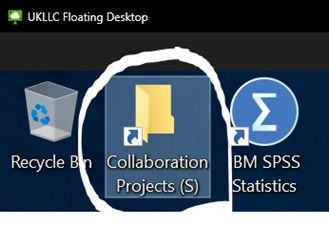
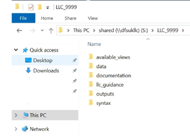

# Getting started
>Last modified: 09 Jul 2025

<strong>This guide explains the basics of working in the UK LLC Trusted Research Environment (TRE).</strong>
  
 
Click on the YouTube link below for a short video guide (90 seconds). Alternatively, scroll down to follow the written step-by-step instructions. 

## Database structure
Data are stored on a SQL Server relational database which sits within the UK LLC TRE. The database name is **UKSERPUKLLC**. The UK LLC data provision pipeline provisions a bespoke set of **views** of the **datasets** held in the database to researchers, based on the datasets requested for each specific project. A database view provides a tailored, read-only, live representation of the underlying data (stored in the database datasets). Using views enables UK LLC to customise your data provision, conduct internal linkages and implement governance controls. Within relational databases, groups of datasets and views are organised into **schema**.  

Each **view** of data provided is named following the convention: **LLC_XXXX.SCHEMA_name_vXXXX_yyyyddmm**, where: 
* **LLC_XXXX** is the project number
* **SCHEMA** is the provenance (e.g. the name of a specific LPS or linked data source)
* **name** is the dataset name (as selected on the data request form)
* **vXXXX_ yyyyddmm** is the version number and date associated with the dataset.  

Associated metadata (value and variable labels) are also provided as database views. A **codelist library** of all codelists requested for any project to date are available to researchers for reference purposes. 

## Your project folders and project naming

<strong>ALWAYS SAVE YOUR WORK ON THE P:\ OR S:\ DRIVE. Once you log off or restart/shutdown the virtual machine you are using, the machine is rebuilt so the majority of the C:\ drive will be wiped.</strong>
  
 

Each UK LLC project is allocated a **project folder** within the UK LLC TRE. The project folder is given the same unique project number that was assigned by the Applications Team when the application to access the TRE was submitted, e.g. LLC_9999. It is important for public/participant transparency, the reusability of content, and governance compliance that these project numbers are used in a clear and consistent way across the project lifecycle. Consequently, all researchers should follow the [**UK LLC Naming of Projects & Data-related Outputs Policy**](https://ukllc.ac.uk/governance).

In order to access your project folder, open the ‘S drive’:  

Find your project folder, named with your UK LLC project number (e.g. LLC_9999):   
 

Your project folder is a **secure working area**, which can only be accessed by you and other approved researchers on your project and authorised UK LLC and SeRP UK staff. Your project folder should be used to store **all workings** related to your project (i.e. syntax, documentation, data files).  

Project folders have a defined **standard folder structure** (as detailed below) to help guide the organisation of projects. We ask that these folders are used in a systematic manner to aid data curation and compliance. This is an important part of UK LLC’s ability to maximise the reuse of research outputs in future research. However, please feel free to create additional sub-folders in your project folder as necessary for your research.
|**Sub-folder**|**Purpose**|
|---|---|
|available_views|Contains csv file outputs from all data provisions with a list of SQL database views that have been made available to the project|
|data|For storing researcher generated datafiles created during analyses|
|documentation|For storing documentation pertinent to the research. This can be generated within the TRE or sent in via ‘file-in’ request|
|llc_guidance|A sub-folder containing key UK LLC requirements documents for ease of reference (e.g. your data request form)|
|outputs|For storing proposed publication-ready analytical outputs to be submitted through the ‘file-out’ review process|
|syntax|For storing researcher-generated analytical syntax/scripts|

## Retrieving data – ODBC connection
**IMPORTANT**: Your project data are not provided as files; instead they are available as **database views**. Therefore, you will not find data files in your project folder on initial login. Data will instead need to be **retrieved** from the UKSERPUKLLC database using an **ODBC connection** (a piece of software which enables programmes – such as R or STATA – to connect to databases and interact with the data).  

There is a **system ODBC Data Source** available to all users in the TRE. This will allow connection to the UKSERPUKLLC database on which all data are held.   

The helper scripts (python, R, Stata) use this data source to pull the relevant data for your project. If you prefer to query the data via another method or software package, the data source is called ‘LLC_DB’.  

A list of your database views can be found in the ‘**available_views**’ sub-folder of your project folder.

## Metadata
All metadata are provided as database views in schemas accessible to everyone in the TRE. Metadata are split into **value labels** called ‘VALUE.all_values’ and **variable labels** called ‘DESCS.all_descriptions’. Using the variables ‘table_name’ and ‘TABLE_SCHEMA’, metadata can be linked to your data. Like all data, metadata can be viewed, queried and linked to your data using different software packages - see [**Available software guide**](../user_guide/UsingSoftware.md).

Value and variable labels are available for LPS data and the majority of NHS England data. NHS England metadata are primarily sourced from an NHS metadata API, but there are gaps, which we will fill from alternative sources. In the interim, please use: [**https://digital.nhs.uk/services/data-access-request-service-dars/dars-products-and-services/metadata-dashboard**](https://digital.nhs.uk/services/data-access-request-service-dars/dars-products-and-services/metadata-dashboard).

##	Reporting concerns about data
All researchers must contact the Data Team at [**support@ukllc.ac.uk**](mailto:support@ukllc.ac.uk) as soon as possible if they have any **concerns** that any of the datasets they have access to have NOT been reasonably de-identified or if there are any concerns about the quality of the data.

