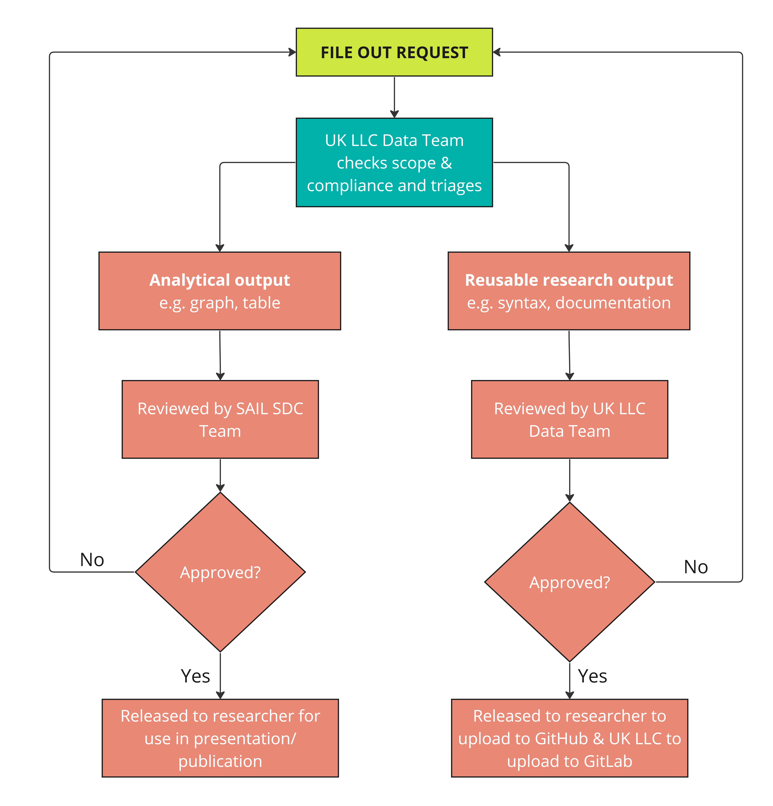
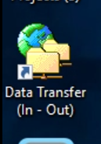
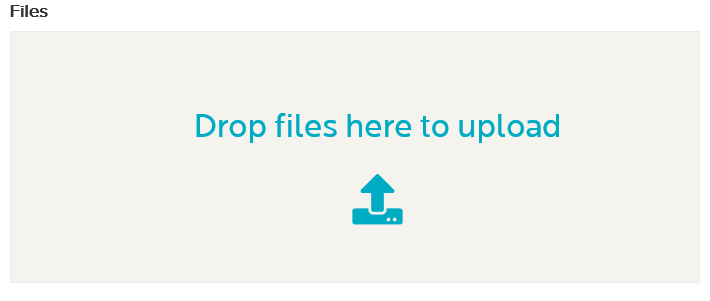
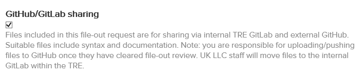
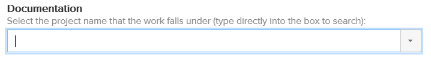

# Moving files in and out
>Last modified: 05 Feb 2025

Click on the YouTube link below for a short video guide (90 seconds). Alternatively, scroll down to follow the written step-by-step instructions. 

## File-ins
You may want to move files that you hold **outside** the TRE (i.e. syntax, documentation), **into** the TRE to facilitate your research. To do so, you must submit a **file-in request** through the [**SeRP Portal**](https://portal.ukllc.ukserp.ac.uk/) following the [**SeRP guidance**](https://docs.hiru.swan.ac.uk/display/HDK/File+In+User+Guide). All file-ins are reviewed by the UK LLC Data Team within one to two working days.  

**Note**: Data **can not** be filed into the TRE by researchers. If your project requires data not currently available, you should contact the UK LLC Applications Team [**(access@ukllc.ac.uk)**](mailto:access@ukllc.ac.uk) who will review each request on a case by case basis.

## File-outs
You will want to take out **analytical outputs** (e.g. tables, graphs) and **reusable research outputs** (e.g. syntax, documentation) from the TRE. Before any output is released it must be **screened** to ensure it is within the **scope** of the project and data owner permissions and is **not disclosive**, i.e. safeguards the confidentiality of data subjects. The two categories of file outs follow different review paths as shown in figure 1.   

All **analytical outputs** are reviewed independently by two members of the **SAIL Databank Statistical Disclosure Control (SDC) Team** based at Swansea University. An analytical file-out may take 7 to 10 working days to be processed depending on complexity. All **reusable research outputs** are reviewed by the **UK LLC Data Team**. A reusable research output may take up to 5 working days to be processed depending on complexity. For further information on reusable research outputs - see [**Using Git guide**.](TeamDataScience.md)

**Figure 1** The file-out review process for analytical outputs and reusable research outputs.   
**Note**: derived data (a type of reusable research output) are not permitted to leave the TRE - see [**Using Git guide.**](TeamDataScience.md)

##	File-out rules 
It is a **critical principle** of UK LLC that only **anonymous** population level aggregate data can be **filed out** from the TRE. It is the responsibility of researchers to ensure they understand and are able to apply the principles of SDC. This is explained elsewhere in [**Guidebook**](SDC.md), and in the **ONS Safe Researcher Training** that all researchers complete prior to being permitted access to the UK LLC TRE. 

**All researchers** agree to uphold these **principles**:
1. All outputs must comply with the project’s permissions and scope.
2. All outputs must be named following the [**UK LLC Naming of Projects and Data-related Outputs Policy**](https://ukllc.ac.uk/governance) - see [**Getting started guide**.](GettingStarted.md)
3. The **SDC threshold is 10 data subjects**. Unweighted counts <10 and statistics (e.g. weighted counts, percentages, means, etc.) derived from groups containing <10 data subjects must be suppressed, i.e. counts ranging from zero to nine, inclusive, are not permitted.
4. All researchers must make best efforts to ensure outputs are anonymous before submitting them for file-out checks.
5. The findings of the file-out review are binding and research users must **correct any identified issues**. 

**Failure to adhere to these principles may result in sanctions** (such as researchers being required to undergo renewed training).  

##	File-out process
To request files out of the TRE **follow the steps below**: 
1.	Launch ‘**Data Transfer (In-Out)**’ from the desktop within the TRE.  

2.	Select ‘**Request File(s) Out**’  
  
3.	Choose your files.    

4. If your file-out is a **reusable research output** please tick the '**GitHub/GitLab sharing**' box.   

5. Select your project number (e.g. llc_9999) from the drop down box.  

6. If the reviewer has any **questions** they will email you to seek clarity. 
7. If your file-out is **rejected** you will have the opportunity to make the **requested amends** and can then **resubmit**. 

