# Using Git
>Last modified: 04 Jul 2025

<strong>This guide explains how to use UK LLC Git repositories to promote reproducible and reusable research.</strong>

 
Click on the YouTube link below for a video guide (5 minutes). Alternatively, scroll down to follow the written step-by-step instructions.

## Reproducible and reusable research
The UK LLC model promotes a culture of reproducible and reusable research where users generate **reusable research outputs** (including derived data, syntax and documentation). These are deposited back into the resource to inform other users’ research, to drive efficiency, and to enable follow-on or replication studies (see Figure 1). UK LLC’s Team Data Science approach is informed by the <strong><a href="https://www.ukrn.org/" target="_blank" rel="noopener noreferrer">UK Reproducibility Network</a></strong> and the <strong><a href="https://www.go-fair.org/fair-principles/" target="_blank" rel="noopener noreferrer">FAIR Guiding Principles</a></strong> for scientific data management and stewardship.

All researchers must deposit reusable research outputs into the UK LLC resource that are:
* Necessary for other researchers to understand and reproduce the research and/or
* Useful to others for reuse within their own project and/or
* Necessary for external stakeholders (including participants and the public) to understand how data are being used in the UK LLC TRE.

**Note**: Failure to make reusable research outputs available will risk future access to the resource.

The UK LLC system ensures that researchers receive **full attribution** for the reusable content they generate.
**Note**: UK LLC cannot guarantee the quality of reusable research outputs. It is the responsibility of the researcher to check reusable research outputs prior to inclusion in analyses and subsequent interpretation.

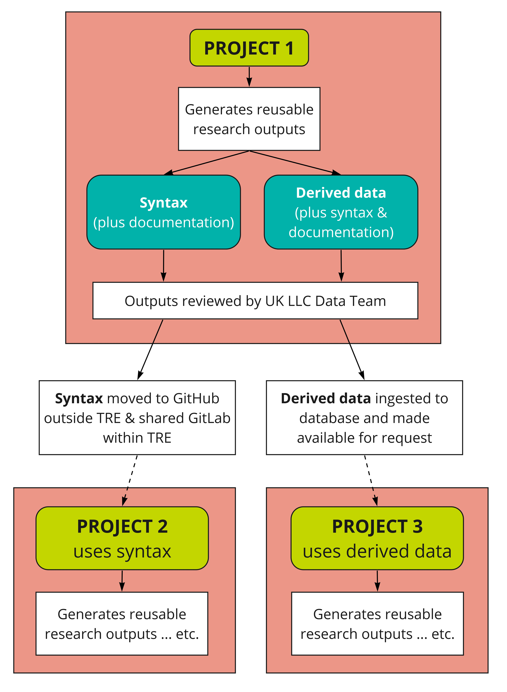

**Figure 1** The inter-relationship between projects and reusable research outputs in the UK LLC TRE

**Note**: the dashed arrows illustrate the re-use of research outputs from one project to another (with prior approval(s) by LPS and/or UK LLC Linked Data Review Panel in the case of derived data)

## UK LLC Git repositories
To facilitate reproducible and reusable research, UK LLC maintains **Git repositories** where, for each project, researchers add cleaned and documented reusable research outputs. There are three distinct UK LLC Git spaces:
1.	Each approved project has its own **Project GitLab** within the UK LLC TRE.
2.	There is a **Shared/ReadAll GitLab** within the UK LLC TRE for sharing code between projects.
3.	Each approved project has its own **Project GitHub** (within the UK LLC GitHub) outside the UK LLC TRE.

You’ll find GitLab available on all UK LLC SeRP desktops. Your permissions will already be mapped to the appropriate group.

The table below summarises the **read/write/access permissions** for these three UK LLC Git spaces that are applicable to each potential user group.

|**User group**|**Internal Project GitLab**|**Internal Shared/ReadAll GitLab**|**External Project GitHub**|
|---|:---:|:---:|:---:|
|UK LLC Data Team|Read/Write|Read/Write|Read/Write|
|Researcher within their project space|Read/Write|Read only|Read/Write|
|All researchers|No access|Read only|Read only|
|Public|No access|No access|Read only|

## How to share syntax with your team members - project GitLab
To share syntax and other files with researchers working on your project, you will need to set up a project GitLab repository as detailed below.

Creating a GitLab repository

To access GitLab within the TRE open a browser (recommend Mozilla Firefox) navigate to <strong><a href="https://gitlab.ukllc.ukserp.ac.uk" target="_blank" rel="noopener noreferrer">https://gitlab.ukllc.ukserp.ac.uk</a></strong> or click on the “UKLLC GitLab” icon from the SeRP desktop.
If you have not already created a GitLab account, you will be asked to do so here. Log in using your SeRP credentials.

1. If this is your first time using GitLab, you’ll need to set up an **SSH (Secure Shell) key pair**. See SeRP UK guide  on how to do this: <strong><a href="https://docs.hiru.swan.ac.uk/display/HDK/GitLab+and+SSH#types-of-ssh-keys-and-which-to-choose" target="_blank" rel="noopener noreferrer">https://docs.hiru.swan.ac.uk/display/HDK/GitLab+and+SSH#types-of-ssh-keys-and-which-to-choose</a></strong>. Having an SSH key set up is essential in allowing you to push to and pull from repositories.

2.	Once SSH keys are set up, in GitLab select “Groups” > “View all groups”, then “UKLLC” from the main menu.

3.	Here you should see the Subgroups you belong to. This should include all projects you belong to and “ReadAll”:
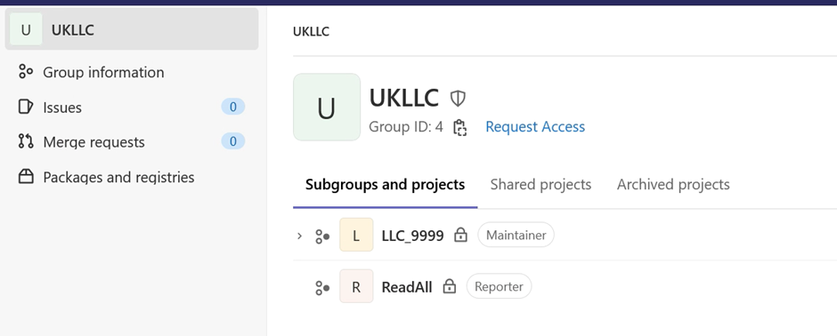

4.	To create a version-controlled area within your project space you’ll need to create a “project” (known as a repository in Git) within your subgroup.

5.	To do this, click on the subproject you want to version control within (in this case LLC_9999) and click “New project”:
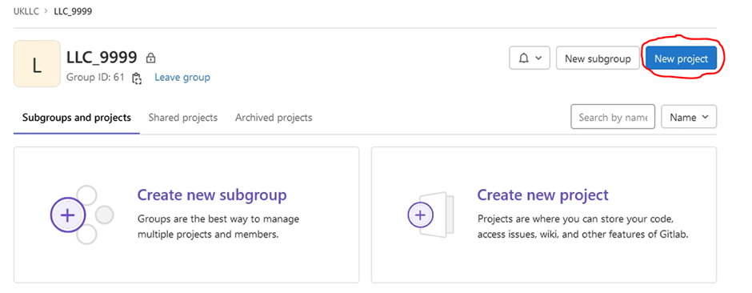

6.	Select “Create blank project”.

7.	Enter project name, this should follow the naming convention <project_number>_<descriptive_name> (e.g. “LLC_9999_GP_asthma_diag”), deselect “initialize repository with a README” and click “Create project”:
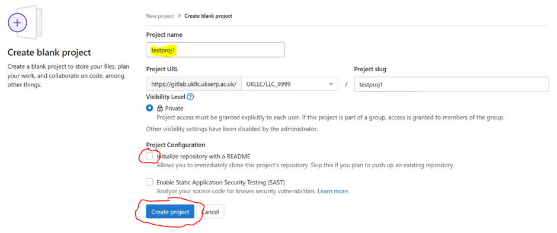

8.	Decide/create a folder in your project working space (Windows Explorer) containing files for version control. This folder should contain syntax and documentation only, not data. Data should be stored in a separate folder.

9.	Open Git BASH and cd (change directory) to folder “S:\#insertProjectName#\#insertFolderName#”, e.g.
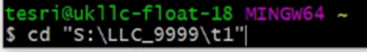

10.	To initialise Git within this folder type git init:
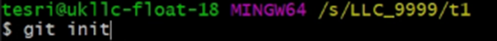

11.	You’ll need to add a “remote” to tell Git which remote repository in GitLab is tied to the specific local folder on your computer. The remote tells Git where to push or pull from. For this you’ll need a project path.

12.	To get your project path go to the project page in GitLab, click the ‘Clone’ drop down and copy the address from ‘Clone with SSH’ cell:
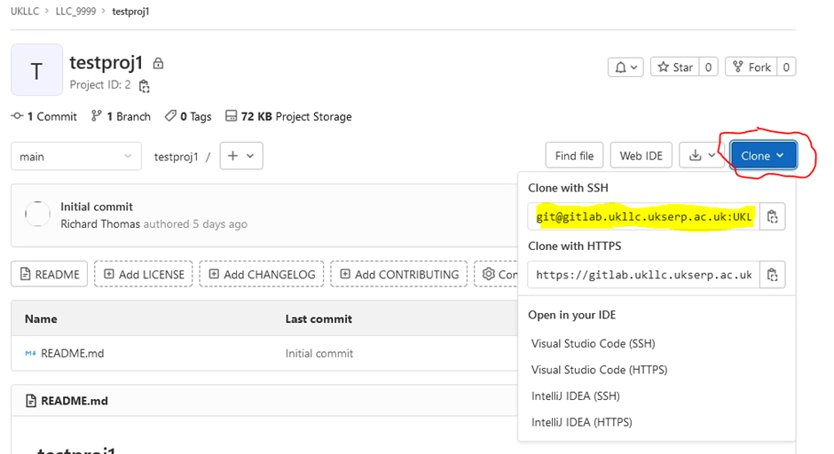
Once you have this, in Git BASH type: git remote add origin #insertProjectPath#:
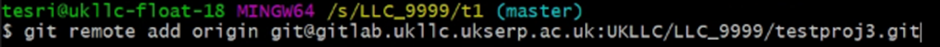

13.	Switch branch to main with:

14.	To add all files in the folder use: “git add .” or to add specific files use: git add #specificFilename#, e.g.
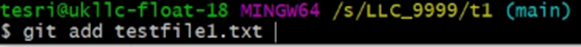

15.	To commit changes: git commit -m ”commitMessage”:
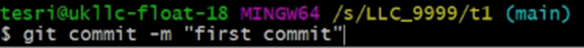

16.	To push your local commits to the main branch of the origin remote:
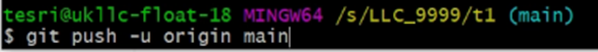

### Dos and don’ts
* Files in the repository should follow the <strong><a href="https://ukllc.ac.uk/governance" target="_blank" rel="noopener noreferrer">UK LLC Naming of Projects and Data-related Outputs Policy</a></strong>
* Repositories themselves should follow the naming convention: <project_number>_<descriptive_name> (e.g. “LLC_9999_GP_asthma_diag”)
* Please keep data files outside your repository and store in a separate folder. This is because these files cannot be shared between projects.

## How to share syntax more widely - GitHub and ReadAll GitLab
To share syntax and other files with researchers working on other projects, you must submit a **file-out**, as detailed below. When a file has been approved:
* it is **your responsibility** to copy the file to your project **GitHub repository** and to switch the visibility of your GitHub from ‘Private’ to **‘Public’**.
* it is **UK LLC's responsibility** to copy the file to the internal **ReadAll GitLab repository**.

### File outs
See the [**Moving files in and out guide**](../user_guide/MovingFilesInAndOut.md) to understand how to submit a syntax or documentation file out for review.

* Documentation must be sufficiently detailed for other researchers to understand the syntax.
* Content of the syntax and documentation must not increase identifiability risk of UK LLC participants.
* Syntax should follow good coding practices, which includes meaningful naming, appropriate level of comments to give context and well-structured.

### GitHub
To **push your syntax and documentation to GitHub** follow these steps:
1. Navigate to <strong><a href="https://github.com/UKLLC/" target="_blank" rel="noopener noreferrer">https://github.com/UKLLC/</a></strong> and sign in.
2. Find your project repository e.g. LLC_0000 and click to open.
3. Select “Add file”, selecting option “Upload files”:
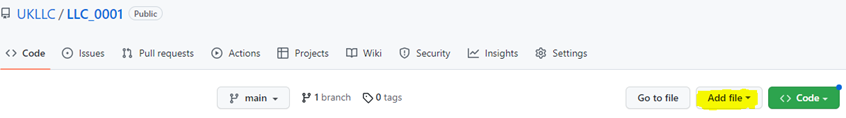
4. Drag/choose files, adding a commit message where highlighted before selecting “Commit changes”:
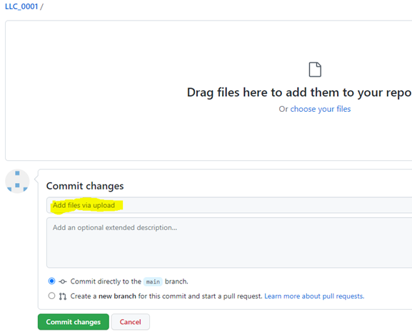
**Note**: your project repository will have a pre-populated readme file with important project information e.g. lay summary. Please feel free to add to this readme to give context to your files.

To set your repository to **Public** visibility:
1. Navigate to the main page of the repository.
2. Under your repository name, click Settings. If you cannot see the "Settings" tab, select the dropdown menu above your repo name and then click Settings.
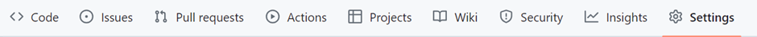
3. In the "Danger Zone" section, to the right of "Change repository visibility", click Change visibility.
4. Select Public visibility.
5. To verify that you're changing the correct repository's visibility, type the name of the repository you want to change the visibility of.
6. Click I understand, change repository visibility.

## How to use another researcher's syntax - ReadAll GitLab
If you wish to use code developed by another researcher you need to **clone** the repository from the ReadAll GitLab:
1.	Within the SeRP navigate to <strong><a href="https://gitlab.ukllc.ukserp.ac.uk" target="_blank" rel="noopener noreferrer">https://gitlab.ukllc.ukserp.ac.uk</a></strong> or click on UKLLC GitLab from the SeRP desktop. Recommended browser: Mozilla Firefox.
2.	From main menu select “Groups” > “View all groups”, select “UKLLC”, then select “ReadAll”.
3.	Here you will see all repositories returned to UK LLC, select the repository you want to clone and click on the Clone dropdown and copy the text under “Clone with SSH”:
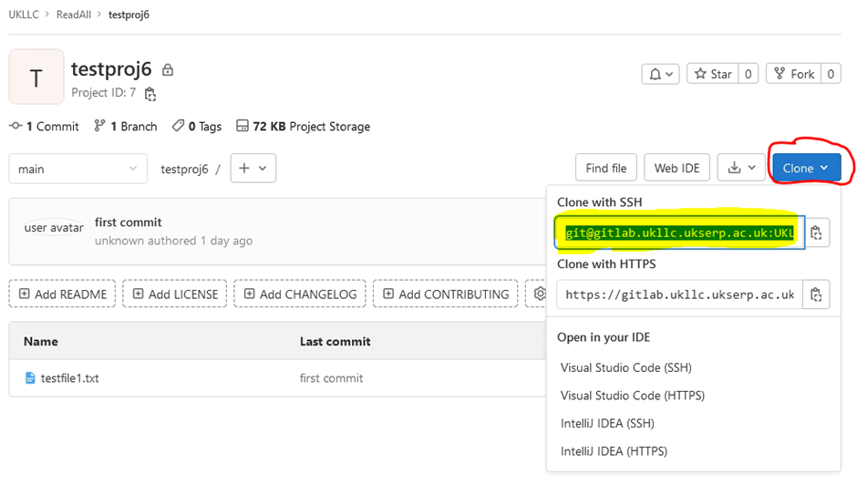
4.	Open Git BASH and change directory (“cd #insertFilePath”) to folder in your project file storage area where you want to clone files to and type: (replacing the repository name with the one copied in the previous step):
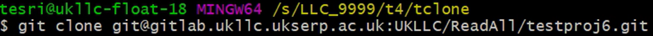
5.	If successful you’ll have a folder written to your chosen directory containing the repository contents.

## How to share a derived dataset
If you have generated a derived dataset that could be helpful to other researchers, you should contact the UK LLC Data Team as detailed below. Derived (or returned) datasets can **not** leave the TRE. If approved, your dataset will be available for request by other researchers in the same way as for LPS and linked datasets.

1. Email the file path of your derived dataset and associated files to the UK LLC Data Team [**support@ukllc.ac.uk**](mailto:support@ukllc.ac.uk).
2. In the email you must detail the project number and GitLab repository containing the accompanying syntax and documentation used to create and document the derived data.
**Note**: Derived data without syntax and documentation will NOT be processed.
3. The contents of the data files and accompanying syntax and documentation must not increase identifiability risk of UK LLC participants and should contain the following **metadata**:

     *	Name of dataset

     *	Dataset description

     *	Full name of dataset creator

     *	Up to six keywords

     *	Whether the dataset contains sensitive information e.g. mental/sexual health

     *	Data sources (this only needs to include the names of the LPS that have contributed data and/or the linked data owners (e.g. NHS England), rather than the names of the individual datasets)

     *	Value and variable labels.
