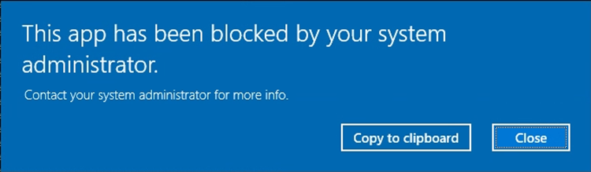
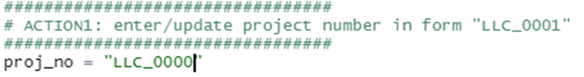
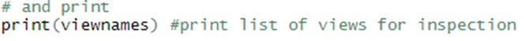
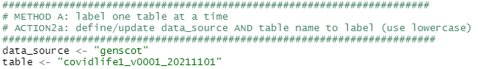
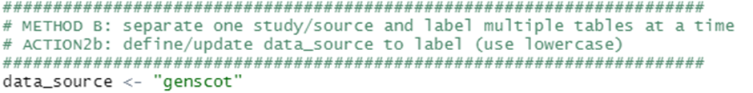
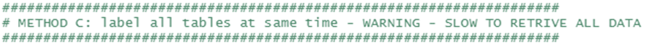
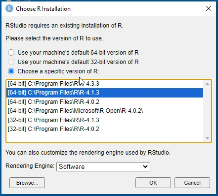
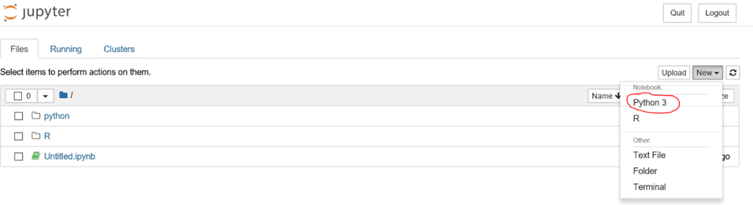
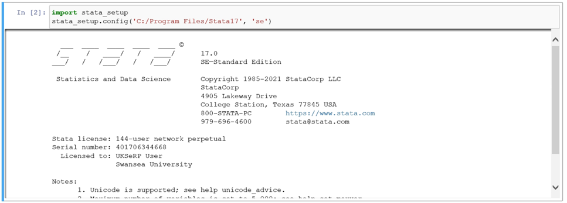
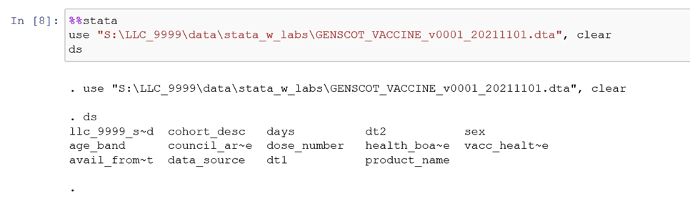

# Available software
>Last modified: 17 Feb 2025

UK LLC supports researchers in using their preferred software packages. The following packages are **pre-installed** in the UK LLC TRE: 
* SQL Server Management Studio
* Python
* R and RStudio
* Stata 
* Jupyter Notebooks
* SPSS.   

If you prefer to use **other software**, please contact [**support@ukllc.ac.uk**](mailto:support@ukllc.ac.uk) and the UK LLC Data Team will coordinate review of your request. Please be aware that alternative software packages may incur a fee. 

## 1. SQL Server Management Studio  
SQL Server Management Studio can be used to **view and query your data**. To explore your database views, open the software package and connect to the server ‘**SERPSQL**’. Under ‘Databases’ in the Object Explorer, navigate to the ‘**UKSERPUKLLC**’ folder, where you can explore your ‘**Views**’ and '**Tables**'. Data and metadata are found in ‘Views’ and Codelists in ‘Tables’.  

To **browse the data** in a specific view, right click on the view name and ‘**Select Top 1000 Rows**’. This will produce a grid-view of the first 1,000 rows of data and a query window where data can be queried using SQL commands. This also works for tables.  

Click on the YouTube link below for a short video guide (70 seconds).

## 2. Python
To use python and install any packages, you need to create your own **Anaconda environment**. You should do this **before running any code**. This enables you to pip and conda install packages **without barriers**. 

### Creating a new environment
Click on the YouTube link below for a short video guide (60 seconds).

We provide an **automatic means** of creating an environment, but you are welcome to create your own environment independently if you prefer. To choose the automatic pathway, double click on: '**S:\ReadAll\python_help\env_helper\create_python_env.bat**'. This creates a new environment as a **clone of the base environment**, meaning all standard packages in the base Anaconda installation will be included.   

**Things to be aware of whilst the environment is being created**:
1.	Creating a new environment can take around **2 hours**, but you can leave this running in the background. 
2.	The terminal may print '**The following packages cannot be cloned out of the root environment:...**' This is expected and the environment should still create despite this message.
3.	At the end of the process, you will see the following **warning message**. This can be closed. It will appear 4 times. Your environment will still be **successfully created** despite the warning.
 

Once complete the script will have created a **new environment** in the location: '**P:/%USERNAME%/envs**' called '**env1**'. Therefore, the **environment name** will be '**P:/%USERNAME%/envs/env1**'.

The **batch file** ('create_python_env.bat') can be **edited** if you wish to store your environment in a **different location** or would like to **name it differently**. Please take a **copy** of the batch file and **save it** in your project area before editing. The environment will be created in the P: drive because this is a drive available only to you and accessible from whichever remote desktop you are assigned on login.

### Using your new environment

If you are using **Jupyter Notebooks, Spyder** or any other **Anaconda tools** for your analyses it is recommended that you launch these from Anaconda Prompt **after activating your new environment**. This will ensure you are running your new environment within the application. To do this:
1. Launch **Anaconda Prompt**.
2. Type: **conda activate "P:/%USERNAME%/envs/env1"** (replacing %USERNAME% with your actual username). 
4. From within Anaconda Prompt type the name of the **application you want to run**: eg “spyder” or “jupyter notebook”.  

### Using the Python helper
Click on the YouTube link below for a short video guide (60 seconds).

We recommend using **Juypter notebook** and we have prepared a template notebook with a comprehensive suite of helper functions. You will find this in: '**S:\ReadAll\python_help\notebook_helper**'. There are two files of note here, '**notebook_template.ipynb** and '**notebook_helper.py**'. Make sure to copy them both into your project’s working directory. The notebook template will guide you through how to pull your data and operate on it, using functions from the notebook helper program. You needn’t look into the underlying code in the notebook helper, but you are welcome to make changes should you wish. 

**Note**: for **Jupyter notebooks** you may want to change directory to your working directory **before running the application**.

## 3. R and RStudio
### Using the R helper
Click on the YouTube link below for a short video guide (120 seconds).

If you are planning on using R, an **R helper** is provided in '**S:\ReadAll\r_help**'. These scripts are designed to help you extract your data from the database and to add **variable** and **value labels** using the **expss R package**. 

To use the R helper:
1.	Take copies of both scripts '**r_label_helper.R**' and '**r_label_functions.R**' and save copies to your working area. This is because you will need to **edit** 'r_label_helper.R' with your project specifics and requirements.
2.	Once you have **local copies**, ensure both scripts are in the **same directory** because '**r_label_helper.R**' will expect to find '**r_label_functions.R**' 
3. Open '**r_label_helper.R**' with **RStudio** and find the comment '**ACTION1: enter/update project number...**'. Update the **proj_no variable** to your project number in the form '**LLC_XXXX**'  

4.	**Run the script** up to and including:  
 

    **N.B.** It can take up to 30 minutes to load in the packages.

5.	You will see a **list of your project views** printed to the console and a '**viewnames**' variable will be created in your environment. Check 'viewnames' are consistent with your expectation.  
6.	View the remainder of the script. There are **three options** pre-scripted for **retrieving data** from the database and adding the **variable and value labels**:  

*   One **table** at a time.  
*   One **LPS/data source** at a time e.g. MCS.  
*   **All tables** at once (not recommended due to performance issues).

### Method 1 - one table at a time
1.	Under **ACTION2a** update the ***data_source*** and ***table*** name variables using lowercase e.g.  

2.	Note your views are in the example form '**LLC_0001.GENSCOT_COVIDLIFE1_v0001_20211101**'
3.	The ***data_source*** (usually LPS name) is in ** red**, separated by the descriptive part (+versions and date) by an underscore. You will need to isolate these and assign to the ***data_source*** and ***table*** variables separately as shown above.

### Method 2 - one LPS/data source at a time
1.	Under **ACTION2b** update the ***data_source*** only using lowercase e.g.  

2.	This will retrieve all views from that data source and apply value and variable labelling. The output will be stored as a list of dataframes called “one_stud_dfs_w_labs”. 

### Method 3 - load all data at once
1.	No update to script required here. Run code underneath:  

2.	As stated in the comments, this method is not recommended if you have a large number of datasets because these will be slow to retrieve and add labels to.  

You are welcome to modify the 'r_label_helper.R' to suit your use case and to use the example syntax to apply labelling to your own subsets of tables.

### Specifying the version of R within RStudio
 Should you wish to change the version of R being used by RStudio. Ensure that if your library is setup for 4.1.3, you set R to 4.1.3 with either of the following methods, else pick the relevant option to your library.

Change R within RStudio:

1. Go to Tools > Global options
2. Click 'Change...' under R version
3. Click the 'Choose a specific version of R' option
4. Select '[64-bit] C:/Program Files/R/R-4.1.3'
5. Click Okay
6. Click Apply

Change R on launch of RStudio:

Hold the CTRL key and double click the RStudio launcher, as shown below

Doing this will change the folder in which RStudio loads your library, as shown above, if you select 4.1.3, the library path will be P:\%USERNAME%\AppData\Roaming\R\4.1.3\Library

For more information on using R and R studio in the TRE  visit the [SeRP guidance](https://ukserp.atlassian.net/wiki/spaces/HDK/pages/16712639/RStudio+and+R).

## 4. Stata
### Using the Stata helper
Click on the YouTube link below for a short video guide (60 seconds).

A Stata helper script is provided in '**S:\ReadAll\stata_help**'. The script 'py_stata_helper.py' is run by a batch file 'run_stata_helper.bat'. This program will extract data from your project views in the database, add variable and value labels and save stata format (.dta) files to your project working space in 'S:\LLC_XXXX\data\stata_w_labs'. To use the helper:
1. Create your own python environment. See 'Creating a new environment' if not already done.
2. When the program completes, double click on 'S:\ReadAll\stata_help\run_stata_helper.bat'.
3. When asked, input your project number in the example form '9999'.
4. The command prompt will print to inform you when a dataset has been retrieved and whether value and variable labels have been found. 
5. The files will be saved in .dta format in 'S:\LLC_XXXX\data\stata_w_labs' and can be opened in Stata.

**Warning**: if your project has been provisioned a large number of views this process can take up to an hour to complete.

### Manually retrieve and label data
To retrieve the full contents of a data view in Stata run:
*odbc load, exec(“select * from #INSERTVIEWNAME#”) dsn(LLC_DB)*  

View names can be found in the '**available_views**' folder in your project space. Replace #INSERTVIEWNAME# with the view name you’d like to retrieve. This must include schema, which is usually your project number e.g.
*odbc load, exec('select * from LLC_9999.bcs70_basic_demographic_v0001_20211101') dsn(LLC_DB)*  

Variables and value labels can be retrieved via the following database views: 
* DESCS.all_descriptions – for **variable** labels
* VALUE.all_values – for **value** labels.

### Using Stata with Jupyter Notebook
If using Stata, we recommend building your analyses into a **Jupyter Notebook**. Jupyter Notebook allows you to execute code and to create visualisations with narrative text in one document (a 'notebook'). This enables researchers to easily **share their code** and **research findings**. If you are new to Jupyter, we recommended that you familiarise yourself using online tutorial/training material.

Stata in Jupyter is invoked using the **IPython kernal**, so you can use Python and Stata in the same environment. To use Stata within Jupyter you will first need to create your own python environment. You will also need to run the Stata helper to convert your database views into Stata files. Once you’ve completed these 2 steps, you can begin with Stata in Jupyter:
1.	Launch Anaconda Prompt.
2.	Type: *conda activate "P:/%USERNAME%/envs/env1"* replacing %USERNAME% with your actual username. This will switch you to your custom environment.
3.	Change directory to where you want to save your workings by typing: *S:* and then *cd "LLC_9999\syntax"* replacing "*LLC_9999\syntax"* with target working directory.
4.	Within Anaconda Prompt type: *jupyter notebook*. This will launch Jupyter Notebook with your custom environment and working directory pre-configured. 
5.	When Jupyter has loaded, select 'New' and 'Python 3' (Warning 404 message will flash up for approx. 10 secs – ignore):  

6.	You are now ready to execute code. In cell 1 type: *pip install --upgrade --user stata_setup*. Then press the **>Run** button on the menu bar.
7. In cell 2 type: *import stata_setup*  **>Run**
8. In cell 3 type: *stata_setup.config(‘C:/Program Files/Stata18’, ‘se’)*  **>Run**

This will configure your stata setup:  

9.	You can then load a dataset and begin analyses. In each cell you intend to run stata code the first line must begin with *%%stata*. See the example below:  

