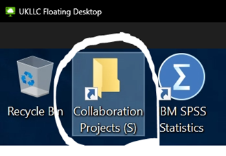
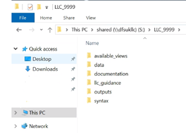

# Getting started
>Last modified: 23 Sep 2026

<strong>The basics of working in the UK LLC Trusted Research Environment (TRE).</strong>

 

Click on the YouTube link below for a short video guide (90 seconds). Alternatively, scroll down to follow the written step-by-step instructions.

## 1. Your project folders and project naming
<aside class="admonition danger">
ALWAYS SAVE YOUR WORK ON THE P:\ OR S:\ DRIVE
Once you log off, restart or shutdown the virtual machine that you are using, the machine is rebuilt and the majority of the C:\ drive wiped.</aside>  

<aside class="admonition danger">
DATA IN YOUR PROJECT SPACE WILL BE DELETED 6 MONTHS AFTER YOUR PROJECT END DATE
You must ensure your code fully reproduces all intermediate files, as these scratch files will not be retained.</aside>  
 

Each UK LLC project is allocated a **project folder** within the UK LLC TRE. The project folder is given the same **unique project number** that was assigned when the application was submitted, e.g. LLC_9999. It is important for public and participant transparency, the reusability of content, and governance compliance that these project numbers are used in a clear and consistent way across the project lifecycle. All researchers should follow the [**UK LLC Reproducible and Reusable Research Policy**](https://ukllc.ac.uk/governance).

In order to access your project folder, open the 'S drive':  

Find your project folder, named with your UK LLC project number (e.g. LLC_9999):  

 

Your project folder is a **secure working area**, which can only be accessed by you, any other approved researchers on your project, and authorised UK LLC and SeRP UK staff. Your project folder should be used to store **all workings** related to your project (i.e. syntax, documentation, data files).

Project folders have a defined **standard structure** (as detailed below) to help guide the organisation of projects. We ask that these folders are used in a systematic manner to aid data curation and compliance. This is an important part of UK LLC’s ability to maximise the reuse of research outputs in future research. However, please feel free to create additional sub-folders as necessary for your research.
|**Sub-folder**|**Purpose**|
|---|---|
|available_views|Contains csv file outputs from all data provisions with a list of SQL database views that have been made available to the project|
|data|For storing datafiles generated created during analyses|
|documentation|This contains a text file with information about which [**freeze**](../ukllc_key_facts/sample/ukllc_sample.md)1 the project has been provisioned to.   It can also be used for storing additional documentation pertinent to the research (either generated within the TRE or sent in via '[**File-in**](../user_guide/moving_files.md#file-ins)' request) |
|llc_guidance|A sub-folder containing key UK LLC requirements documents for ease of reference (e.g. your data request form)|
|outputs|For storing proposed publication-ready analytical outputs to be submitted through the '[**File-out**](../user_guide/moving_files.md#file-outs)' review process|
|syntax|For storing researcher-generated analytical syntax/scripts|

>**Note**  
>1 Projects remain tied to their original 'freeze' unless newly available data (i.e. data that were not available when the original application was submitted) are requested via an amendment.

## 2. Database structure
Data are stored on a SQL Server relational database called **UKSERPUKLLC**. The UK LLC data provision pipeline makes a bespoke set of **views of the datasets** held in the database available to researchers, based on the datasets requested for each specific project.  
A database view provides a tailored, read-only, live representation of the underlying data. Using views enables UK LLC to customise your data provision, conduct internal linkages and implement governance controls. Within relational databases, groups of datasets and views are organised into **schema**.

Each view of the data provided is named following the convention: **LLC_XXXX.SCHEMA_name_vXXXX_yyyyddmm**, where:
* **LLC_XXXX** is the project number
* **SCHEMA** is the provenance (e.g. the name of a specific LPS or linked data source)
* **name** is the dataset name (as selected on the data request form)
* **vXXXX_ yyyyddmm** is the version number and date associated with the dataset.

Associated metadata (value and variable labels) are also provided as database views. A **codelist library** of all codelists requested for any project to date are available to researchers for reference purposes.  

## 3. Retrieving data – ODBC connection
**IMPORTANT**: Your project data are not provided as files but as **database views**, so you will not find data files in your project folder on initial login. Data will instead need to be retrieved from the UKSERPUKLLC database using an **ODBC connection** (a piece of software which enables programmes – such as R or STATA – to connect to databases and interact with the data).

There is a **system ODBC Data Source** available to all users in the TRE. This will allow connection to the UKSERPUKLLC database on which all data are held.

UK LLC's helper scripts (python, R, Stata) use this data source to pull the relevant data for your project. More information about these helper scripts is available on the [**Available software**](../user_guide/usingsoftware.md) page.  (If you prefer to query the data via another method or software package, the data source is called 'LLC_DB'.)

A list of your database views can be found in the '**available_views**' sub-folder of your project folder.  

## 4. Naming your files
You should use the following file naming convention:

    <llc>_<project_number>_<file_name>_<file_type>_<version>

* **< llc>_<project_number>** e.g. llc_9999
* **<file_name>** corresponds to a concise descriptor of the file of maximum 10 characters length
* **<file_type>** corresponds to a signifier of the type of content in the file, e.g. 'syntax', 'data', 'doc'
* **< version>** corresponds to an integer of variable length, sequenced in order of versioning (decimal values are not permitted).

| **Example**|**Interpretation**|
|---|---|
|llc_9999_sesdemog_syntax_v1|The syntax used to create the sociodemographic dataset 'llc_9999_sesdemog_data_v1'|
|llc_9999_sesdemog_data_v1|The data derived by project llc_9999 researchers about sociodemographic measures using the syntax in the syntax file above|
|llc_9999_sesdemog_doc_v1|Documentation summarising descriptive sociodemographic information about the participants included in the dataset file above |

As data processing/analysis syntax can produce multiple outputs, each file should be given a unique name pertinent to the data. Multiple outputs produced by one syntax file should not increment the version number. Version numbers should only increment when there has been a change in analyses or data pipeline, resulting in a data output with the same name being produced. Where multiple syntax files are used in sequence/combination to produce a data output, a master syntax file should be maintained and versioned in accordance to the versioning of the data output.

## 5. Metadata
All metadata are provided as database views in schemas accessible to everyone in the TRE. Metadata are split into **value labels** called ‘VALUE.all_values’ and **variable labels** called ‘DESCS.all_descriptions’. Using the variables ‘table_name’ and ‘TABLE_SCHEMA’, metadata can be linked to your data. Like all data, metadata can be viewed, queried and linked to your data using different software packages - see [**Available software guide**](../user_guide/usingsoftware.md).

Value and variable labels are available for LPS data and the majority of NHS England data. NHS England metadata are primarily sourced from an NHS metadata API, but there are gaps, which we will fill from alternative sources. In the interim, please use: <strong><a href="https://digital.nhs.uk/services/data-access-request-service-dars/dars-products-and-services/metadata-dashboard" target="_blank" rel="noopener noreferrer">https://digital.nhs.uk/services/data-access-request-service-dars/dars-products-and-services/metadata-dashboard</a></strong>.

## 6. Understanding your project's denominator
A file called '**study_permissions**_v000_yyyymmdd' is automatically provisioned to all projects. This dataset serves as the denominator, or 'spine', for all LPS participants in the UK LLC TRE. The date in the file name relates to the Freeze to which each project is fixed. 
 

The study_permissions enable researchers to **calculate linkage rates** (where relevant) and contextualise a project's LPS participants in relation to the LPS datasets as a whole.  

More information about using the study permissions dataset is [**available here**](../ukllc_managed_data/datasets/nhse_reference/study_permissions.ipynb). 

## 7. Reporting concerns about data
All researchers must contact the Data Team at [**support@ukllc.ac.uk**](mailto:support@ukllc.ac.uk) as soon as possible if they have any concerns that any of the datasets have NOT been reasonably de-identified or if there are any concerns about the quality of the data.
