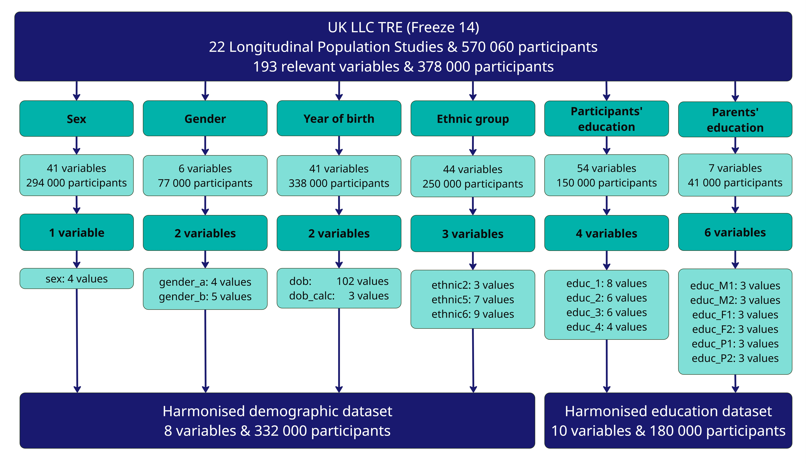

# Harmonisation: UK LLC's approach
>Published 17 February 2026

<strong>By Rachel Calkin, UK LLC Research Manager (Data), February 2026.</strong>
  
 
## Background 

Researchers working with data collected at different time points, for different reasons, or through different methods will be familiar with the difficulties of combining such information to create a coherent picture ([O’Neill et al, 2019](https://doi.org/10.1093/ije/dyz004)). To support efficient and consistent analysis, UK LLC has created standardised, or **‘harmonised’**, variables that enable rapid understanding of key characteristics within datasets. 

Harmonisation involves understanding the range of data items recorded by each LPS, mapping responses to a standardised list that covers all the options presented by all LPS, and then generating a new dataset in which the original data is transformed to the new values. Each LPS employs its own conventions for variable naming, response coding, and data organisation, and these may vary across time. Harmonisation aligns these differing approaches, facilitating valid comparison across studies.  

## UK LLC’s approach 

UK LLC provides harmonised variables for five key participant characteristics: sex, gender, year of birth, ethnicity, and education. These variables are consolidated into two datasets, offering an accessible overview of participants’ sociodemographic profiles. The harmonisation workflow is summarised in the chart below. 

 

Perhaps the simplest variable to harmonise is (biological) sex1 because, however the question is asked and the answer recorded, there are only two valid responses. Even here, though, the issue is complicated by categories of non-response such as ‘no answer’, ‘prefer not to say’, ‘not asked’. Harmonisation between LPS becomes much more complex when there are a wider range of options. For characteristics such as gender and ethnicity - where data collection practices vary substantially across LPS - UK LLC generates multiple hierarchical variables that reflect different levels of detail. Harmonising participants’ highest educational level is further complicated because not only do LPS collect different information, but qualifications awarded in the UK differ between the four nations and have changed over time. Here, the approach has been to create six datasets which are not hierarchical but, rather, reflect alternative ways of grouping qualifications. 

The [detailed specifications](../../ukllc_managed_data/Datasets/sociodemo_harmonised/sociodemo_harmonised.md#harmonisation-methodology) which describe how each source variable is translated into its harmonised counterpart are included in UK LLC’s data documentation.  

While harmonisation makes it simpler for researchers to compare key characteristics between studies, the process does mean that variables in the harmonised datasets are less granular than the originals on which they are based. No information is lost, however, as UK LLC does not modify LPS datasets. Instead, we generate new datasets by mapping original variables onto a shared, harmonised representation which summarises the key characteristics of each variable. 

>For further information on harmonisation processes, please consult the data documentation elsewhere in [Guidebook](../../ukllc_managed_data/Datasets/sociodemo_harmonised/sociodemo_harmonised.md).   
## Benefits of harmonised data 

The benefits of harmonised data have been outlined in detail elsewhere (e.g. [Cheng et al., 2024](https://doi.org/10.1038/s41597-024-02956-3)). For researchers working in UK LLC’s Trusted Research Environment (TRE), the specific benefits include:  

* Having access to ‘off the shelf’ datasets, meaning no additional coding or regrouping of variables is needed.  
* Comprehensive documentation, and access to both the original and the harmonised datasets, enables researchers to assess the suitability of harmonised variables for their needs (or to construct alternatives if preferred). 
* Each dataset in the TRE has a Digital Object Identifier ([DOI](https://www.doi.org/the-identifier/what-is-a-doi/)), enabling reliable and consistent citations. 
* Harmonised variables are updated as more datasets are ingested into the TRE, so researchers wanting to [amend their project](../../user_guide/RequestingAnAmendment.md) to include additional LPS can be assured that the same harmonised variables are available for all studies2.  

**Notes**  
 * Harmonised datasets include all LPS for which relevant variables exist; however, researchers have access only to data derived from the studies approved within their project application.  
* Extensive efforts have been made to include all relevant variables in the harmonised datasets but there may be some omissions. UK LLC welcomes notification of any gaps at [support@ukllc.ac.uk](mailto:support@ukllc.ac.uk).
* In the above chart, discrepancies between total LPS participant counts and the number included in harmonised datasets reflect the time interval between data deposition into the TRE and completion of harmonisation processes.

 
1 <small>UK LLC harmonises sex and gender separately wherever LPS collect information on both characteristics.</small>   

2 <small>Availability of harmonised variables is dependent on LPS having deposited relevant source variables into the TRE. A summary of which LPS are included in the harmonised datasets is available [here](../../ukllc_managed_data/Datasets/sociodemo_harmonised/sociodemo_harmonised.md#table-1-lps-included-in-each-dataset).</small>

 
