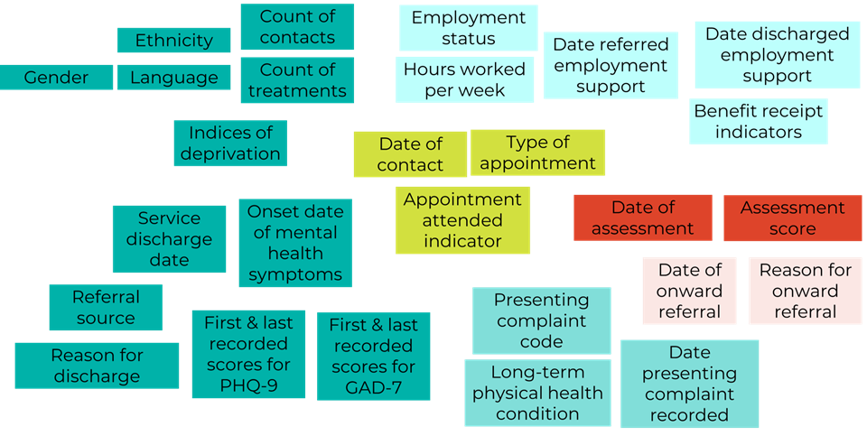
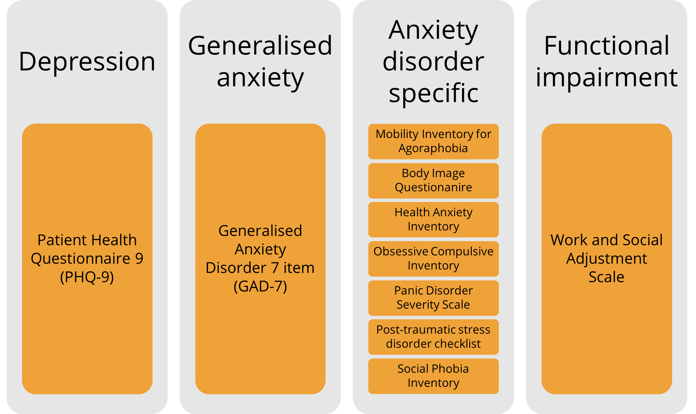

# DRAFT
# The research potential of the IAPT dataset
>Published 19 May 2026

<strong>By Rachel Latham, Research Fellow, King's College London, May 2026.</strong>
  

## Background  

In 2008 the **Improving Access to Psychological Therapies (IAPT)** service was launched in England to provide evidence-based, NICE-recommended psychological therapy for adults experiencing anxiety, depression and other related common mental health conditions. Since then, the service has grown significantly in both scope and scale offering employment support, online (digital) treatment options, extending support to people with long term-physical health conditions or medically unexplained symptoms and has over 1 million people accessing the service annually (<a href="https://digital.nhs.uk/data-and-information/publications/statistical/nhs-talking-therapies-for-anxiety-and-depression-annual-reports/2024-25" target="_blank" rel="noopener noreferrer">NHS Digital, 2025</a>).  

IAPT – which was re-named to **'NHS Talking Therapies for Anxiety and Depression'** in 2023 – is the largest publicly funded and systematic implementation of evidence-based psychological care in the world (<a href="https://doi.org/10.1111/bjc.12259" target="_blank" rel="noopener noreferrer">Wakefield et al., 2021</a>). The model has inspired similar services in countries such as Norway (<a href="https://doi.org/10.1159/000504453" target="_blank" rel="noopener noreferrer">Knapstad et al., 2020</a>) and Australia (<a href="https://doi.org/10.1080/09638237.2020.1760224" target="_blank" rel="noopener noreferrer">Baigent et al., 2023</a>).

The IAPT dataset contains information about **adults in England who are referred to psychological therapy** as part of the NHS Talking Therapies for anxiety and depression service. As with all NHS datasets, IAPT data is not collected for research purposes however, it has several features that make it a potentially very useful research resource!

## Naturalistic treatment data
Information is routinely collected from almost all adults accessing NHS psychological therapy for common mental health problems in England. The IAPT dataset therefore provides **large-scale, real-world data** about referrals, access, waiting times, treatment, and outcomes. This is valuable information for understanding who is accessing treatment and how, what therapy they receive and for evaluating treatment outcomes - for example, outcomes associated with particular therapies (e.g. Cognitive Behaviour Therapy) and outcomes for particular groups of people. Because the information is collected in a standardised way across England, it also enables different geographical areas within the nation to be compared.

## Comprehensive coverage
The IAPT dataset contains hundreds of variables organised into a series of tables that researchers can link together using 'participant ID' and/or 'pathway ID' (which identifies a particular referral for a person). These tables capture **de-identified patient-level information** including socio-demographics, employment and benefit details, care pathway (referral, appointments, treatment type) and patient outcomes for each referral received.
Example variables that may be of interest to mental health researchers are shown below:

  

   
 

**Data is longitudinal, spanning from referral to service discharge** allowing researchers to track patients’ journey through their treatment. Some people may access psychological therapy on more than one occasion and therefore have multiple referrals and episodes of treatment over time which allows patterns of care and re-referral for individuals over longer periods of time to be examined.  

## Repeated measures of symptoms using standardised and validated measures
A key feature of the NHS Talking Therapies service is the **systematic use of routine outcome monitoring**. Patients complete a standardised set of self-report measures of their symptoms (see below) on a session-to-session basis during treatment. These repeated measures enable researchers to assess symptom trajectories over the course of treatment.  

**<i><small>NHS Talking Therapies for anxiety and depression main outcome measures for anxiety, depression, specific anxiety disorders, and functional impairment</i></small>**

Importantly, instead of relying on an outcome measured only at the end of treatment, measuring symptoms at every session ensures there is a last available score that can be used for outcome monitoring even if the treatment ends unexpectedly early. NHS England reports that that outcome data is obtained for 98.5% of all patients who have a course of treatment ([NHS England, 2024](https://www.england.nhs.uk/wp-content/uploads/2018/06/nhs-talking-therapies-manual-v7.1-updated.pdf)). Pairing patients' first and last symptom scores then allows key patient outcome metrics such as recovery, reliable improvement, reliable deterioration and no reliable change to be determined. 

## Research using the IAPT dataset
Existing research has utilised the IAPT dataset – at both national and local levels – to explore a range of topics, including:  

* Inequalities in accessing psychological therapy (e.g. <a href="https://doi.org/10.1017/S0033291723001010" target="_blank" rel="noopener noreferrer">Sharland et al., 2023</a>; <a href="https://doi.org/10.1192/bjp.2024.174" target="_blank" rel="noopener noreferrer">Bamrah et al., 2025</a>).

* Trajectories of symptom severity during psychological therapy (e.g. <a href="https://doi.org/10.1016/j.jad.2021.06.084" target="_blank" rel="noopener noreferrer">Saunders et al., 2019</a>; <a href="https://doi.org/10.1017/S0033291722003403" target="_blank" rel="noopener noreferrer">Skelton et al., 2022</a>)

* Determinants of variability in treatment response (e.g. <a href="https://doi.org/10.1037/ccp0000416" target="_blank" rel="noopener noreferrer">Rimes et al., 2019</a>; <a href="https://doi.org/10.1016/j.jad.2021.06.084" target="_blank" rel="noopener noreferrer">Saunders et al., 2021</a>; <a href="https://doi.org/10.1017/S0033291720005395" target="_blank" rel="noopener noreferrer">Stochl et al., 2021</a>; <a href="https://doi.org/10.1017/S1352465822000558" target="_blank" rel="noopener noreferrer">Amati et al., 2023</a>).

Linkage of the IAPT dataset with UK LLC’s partner LPS participants presents a unique opportunity to explore even more exciting research questions! 

### To make it easier for researchers to navigate and use the linked IAPT data we have:  
* Documented the dataset in [**Guidebook**](../../linked_health_data/NHS_England/mental_health_datasets/iapt/understanding_iapt.md) – this provides a clear overview of the different versions of the IAPT dataset, its scope, main strengths and limitations, and key variables available.
* Provided guidance to understand the structure of the data and practical tips for handling the multiple rows of data per participant in IAPT.
* Cross-referenced NHS documentation to fill in variable labels and value labels where these were incomplete.

