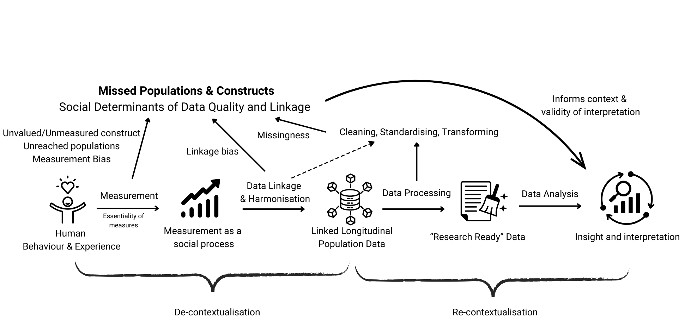

# Beyond the linkage rate: understanding linkage quality in UK LLC
To be published September 2026

<strong>By Joseph Lam, Research Fellow, UCL, September 2026.</strong>
  

## Introduction
When researchers work with linked data, it can be tempting to think of linkage as a purely technical step: records either match or they do not. But linkage can also shape who is represented in the data, what is represented about them, and ultimately how research findings should be interpreted.  

I discussed some of these issues at a UK LLC User Group earlier this year. They are particularly important for UK LLC, where information volunteered by longitudinal population study (LPS) participants is linked to health and administrative records held by different organisations.  

  

<b><small>N.B. This work was undertaken when UK LLC had fewer partner LPS.</small></b>

## Who is represented?
The population successfully linked to health and administrative data is not necessarily identical to the population we started with.  

People may be missed because identifying information is incomplete, inaccurate or has changed over time; because they do not appear in a particular administrative system; or because linkage methods perform differently for different kinds of records. 

>These processes can create linkage bias when the probability of successful linkage is related to characteristics that also matter for the research question.   

This means that a high overall linkage rate does not, by itself, tell us whether a linkage is representative. Two linkages could both successfully link, say, 90% of eligible participants, but have quite different implications. In one, the remaining 10% might be distributed relatively evenly across the population. In another, people from particular ethnic, socioeconomic, age or geographic groups might be disproportionately unlinked. The headline linkage rate is the same, but the potential consequences for research are not. For UK LLC researchers, understanding **who is missing from a linkage, and why**, can therefore be just as important as knowing how many people were linked.

## What is represented?
There is a related question: what do the linked data actually represent?  

Health and administrative data do not simply record an objective version of people's lives. They are generated through interactions between people, services and institutions. Whether something is recorded, how it is defined, how frequently it is updated and whose experiences are captured can all vary. Data then go through further stages of cleaning, standardisation, harmonisation and linkage before becoming the 'research-ready' data researchers see in the Trusted Research Environment (TRE). These processes are essential, but they can also remove some of the context in which the data were originally generated. I use the figure above as an illustration of such processes.  
>Interpreting linked data therefore requires us to think about both missed populations and missed or imperfectly measured constructs.  

## Making linkage quality more visible
This is why UK LLC is thinking about linkage quality as more than a single performance statistic.  

Useful information for researchers could include overall linkage rates, differences in linkage across population groups, patterns of missing identifiers, the linkage methods used, and known changes to source data or linkage pipelines. The aim is not to label a linkage simply as 'good' or 'bad', but to provide enough information for researchers to judge whether it is suitable for a particular analysis and where sensitivity analyses may be needed.  

Importantly, this understanding cannot remain static. As more LPS are onboarded to UK LLC, participant permissions are updated, and new linkages become available, including further health and financial data linkages, the composition of the linked resource will continue to change. Linkage methods and source data can change too. Assessments of linkage quality therefore need to be revisited rather than treated as something established once and then assumed to remain valid.  

There are also different levels at which researchers may need this information. An overall UK LLC linkage rate provides a useful resource-level picture, but it may conceal **substantial variation between individual LPS**. Each study has different populations, histories of data collection, consent or permission processes, and availability and quality of identifiers. LPS-specific linkage quality information is therefore important alongside UK LLC-wide reporting.  

Ultimately, the relevant population will often be more specific still. A researcher may define an analytical cohort using participants from particular LPS, age groups, time periods or combinations of linked health, financial and other administrative datasets. Linkage quality reporting therefore needs to be sufficiently flexible to help researchers understand the particular linked population used for their research question, rather than relying only on a single headline figure for the whole resource.  

>UK LLC is continuing conversations with organisations including NHS England and the Office for National Statistics about the quality and characteristics of different linkages, changes to linkage approaches, and how this information can be communicated to researchers. 

Some of this work is still developing, but the direction is important: making linkage provenance, quality and representativeness more visible and usable for UK LLC researchers.
Linked data can answer questions that no individual dataset could answer alone. Understanding how those linked populations were created, and where they may differ from the populations and experiences we hope to study, is part of using that opportunity responsibly and producing robust research.
