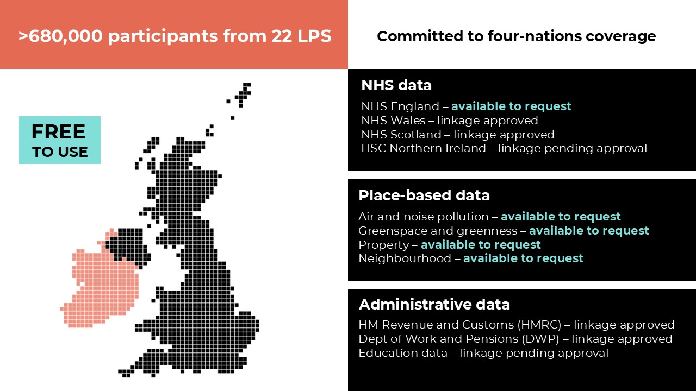

# Welcome to UK LLC Guidebook

>Last modified: 24 Jun 2026

<strong>The home of UK LLC data documentation and user guide.</strong>

 

[**UK LLC**](https://ukllc.ac.uk/) **is the national Trusted Research Environment (TRE) for data linkage in longitudinal research**, bringing together data from **Longitudinal Population Studies (LPS)** and linking these to study participants' **health**, **administrative** and **place-based** records. As summarised in the diagram below, UK LLC is committed to **four nations coverage**, is **free** to access and researchers can currently request access to LPS participants' records linked to [**NHS England**](../docs/linked_health_data/nhs_england/nhse.ipynb) and [**place-based datasets**](../docs/linked_geo_data/place_based_intro.md) (where participant permissions allow). Click on the links below to read more about: 
- [**UK LLC's unique attributes**](../docs/unique_attributes_ukllc.md) - why you should consider UK LLC for your next research project
- [**UK LLC's ongoing development**](../docs/next_steps_ukllc.md) - expansion in partner LPS and data sources, and synthetic data and training TRE 
- [**UK LLC's published protocol**](https://ijpds.org/article/view/2468/6167) - explains in detail how UK LLC works. 

 

